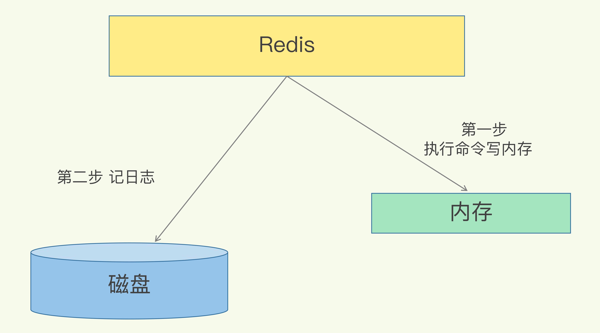
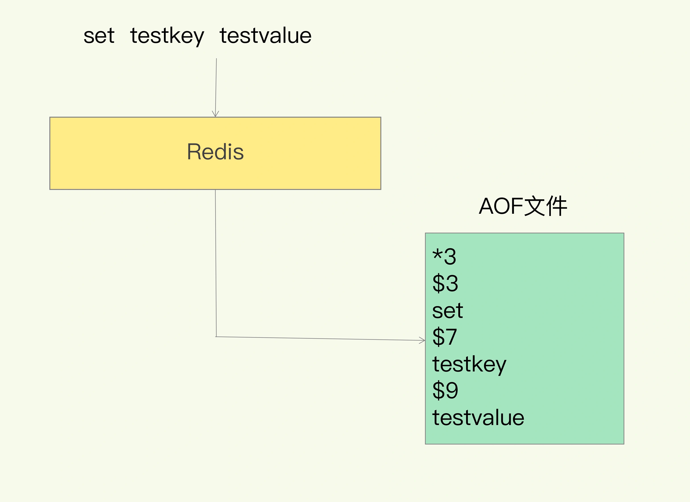
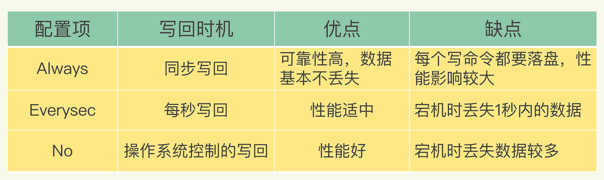
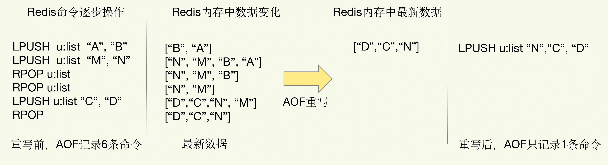
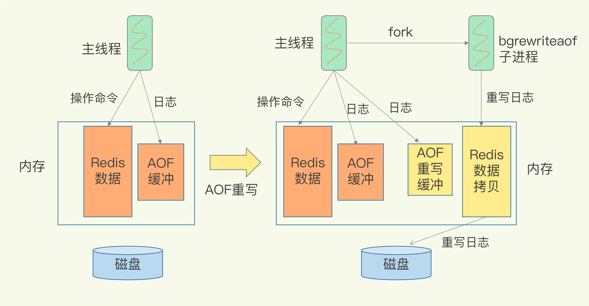
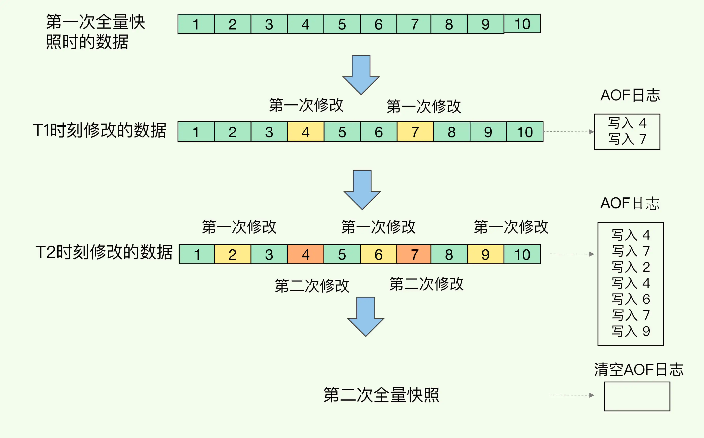

##临界知识
redis主线程避免阻塞,主线程需要响应客户端请求
同步/异步 持久化,异步避免主线程阻塞  
持久化时机,每秒,立即,跟随系统,trade-off取舍原则
持久化文件内容AOF,记录操作,将操作持久化,重放速度慢
内存快照RDB,将结果持久化,重放速度快
持久化文件结构,追加写,索引写的区别
持久化文件定期压缩--重写机制
fork进程机制,写时复制机制
多进程操作同一个文件,锁竞争
全量(RDB快照,重放速度快)和增量(AOF,增量回写),实现增量与快速回放
主进程重写会涉及主进程缓冲区+子进程缓冲区
持久化中涉及的cpu密集型+io密集型操作,fork是cpu密集型,RDB扫描是cpu密集，RDB写是io密集
redis中的cpu绑核影响

##AOF
###写入时机
先执行命令再记日志

1.写后日志这种方式，就是先让系统执行命令，只有命令能执行成功，才会被记录到日志中，为了避免额外的检查开销，Redis 在向 AOF 里面记录日志的时候，并不会先去对这些命令进行语法检查
2.它是在命令执行后才记录日志，所以不会阻塞当前的写操作
###AOF持久化内容
记录操作
set testkey testvalue

###AOF持久化问题
1.如果刚执行完一个命令，还没有来得及记日志就宕机了，那么这个命令和相应的数据就有丢失的风险
2.AOF 虽然避免了对当前命令的阻塞，但可能会给下一个操作带来阻塞风险。这是因为，AOF 日志也是在主线程中执行的，如果在把日志文件写入磁盘时，磁盘写压力大，就会导致写盘很慢，进而导致后续的操作也无法执行
###写回策略
```asp
Always，同步写回：每个写命令执行完，立马同步地将日志写回磁盘；
Everysec，每秒写回：每个写命令执行完，只是先把日志写到 AOF 文件的内存缓冲区，每隔一秒把缓冲区中的内容写入磁盘；
No，操作系统控制的写回：每个写命令执行完，只是先把日志写到 AOF 文件的内存缓冲区，由操作系统决定何时将缓冲区内容写回磁盘。
```

###AOF重写机制,避免AOF文件过大
随着接收的写命令越来越多，AOF 文件会越来越大
```asp
一是，文件系统本身对文件大小有限制，无法保存过大的文件；
二是，如果文件太大，之后再往里面追加命令记录的话，效率也会变低；
三是，如果发生宕机，AOF 中记录的命令要一个个被重新执行，用于故障恢复，如果日志文件太大，整个恢复过程就会非常缓慢，这就会影响到 Redis 的正常使用
```
####AOF重写原理
Redis 根据数据库的现状创建一个新的 AOF 文件，
也就是说，读取数据库中的所有键值对，然后对每一个键值对用一条命令记录它的写入。
比如说，当读取了键值对“testkey”: “testvalue”之后，重写机制会记录 set testkey testvalue 这条命令。这样，当需要恢复时，可以重新执行该命令，实现“testkey”: “testvalue”的写入。


AOF重写机制指的是，对过大的AOF文件进行重写，以此来压缩AOF文件的大小。 具体的实现是：检查当前键值数据库中的键值对，
记录键值对的最终状态，从而实现对 某个键值对 重复操作后产生的多条操作记录压缩成一条 的效果。进而实现压缩AOF文件的大小。
```asp
我们知道，AOF 文件是以追加的方式，逐一记录接收到的写命令的。当一个键值对被多条写命令反复修改时，
AOF 文件会记录相应的多条命令。但是，在重写的时候，是根据这个键值对当前的最新状态，
为它生成对应的写入命令。这样一来，一个键值对在重写日志中只用一条命令就行了，
而且，在日志恢复时，只用执行这条命令，就可以直接完成这个键值对的写入了。
```

####AOF重写后台进程,写实复制机制
```asp
和 AOF 日志由主线程写回不同，重写过程是由后台子进程 bgrewriteaof 来完成的，这也是为了避免阻塞主线程，导致数据库性能下降
```
####AOF触发时机
```asp
AOF什么时候触发？ 
1. auto-aof-rewrite-min-size: 表示运行AOF重写时文件的最小大小，默认为64MB 
2. auto-aof-rewrite-percentage: 这个值的计算方法是：当前AOF文件大小和上一次重写后AOF文件大小的差值，再除以上一次重写后AOF文件大小。
也就是当前AOF文件比上一次重写后AOF文件的增量大小，和上一次重写后AOF文件大小的比值。 
AOF文件大小同时超出上面这两个配置项时，会触发AOF重写。
```
####AOF重写实现
fork子进程时，子进程是会拷贝父进程的页表，即虚实映射关系，而不会拷贝物理内存。子进程复制了父进程页表，也能共享访问父进程的内存数据了，此时，类似于有了父进程的所有内存数据。

####AOF重写问题
```asp
1.AOF 日志重写的时候，是由 bgrewriteaof 子进程来完成的，不用主线程参与，
我们今天说的非阻塞也是指子进程的执行不阻塞主线程。但是，
你觉得，这个重写过程有没有其他潜在的阻塞风险呢？如果有的话，会在哪里阻塞？
```
```asp
Redis采用fork子进程重写AOF文件时，潜在的阻塞风险包括：fork子进程 和 AOF重写过程中父进程产生写入的场景，
下面依次介绍。 a、fork子进程，fork这个瞬间一定是会阻塞主线程的
（注意，fork时并不会一次性拷贝所有内存数据给子进程，老师文章写的是拷贝所有内存数据给子进程，我个人认为是有歧义的），
fork采用操作系统提供的写实复制(Copy On Write)机制，就是为了避免一次性拷贝大量内存数据给子进程造成的长时间阻塞问题，
但fork子进程需要拷贝进程必要的数据结构，其中有一项就是拷贝内存页表（虚拟内存和物理内存的映射索引表），这个拷贝过程会消耗大量CPU资源，
拷贝完成之前整个进程是会阻塞的，阻塞时间取决于整个实例的内存大小，实例越大，内存页表越大，fork阻塞时间越久。拷贝内存页表完成后，
子进程与父进程指向相同的内存地址空间，也就是说此时虽然产生了子进程，但是并没有申请与父进程相同的内存大小。那什么时候父子进程才会真正内存分离呢？
“写实复制”顾名思义，就是在写发生时，才真正拷贝内存真正的数据，这个过程中，父进程也可能会产生阻塞的风险，就是下面介绍的场景。
 b、fork出的子进程指向与父进程相同的内存地址空间，此时子进程就可以执行AOF重写，把内存中的所有数据写入到AOF文件中。但是此时父进程依旧是会有流量写入的，
 如果父进程操作的是一个已经存在的key，那么这个时候父进程就会真正拷贝这个key对应的内存数据，申请新的内存空间，这样逐渐地，父子进程内存数据开始分离，
 父子进程逐渐拥有各自独立的内存空间。因为内存分配是以页为单位进行分配的，默认4k，如果父进程此时操作的是一个bigkey，重新申请大块内存耗时会变长，可能会产阻塞风险。
 另外，如果操作系统开启了内存大页机制(Huge Page，页面大小2M)，那么父进程申请内存时阻塞的概率将会大大提高，所以在Redis机器上需要关闭Huge Page机制。
 Redis每次fork生成RDB或AOF重写完成后，都可以在Redis log中看到父进程重新申请了多大的内存空间。
```


```asp
2.AOF 重写也有一个重写日志，为什么它不共享使用 AOF 本身的日志呢？
```
```asp
 问题2，AOF重写不复用AOF本身的日志，一个原因是父子进程写同一个文件必然会产生竞争问题，控制竞争就意味着会影响父进程的性能。二是如果AOF重写过程中失败了，那么原本的AOF文件相当于被污染了，无法做恢复使用。
 所以Redis AOF重写一个新文件，重写失败的话，直接删除这个文件就好了，不会对原先的AOF文件产生影响。等重写完成之后，直接替换旧文件即可。
```

```asp
AOF重写时，主进程有写操作,主进程和子进程会发生文件竞争吗?
```
```asp
主进程
1.子线程重新AOF日志完成时会向主线程发送信号处理函数，会完成 （1）将AOF重写缓冲区的内容写入到新的AOF文件中。（2）将新的AOF文件改名，原子地替换现有的AOF文件。完成以后才会重新处理客户端请求。
2.不共享AOF本身的日志是防止锁竞争，类似于redis rehash。
```

###AOF重放
##RDB(redis database,内存快照)
快速恢复
就是把某一时刻的状态以文件的形式写到磁盘上，也就是快照。这样一来，即使宕机，快照文件也不会丢失，数据的可靠性也就得到了保证。这个快照文件就称为 RDB 文件
和 AOF 相比，RDB 记录的是某一时刻的数据，并不是操作，所以，在做数据恢复时，我们可以直接把 RDB 文件读入内存，很快地完成恢复
###对哪些数据做快照？
Redis 的数据都在内存中，为了提供所有数据的可靠性保证，它执行的是全量快照
####子进程写入 RDB 文件
bgsave：创建一个子进程，专门用于写入 RDB 文件，避免了主线程的阻塞，这也是 Redis RDB 文件生成的默认配置
###做快照时，数据还能被增删改吗？
Redis 就会借助操作系统提供的写时复制技术（Copy-On-Write, COW），在执行快照的同时，正常处理写操作
如果主线程对这些数据也都是读操作（例如图中的键值对 A），那么，主线程和 bgsave 子进程相互不影响。
但是，如果主线程要修改一块数据（例如图中的键值对 C），那么，这块数据就会被复制一份，生成该数据的副本（键值对 C’）。然后，主线程在这个数据副本上进行修改。同时，bgsave 子进程可以继续把原来的数据（键值对 C）写入 RDB 文件。

这个操作是子进程在后台完成的，这就允许主线程同时可以修改数据。


##AOF与RDB混搭
```asp
数据不能丢失时，内存快照和 AOF 的混合使用是一个很好的选择；
如果允许分钟级别的数据丢失，可以只使用 RDB；
如果只用 AOF，优先使用 everysec 的配置选项，因为它在可靠性和性能之间取了一个平衡。
```

##AOF和RDB越来越大问题
不会，有过期机制，定期淘汰机制
##RDB中cpu密集型操作和io密集型操作
```asp
2核CPU、4GB内存、500G磁盘，Redis实例占用2GB，写读比例为8:2，此时做RDB持久化，产生的风险主要在于 CPU资源 和 内存资源 这2方面：

a、内存资源风险：Redis fork子进程做RDB持久化，由于写的比例为80%，那么在持久化过程中，“写实复制”会重新分配整个实例80%的内存副本，大约需要重新分配1.6GB内存空间，
这样整个系统的内存使用接近饱和，如果此时父进程又有大量新key写入，很快机器内存就会被吃光，如果机器开启了Swap机制，那么Redis会有一部分数据被换到磁盘上，
当Redis访问这部分在磁盘上的数据时，性能会急剧下降，已经达不到高性能的标准（可以理解为武功被废）。如果机器没有开启Swap，会直接触发OOM，父子进程会面临被系统kill掉的风险。

b、CPU资源风险：虽然子进程在做RDB持久化，但生成RDB快照过程会消耗大量的CPU资源，虽然Redis处理处理请求是单线程的，但Redis Server还有其他线程在后台工作，
例如AOF每秒刷盘、异步关闭文件描述符这些操作。由于机器只有2核CPU，这也就意味着父进程占用了超过一半的CPU资源，此时子进程做RDB持久化，可能会产生CPU竞争，
导致的结果就是父进程处理请求延迟增大，子进程生成RDB快照的时间也会变长，整个Redis Server性能下降。

c、另外，可以再延伸一下，老师的问题没有提到Redis进程是否绑定了CPU，如果绑定了CPU，那么子进程会继承父进程的CPU亲和性属性，子进程必然会与父进程争夺同一个CPU资源，
整个Redis Server的性能必然会受到影响！所以如果Redis需要开启定时RDB和AOF重写，进程一定不要绑定CPU。
```
