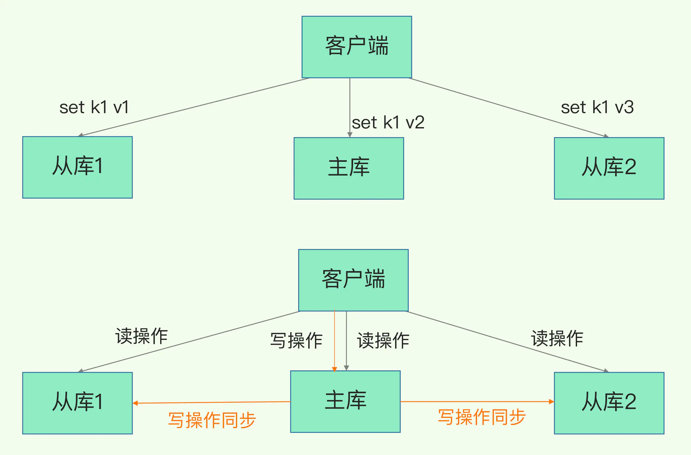
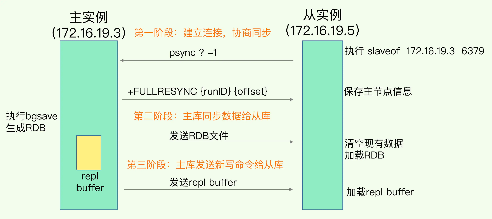
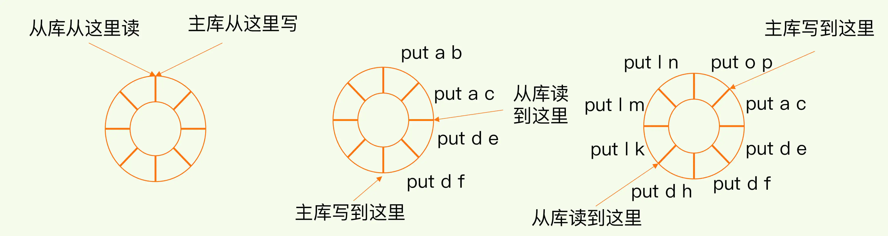
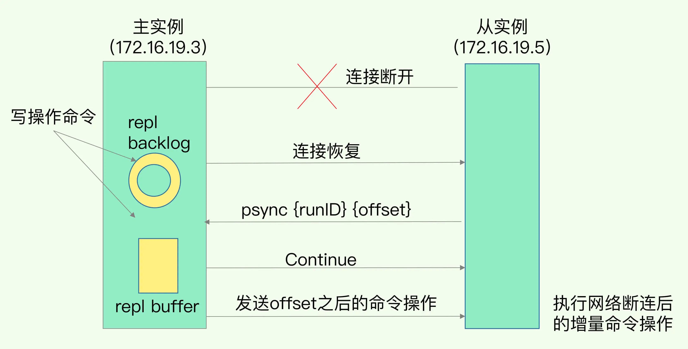
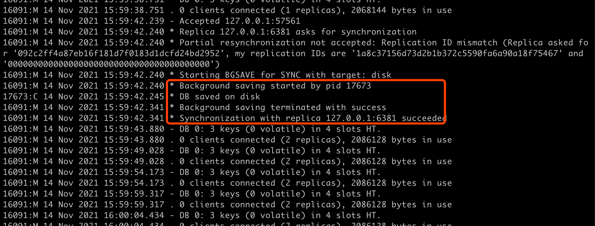
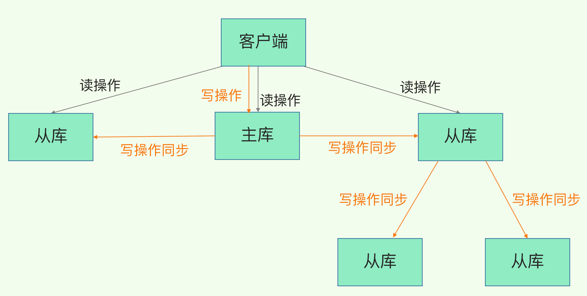

##临界知识
可用性:数据持久化,数据可用性
数据可用性:冗余备份
数据冗余架构模型:主从
读写分离原因
主从数据同步过程,RBD同步,repl_backlog_buffer缓存增量同步
数据一致性需求
扩展性架构:分片集群
网络分区:脑裂
环形数组缓冲
fork子进程cpu密集操作
AOF和RBD的优缺点
##redis可用性
数据少丢失,使用持久化方案
数据可用性,使用冗余备份方案
##主从模式

###读写分离原因,基于读:写=8:2
读操作：主库、从库都可以接收；
写操作：首先到主库执行，然后，主库将写操作同步给从库。

```asp
不管是主库还是从库，都能接收客户端的写操作，那么，一个直接的问题就是：如果客户端对同一个数据（例如 k1）前后修改了三次，
每一次的修改请求都发送到不同的实例上，在不同的实例上执行，那么，这个数据在这三个实例上的副本就不一致了（分别是 v1、v2 和 v3）。
在读取这个数据的时候，就可能读取到旧的值

如果我们非要保持这个数据在三个实例上一致，就要涉及到加锁、实例间协商是否完成修改等一系列操作，但这会带来巨额的开销，当然是不太能接受的。
```
```asp
而主从库模式一旦采用了读写分离，所有数据的修改只会在主库上进行，不用协调三个实例。主库有了最新的数据后，会同步给从库，这样，主从库的数据就是一致的
```
###主从全量同步过程

FULLRESYNC
CONTINUE

###主从增量同步过程
一旦主从库完成了全量复制，它们之间就会一直维护一个网络连接，主库会通过这个连接将后续陆续收到的命令操作再同步给从库，
这个过程也称为基于长连接的命令传播，可以避免频繁建立连接的开销
####网络断连或阻塞
增量复制时，主从库之间具体是怎么保持同步的呢？这里的奥妙就在于 repl_backlog_buffer 这个缓冲区  
repl_backlog_buffer 是一个环形缓冲区，主库会记录自己写到的位置，从库则会记录自己已经读到的位置
对主库来说，对应的偏移量就是 master_repl_offset。主库接收的新写操作越多，这个值就会越大  
同样，从库在复制完写操作命令后，它在缓冲区中的读位置也开始逐步偏移刚才的起始位置，此时，从库已复制的偏移量 slave_repl_offset 也在不断增加。正常情况下，这两个偏移量基本相等。

主从库的连接恢复之后，从库首先会给主库发送 psync 命令，并把自己当前的 slave_repl_offset 发给主库，主库会判断自己的 master_repl_offset 和 slave_repl_offset 之间的差距。
在网络断连阶段，主库可能会收到新的写操作命令，所以，一般来说，master_repl_offset 会大于 slave_repl_offset。此时，主库只用把 master_repl_offset 和 slave_repl_offset 之间的命令操作同步给从库就行。


```asp
1. 一个从库如果和主库断连时间过长，造成它在主库repl_backlog_buffer的slave_repl_offset位置上的数据已经被覆盖掉了，此时从库和主库间将进行全量复制。

2. 每个从库会记录自己的slave_repl_offset，每个从库的复制进度也不一定相同。在和主库重连进行恢复时，从库会通过psync命令把自己记录的slave_repl_offset发给主库，
主库会根据从库各自的复制进度，来决定这个从库可以进行增量复制，还是全量复制。
```
####环形缓冲写满
repl_backlog_buffer 是一个环形缓冲区，所以在缓冲区写满后，主库会继续写入，此时，就会覆盖掉之前写入的操作。如果从库的读取速度比较慢，  
就有可能导致从库还未读取的操作被主库新写的操作覆盖了，这会导致主从库间的数据不一致,此时主库再进行同步就是全量同步
```asp
方案1：增大环形缓冲区，repl_backlog_size，缓冲空间大小 = 主库写入命令速度 * 操作大小 - 主从库间网络传输命令速度 * 操作大小

方案2：使用切片集群减少数据

```
##复制buffer
[](http://mdba.cn/2015/03/17/redis%E4%B8%BB%E4%BB%8E%E5%A4%8D%E5%88%B6%EF%BC%882%EF%BC%89-replication-buffer%E4%B8%8Ereplication-backlog/)
###replication buffer
```asp
redis的slave buffer（replication buffer，master端上）存放的数据是下面三个时间内所有的master数据更新操作。

1）master执行rdb bgsave产生snapshot的时间

2）master发送rdb到slave网络传输时间

3）slave load rdb文件把数据恢复到内存的时间

replication buffer太小会引发的问题：

replication buffer由client-output-buffer-limit slave设置，当这个值太小会导致主从复制链接断开。

1）当master-slave复制连接断开，server端会释放连接相关的数据结构。replication buffer中的数据也就丢失了，此时主从之间重新开始复制过程。

2）还有个更严重的问题，主从复制连接断开，导致主从上出现rdb bgsave和rdb重传操作无限循环
```
###replication backlog
```asp
maser不仅将所有的数据更新命令发送到所有slave的replication buffer，还会写入replication backlog。当断开的slave重新连接上master的时候，
slave将会发送psync命令（包含复制的偏移量offset），请求partial resync。
如果请求的offset不存在，那么执行全量的sync操作，相当于重新建立主从复制
```
##重要概念
###单机rdb快照和主从同步的rdb的关联?每个从节点进来都会进行一次rdb bgsave?
```asp
单机redis定期使用rdb快照持久化,主从redis也会使用rdb全量复制，
主从产生的rdb也会作为最新的rdb快照吧，但是rdb快照不会用来作为主从的复制
```

```asp
看起来每个从节点进来，master节点都会进行一次rdb bgsave，不会发送之前生产的rdb
```
###主从从模式分压主库
```asp
主库需要扫描内存生成RDB,然后传输RDB
主库忙于 fork 子进程生成 RDB 文件，进行数据全量同步。fork 这个操作会阻塞主线程处理正常请求，从而导致主库响应应用程序的请求速度变慢。
此外，传输 RDB 文件也会占用主库的网络带宽，同样会给主库的资源使用带来压力。

```
可以手动选择一个从库（比如选择内存资源配置较高的从库），用于级联其他的从库。然后，我们可以再选择一些从库（例如三分之一的从库），
在这些从库上执行如下命令，让它们和刚才所选的从库，建立起主从关系



###同步为啥使用RDB不使用AOF
RDB记录快照,并且进行数据压缩,扫描快,io传输效率高
AOF需要重放执行,校验逻辑，并且有大量重复操作
```asp
1、RDB文件内容是经过压缩的二进制数据（不同数据类型数据做了针对性优化），文件很小。而AOF文件记录的是每一次写操作的命令，写操作越多文件会变得很大，
其中还包括很多对同一个key的多次冗余操作。在主从全量数据同步时，传输RDB文件可以尽量降低对主库机器网络带宽的消耗，从库在加载RDB文件时，一是文件小，读取整个文件的速度会很快，
二是因为RDB文件存储的都是二进制数据，从库直接按照RDB协议解析还原数据即可，速度会非常快，而AOF需要依次重放每个写命令，这个过程会经历冗长的处理逻辑，
恢复速度相比RDB会慢得多，所以使用RDB进行主从全量同步的成本最低。

2、假设要使用AOF做全量同步，意味着必须打开AOF功能，打开AOF就要选择文件刷盘的策略，选择不当会严重影响Redis性能。而RDB只有在需要定时备份和主从全量同步数据时才会触发生成一次快照。
而在很多丢失数据不敏感的业务场景，其实是不需要开启AOF的。
```
