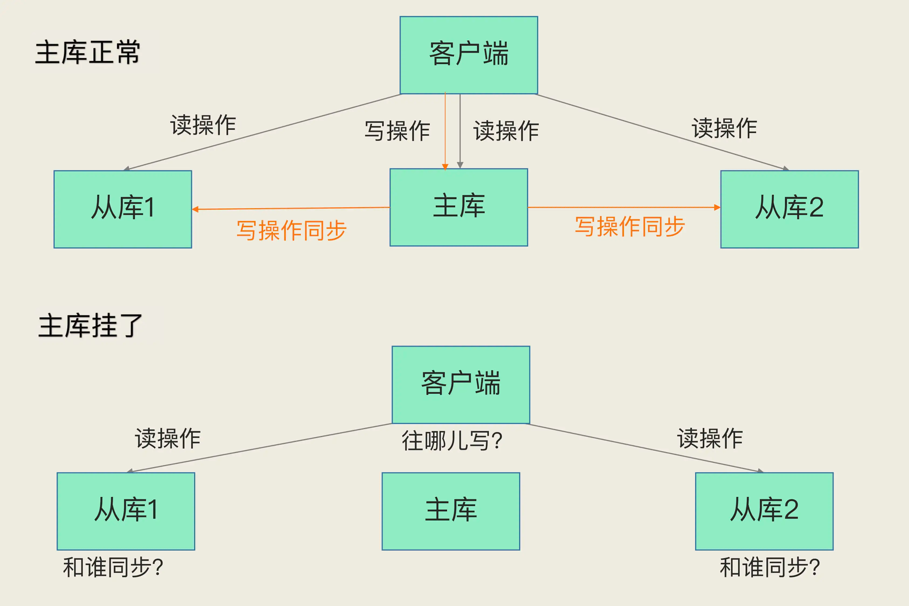

##临界知识
哨兵集群与redis主库从库沟通方式,订阅发布
健康监控ping
主观下线与客观下线确认
选举哨兵leader算法
切换主库机制,优先级策略
选举后无感知业务恢复
事件通知机制-新主库确定后通知客户端机制
主从+哨兵模式下的对象沟通方式:主从,哨兵,客户端
共识算法raft

[](https://www.bilibili.com/read/cv10128941)
[](https://xie.infoq.cn/article/b1485fe1965051e35bf71b3a7)
[](https://segmentfault.com/a/1190000039766545)
##主库宕机恢复方案

```asp
如何确定主库挂了
该选择哪个从库作为主库？
怎么把新主库的相关信息通知给从库和客户端呢？
```
##哨兵集群
哨兵其实就是一个运行在特殊模式下的 Redis 进程，主从库实例运行的同时，它也在运行。哨兵主要负责的就是三个任务：监控、选主（选择主库）和通知。
哨兵集群负责将主库信息的变更告知客户端
###哨兵和主库/从库的沟通方式

哨兵使用info和主库进行沟通,获取主库从库的信息
哨兵是通过INFO指令，从主库获取从库信息，并与每个从库建立连接，监控所有主从库状态

哨兵除了彼此之间建立起连接形成集群外，还需要和从库建立连接。这是因为，在哨兵的监控任务中，它需要对主从库都进行心跳判断，而且在主从库切换完成后，
它还需要通知从库，让它们和新主库进行同步
###哨兵获取从库信息

###哨兵相互发现方式-主库订阅发布

哨兵通过对主库进行订阅发布，相互发现
基于pub/sub机制,在主库中有一个"__sentinel__:hello"的频道，哨兵之间互相发现通信
哨兵之间通信不是哨兵之间之间联系，而是通过订阅主库的同一频道来获取彼此的信息
###哨兵和哨兵的沟通方式
哨兵和哨兵直接进行沟通
哨兵 2、3 可以和哨兵 1 建立网络连接。通过这个方式，哨兵 2 和 3 也可以建立网络连接，这样一来，哨兵集群就形成了。它们相互间可以通过网络连接进行通信，
比如说对主库有没有下线这件事儿进行判断和协商

主库挂了后，哨兵和哨兵选举leader时直接沟通达成共识，此过程和订阅发布没关系  
###客户端与哨兵的通信方式-哨兵基于pub/sub 机制的客户端事件通知
1：哨兵主动通知：哨兵需要将最新的主库地址写入自己的pubsub中，客户端需要订阅这个pubsub，当这个pubsub有数据时，客户端就能感知到
哨兵和客户端建立连接，新主库信息由哨兵通知客户端
哨兵是一个特殊的redis实例，所以客户端可以订阅哨兵的指定频道获得redis主从库的信息


从本质上说，哨兵就是一个运行在特定模式下的 Redis 实例，只不过它并不服务请求操作，只是完成监控、选主和通知的任务。所以，每个哨兵实例也提供 
pub/sub 机制，客户端可以从哨兵订阅消息。哨兵提供的消息订阅频道有很多，不同频道包含了主从库切换过程中的不同关键事件。
##监控主库下线,达成共识

```asp
监控是指哨兵进程在运行时，周期性地给所有的主从库发送 PING 命令，检测它们是否仍然在线运行。如果从库没有在规定时间内响应哨兵的 PING 命令，哨兵就会把它标记为“下线状态”；
同样，如果主库也没有在规定时间内响应哨兵的 PING 命令，哨兵就会判定主库下线，然后开始自动切换主库的流程。
```
###哨兵判定主库异常时机
哨兵集群中任意一个实例都可以发起主库异常“投票仲裁”流程

###主观下线&客观下线(少数服从多数)
####主观下线
哨兵进程会使用 PING 命令检测它自己和主、从库的网络连接情况，用来判断实例的状态。如果哨兵发现主库或从库对 PING 命令的响应超时了，那么，哨兵就会先把它标记为“主观下线”。
####客观下线
只有大多数的哨兵实例，都判断主库已经“主观下线”了，主库才会被标记为“客观下线”，这个叫法也是表明主库下线成为一个客观事实了。这个判断原则就是：少数服从多数。

###主库客观下线机制
主观下线、客观下线,少数服从多数
```asp
哨兵机制也是类似的，它通常会采用多实例组成的集群模式进行部署，这也被称为哨兵集群。引入多个哨兵实例一起来判断，就可以避免单个哨兵因为自身网络状况不好，
而误判主库下线的情况。同时，多个哨兵的网络同时不稳定的概率较小，由它们一起做决策，误判率也能降低。

一个哨兵获得了仲裁所需的赞成票数后，就可以标记主库为“客观下线”。这个所需的赞成票数是通过哨兵配置文件中的 quorum 配置项设定的。
例如，现在有 5 个哨兵，quorum 配置的是 3，那么，一个哨兵需要 3 张赞成票，就可以标记主库为“客观下线”了。这 3 张赞成票包括哨兵自己的一张赞成票和另外两个哨兵的赞成票。
```

###主库下线后哨兵如何沟通?
只有发现哨兵时订阅发布，互相通信使用socket
###主观下线后,发起客观下线仲裁,其他哨兵需要重新请求主库获取最新状态吗？
哨兵节点判断主库主观下线后，获取其他哨兵的状态，此时其他哨兵有可能还没有开始ping主库，全部都是主库在线状态。这块redis有什么措施吗？
所有哨兵判断主观下线后，大家都获取其他哨兵状态，直到满足n/2+1
###多个哨兵触发主观下线,都发起仲裁,可能导致多个客观下线结果吗?
可能,每个哨兵都去请求其他哨兵,然后汇总所有的哨兵的意见,只要满足n/2+1,每个哨兵都可以发起客观下线仲裁,都可以发起leader选举


##哨兵选举leader&切换新主库
###选举leader原理/多个哨兵满足客观下线时,都发起leader选举,如何确定一个leader,选举过程会变成死循环吗?
不会
```asp
1.每个哨兵Ping主库的定时器周期会加时间偏移
2.只有判断客观下线的哨兵才会发起选举
3.即使出现了都投给自己一票的情况，导致无法选出Leader，哨兵会停一段时间（一般是故障转移超时时间failover_timeout的2倍），然后再可以进行下一轮投票
4.哨兵如果没有给自己投票，就会把票投给第一个给它发送投票请求的哨兵。后续再有投票请求来，哨兵就拒接投票了。
5.拉票
```

###纪元
[](https://zhuanlan.zhihu.com/p/360239576)
```asp
纪元（epoch）
Redis Cluster 使用了类似于 Raft 算法 term（任期）的概念称为 epoch（纪元），用来给事件增加版本号。Redis 集群中的纪元主要是两种：currentEpoch 和 configEpoch。

currentEpoch
这是一个集群状态相关的概念，可以当做记录集群状态变更的递增版本号。每个集群节点，都会通过 server.cluster->currentEpoch 记录当前的 currentEpoch。

集群节点创建时，不管是 master 还是 slave，都置 currentEpoch 为 0。当前节点接收到来自其他节点的包时，如果发送者的 currentEpoch（消息头部会包含发送者的 
currentEpoch）大于当前节点的currentEpoch，那么当前节点会更新 currentEpoch 为发送者的 currentEpoch。因此，集群中所有节点的 currentEpoch 最终会达成一致，
相当于对集群状态的认知达成了一致


currentEpoch 作用在于，当集群的状态发生改变，某个节点为了执行一些动作需要寻求其他节点的同意时，就会增加 currentEpoch 的值。目前 currentEpoch 
只用于 slave 的故障转移流程，这就跟哨兵中的sentinel.current_epoch 作用是一模一样的。当 slave A 发现其所属的 master 下线时，就会试图发起故障转移流程。
首先就是增加 currentEpoch 的值，这个增加后的 currentEpoch 是所有集群节点中最大的。然后slave A 向所有节点发起拉票请求，请求其他 master 投票给自己，使自己能成为新的 master。
其他节点收到包后，发现发送者的 currentEpoch 比自己的 currentEpoch 大，就会更新自己的 currentEpoch，并在尚未投票的情况下，投票给 slave A，表示同意使其成为新的 master。

```
###拉票
###哨兵成为leader的条件
哨兵集群执行主从切换机制：谁发现，谁就发起投票流程，谁获得多数票，谁就是哨兵Leader，由Leader负责主从库切换
哨兵集群Leader选举成功与否，依赖于网络通信状况，网络拥塞会导致选举失败，重新进行新一轮选举  
哨兵成为Leader的必要条件：
a：获得半数以上的票数，n/2 +1 
b：得到的票数要达到配置的quorum阀值
###哨兵设置为奇数的原因
如果哨兵集群只有 2 个实例，此时，一个哨兵要想成为 Leader，必须获得 2 票，而不是 1 票。所以，如果有个哨兵挂掉了，那么，此时的集群是无法进行主从库切换的。因此，通常我们至少会配置 3 个哨兵实例。
###哨兵选票能给谁?
哨兵既能投票给自己,又能投票给其他哨兵,
###哨兵确保投票
###主库确定机制,多个哨兵还是leader哨兵决定主库?
哨兵集群判断出主库“主观下线”后，会选出一个“哨兵领导者”，之后整个过程由它来完成主从切换。
主从切换只能由Leader哨兵执行，而成为Leader有两个必要的条件，所以当哨兵集群中实例异常过多时，会导致主从库无法切换

除了要检查从库的当前在线状态，还要判断它之前的网络连接状态
从库优先级、从库复制进度以及从库 ID 号
它的 slave_repl_offset 需要最接近 master_repl_offset。如果在所有从库中，有从库的 slave_repl_offset 最接近 master_repl_offset，那么它的得分就最高，可以作为新主库。


##通知
###订阅发布
哨兵与从库/客户端通过订阅发布方式通知
###通知机制
哨兵会执行最后一个任务：通知。在执行通知任务时，哨兵会把新主库的连接信息发给其他从库，让它们执行 replicaof 命令，和新主库建立连接，并进行数据复制。
同时，哨兵会把新主库的连接信息通知给客户端，让它们把请求操作发到新主库上。
##新主库上线如何做到业务无感知
```asp
客户端能否正常地进行请求操作呢？如果想要应用程序不感知服务的中断，还需要哨兵或需要客户端再做些什么吗?
```
```asp
如果客户端使用了读写分离，那么读请求可以在从库上正常执行，不会受到影响。但是由于此时主库已经挂了，而且哨兵还没有选出新的主库，
所以在这期间写请求会失败，失败持续的时间 = 哨兵切换主从的时间 + 客户端感知到新主库 的时间。

如果不想让业务感知到异常，客户端只能把写失败的请求先缓存起来或写入消息队列中间件中，等哨兵切换完主从后，再把这些写请求发给新的主库，
但这种场景只适合对写入请求返回值不敏感的业务，而且还需要业务层做适配，另外主从切换时间过长，也会导致客户端或消息队列中间件缓存写请求过多，
切换完成之后重放这些请求的时间变长。
```
##哨兵达到一致共识
##哨兵集群有实例挂了
##哨兵执行新主库切换
