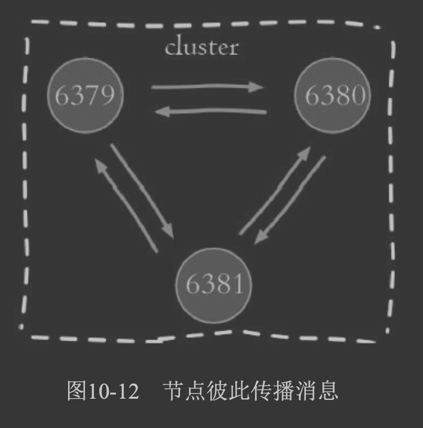
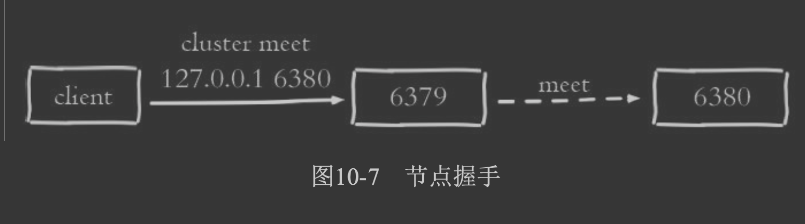
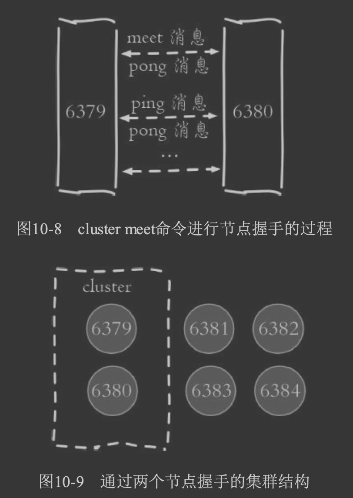
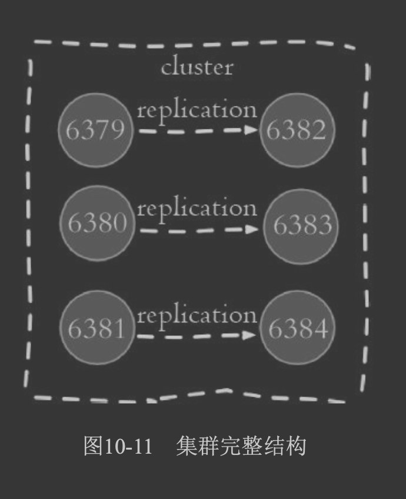
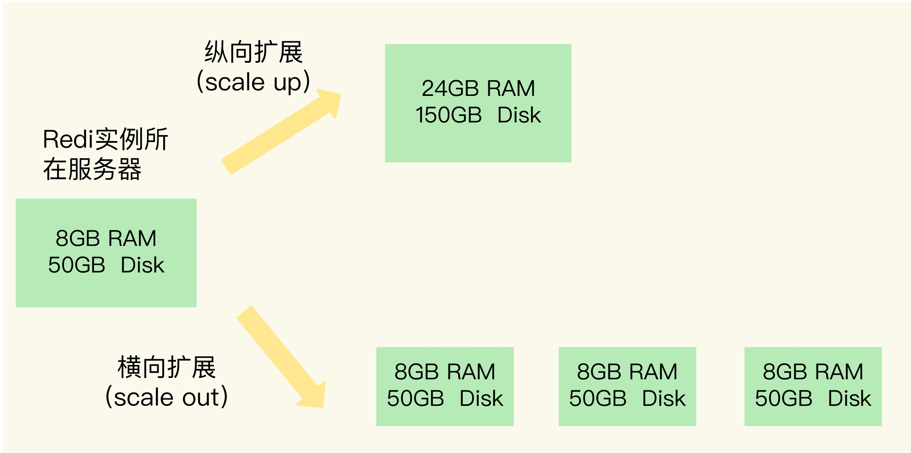
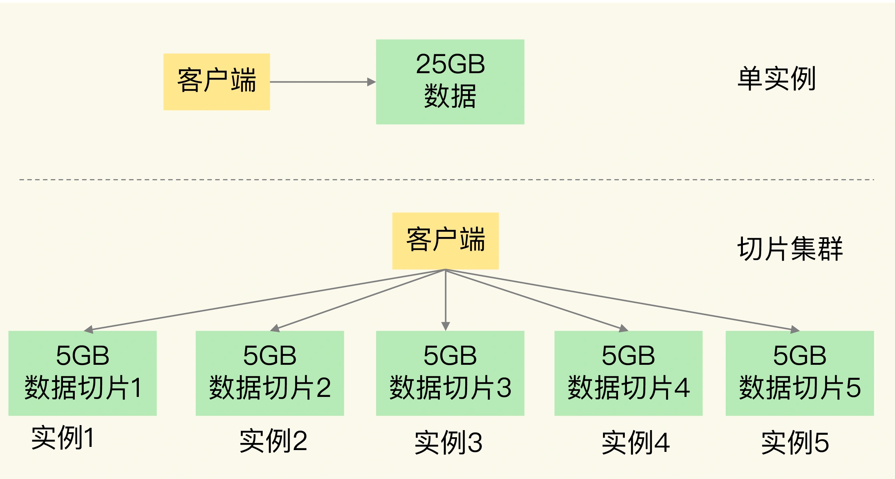
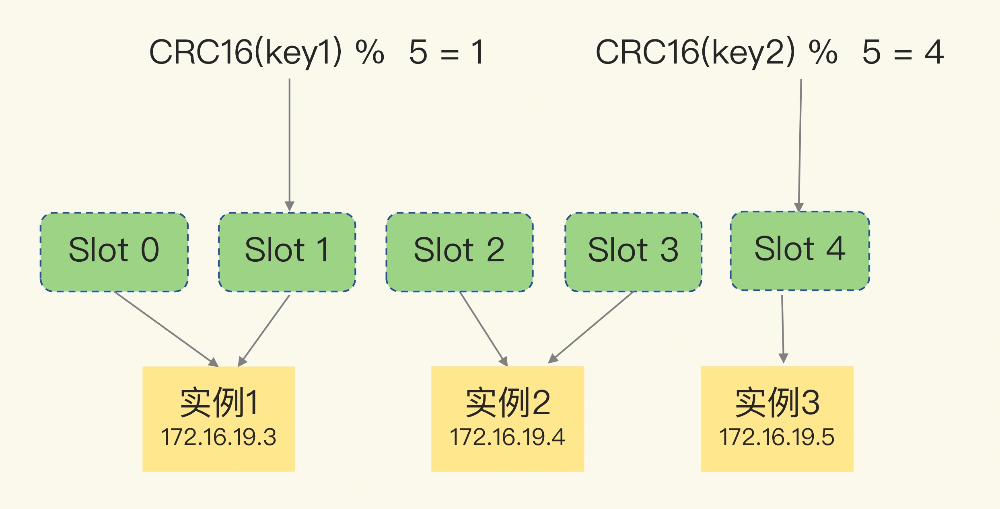
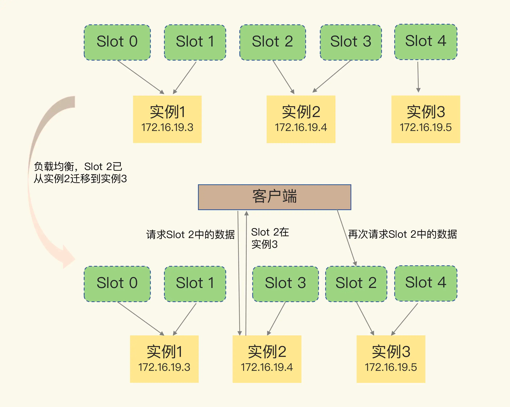
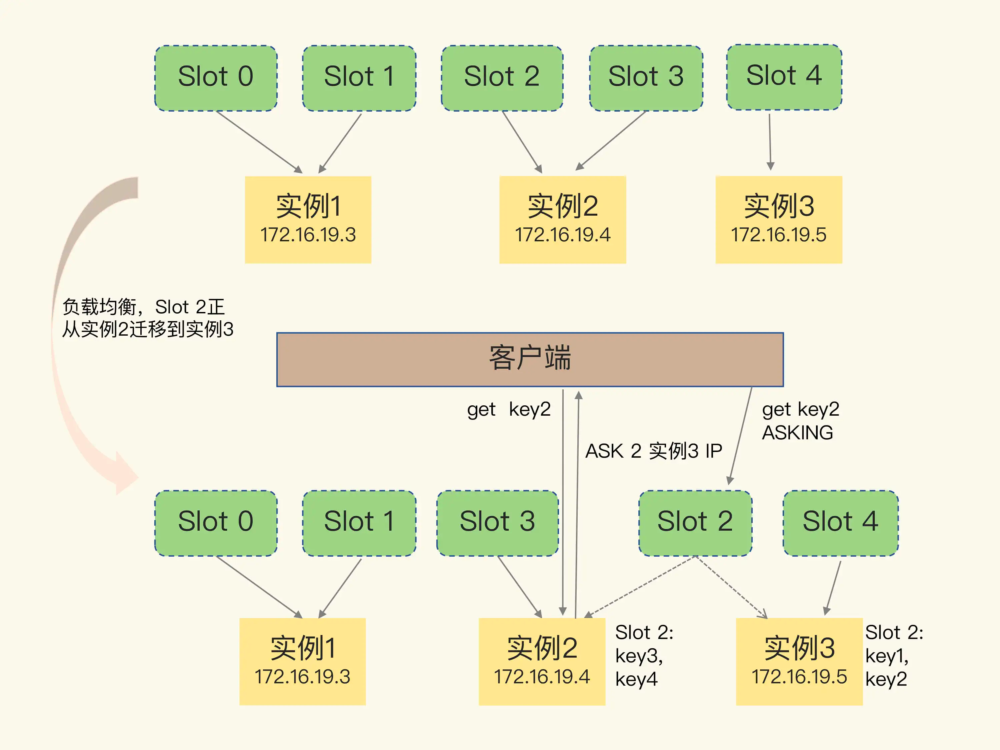

##临界知识
Gossip协议工作原理就是节点彼此不断通信交换信息，一段时间后所有的节 点都会知道集群完整的信息
##纵向扩展问题
```asp
第一个问题是，当使用 RDB 对数据进行持久化时，如果数据量增加，需要的内存也会增加，主线程 fork 子进程时就可能会阻塞（比如刚刚的例子中的情况）。
不过，如果你不要求持久化保存 Redis 数据，那么，纵向扩展会是一个不错的选择。不过，这时，你还要面对第二个问题：纵向扩展会受到硬件和成本的限制。
这很容易理解，毕竟，把内存从 32GB 扩展到 64GB 还算容易，但是，要想扩充到 1TB，就会面临硬件容量和成本上的限制了
```
[](https://www.zhihu.com/question/265014061/answer/288486230)
```asp
如果你指的是 x86-64 处理器（AMD、Intel 或兼容系统），它的实际地址空间大小是 [公式]，还有 16 比特暂时没有用。不过，这样的话虚拟地址空间也有 256 TB 了。
内核空间占一半（同样是高地址区域），普通进程使用另外一半，也就是 128 TB
```

##Gossip(流言)协议(redis切片集群通信)


###集群节点握手(meet,ping/pong)
Redis 实例会把自己的哈希槽信息发给和它相连接的其它实例，来完成哈希槽分配信息的扩散。当实例之间相互连接后，每个实例就有所有哈希槽的映射关系了
###meet节点握手

```asp
1)节点6379本地创建6380节点信息对象，并发送meet消息。
2)节点6380接受到meet消息后，保存6379节点信息并回复pong消息。
3)之后节点6379和6380彼此定期通过ping/pong消息进行正常的节点通 信。
```
###ping、pong通信

###从节点复制

##redis切片集群槽位slot(横向扩展)


###为啥用一致性hash算法
hash算法在增加节点时需要迁移的数据过多,
key/n,key/(n+1)
普通hash求余算法最为不妥的地方就是在有机器的添加或者删除之后会造成大量的对象存储位置失效。下面来分析一下一致性哈希算法是如何处理的
###Hash Slot原理(16384)
```$xslt
一致性hash：对节点和数据，都做一次hash运算，然后比较节点和数据的hash值，数据值和节点最相近的节点作为处理节点。为了分布得更均匀，通过使用虚拟节点的方式，每个节点计算出n个hash值，均匀地放在hash环上这样数据就能比较均匀地分布到每个节点

首先根据键值对的 key，计算一个 16 bit 的值；然后，再用这个 16bit 值对 16384 取模，得到 0~16383 范围内的模数，
每个模数代表一个相应编号的哈希槽。
```

####16384背后的临界知识

###slot分配
```$xslt
Redis 会自动把这些槽平均分布在集群实例上。例如，如果集群中有 N 个实例，那么，每个实例上的槽个数为 16384/N 个。当然， 我们也可以使用 
cluster meet 命令手动建立实例间的连接，形成集群，再使用 cluster addslots 命令，指定每个实例上的哈希槽个数。
```

```$xslt
假设集群中不同 Redis 实例的内存大小配置不一，如果把哈希槽均分在各个实例上，在保存相同数量的键值对时，和内存大的实例相比，内存小的实例就会有更大的容量压力。
遇到这种情况时，你可以根据不同实例的资源配置情况，使用 cluster addslots 命令手动分配哈希槽。
```


###hash槽重分配
###客户端如何定位节点
节点自身维护槽的映射关系，不需要客户端或者代理服务维护槽分区元数据

在定位键值对数据时，它所处的哈希槽是可以通过计算得到的，这个计算可以在客户端发送请求时来执行
客户端收到哈希槽信息后，会把哈希槽信息缓存在本地,当客户端请求键值对时，会先计算键所对应的哈希槽
###重定向机制(完全迁移)
```asp
127.0.0.1:6379> get c
(error) MOVED 7365 127.0.0.1:6380
```

###slot正在迁移
```asp
GET hello:key(error) 
ASK 13320 172.16.19.5:6379
```

##数据倾斜
##避免数据倾斜
##解决数据倾斜
reshard
##集群功能限制
难以实现聚合操作mset,
难以实现事务
###方案,使用tag
[](https://redis.io/topics/cluster-spec)
```asp
127.0.0.1:6380> set {xxoo2}key 111
OK
127.0.0.1:6380> set {xxoo2}key111 111
OK
127.0.0.1:6380> set {xxoo2}key3 111
OK
```
