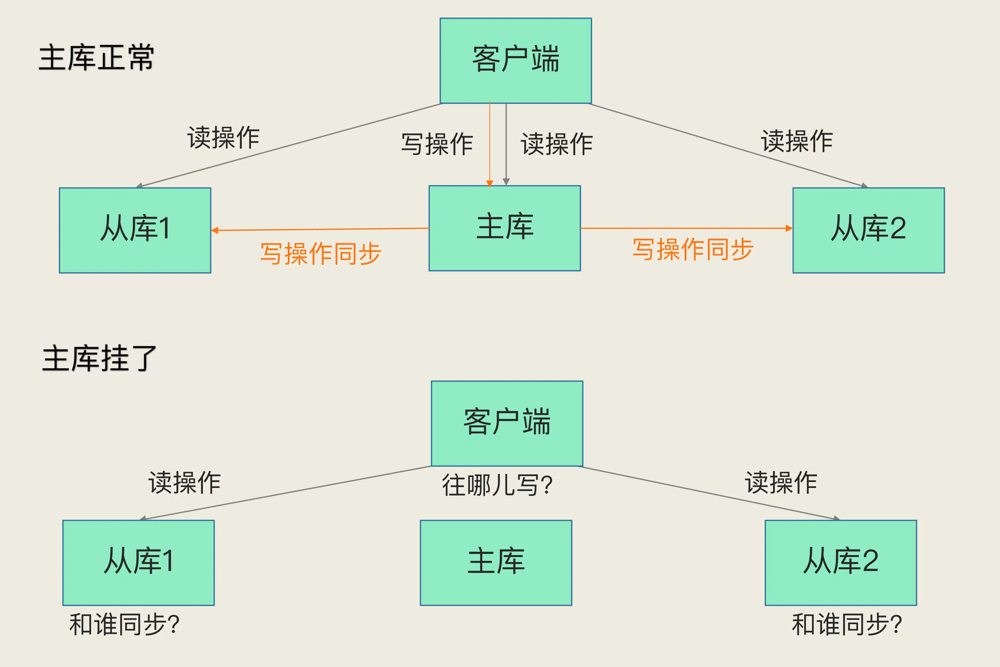
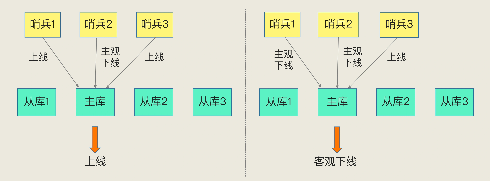
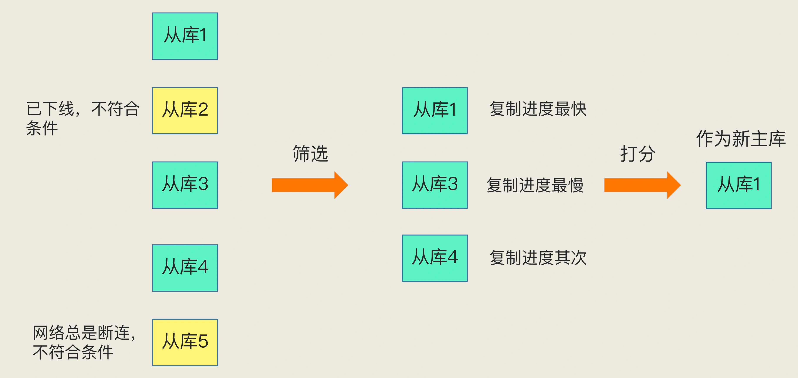
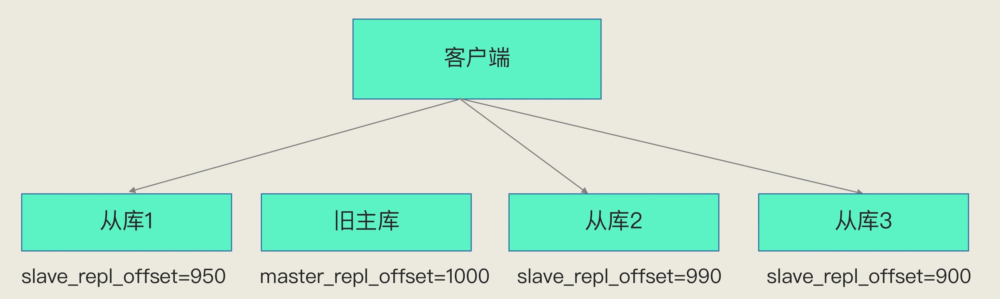

##临界知识
哨兵集群与redis主库从库沟通方式
健康监控ping
下线可信度评估(少数服从多数)
选举过程
切主达成共识
选举后无感知业务恢复
##主库宕机恢复方案

```asp
如何确定主库挂了
该选择哪个从库作为主库？
怎么把新主库的相关信息通知给从库和客户端呢？
```
##哨兵集群
哨兵其实就是一个运行在特殊模式下的 Redis 进程，主从库实例运行的同时，它也在运行。哨兵主要负责的就是三个任务：监控、选主（选择主库）和通知。

##监控
```asp
监控是指哨兵进程在运行时，周期性地给所有的主从库发送 PING 命令，检测它们是否仍然在线运行。如果从库没有在规定时间内响应哨兵的 PING 命令，哨兵就会把它标记为“下线状态”；
同样，如果主库也没有在规定时间内响应哨兵的 PING 命令，哨兵就会判定主库下线，然后开始自动切换主库的流程。
```
###下线时降低误判率(少数服从多数)
主观下线、客观下线,少数服从多数
```asp
哨兵机制也是类似的，它通常会采用多实例组成的集群模式进行部署，这也被称为哨兵集群。引入多个哨兵实例一起来判断，就可以避免单个哨兵因为自身网络状况不好，
而误判主库下线的情况。同时，多个哨兵的网络同时不稳定的概率较小，由它们一起做决策，误判率也能降低。

“客观下线”的标准就是，当有 N 个哨兵实例时，最好要有 N/2 + 1 个实例判断主库为“主观下线”，才能最终判定主库为“客观下线”。这样一来，
就可以减少误判的概率，也能避免误判带来的无谓的主从库切换。
```

##选举新主库

除了要检查从库的当前在线状态，还要判断它之前的网络连接状态
从库优先级、从库复制进度以及从库 ID 号
它的 slave_repl_offset 需要最接近 master_repl_offset。如果在所有从库中，有从库的 slave_repl_offset 最接近 master_repl_offset，那么它的得分就最高，可以作为新主库。

##通知
##新主库上线如何做到业务无感知
```asp
客户端能否正常地进行请求操作呢？如果想要应用程序不感知服务的中断，还需要哨兵或需要客户端再做些什么吗?
```
```asp
如果客户端使用了读写分离，那么读请求可以在从库上正常执行，不会受到影响。但是由于此时主库已经挂了，而且哨兵还没有选出新的主库，
所以在这期间写请求会失败，失败持续的时间 = 哨兵切换主从的时间 + 客户端感知到新主库 的时间。

如果不想让业务感知到异常，客户端只能把写失败的请求先缓存起来或写入消息队列中间件中，等哨兵切换完主从后，再把这些写请求发给新的主库，
但这种场景只适合对写入请求返回值不敏感的业务，而且还需要业务层做适配，另外主从切换时间过长，也会导致客户端或消息队列中间件缓存写请求过多，
切换完成之后重放这些请求的时间变长。
```
##哨兵达到一致共识
##哨兵集群有实例挂了
##哨兵执行新主库切换
