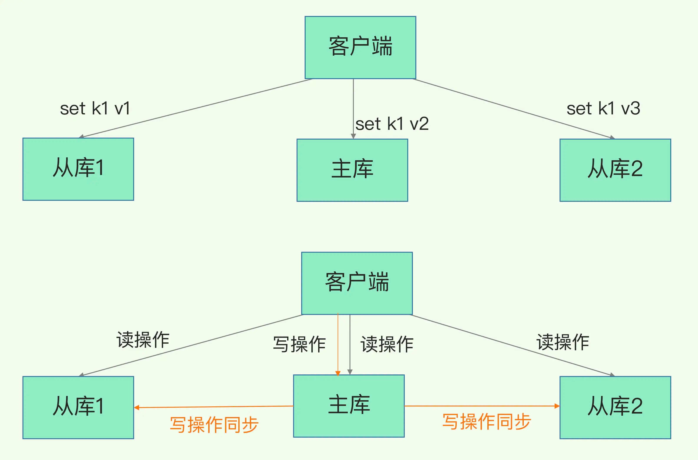
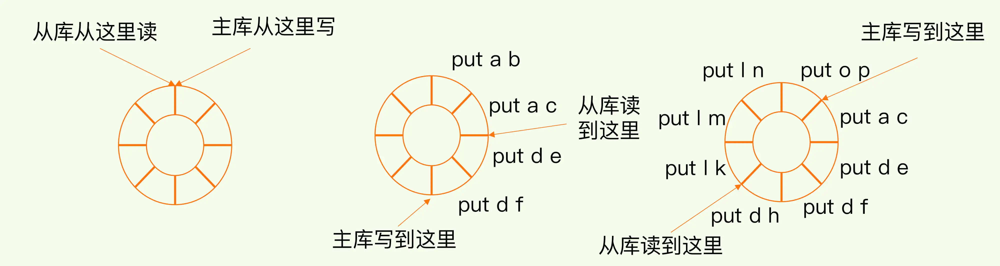

##临界知识
可用性:数据持久化,数据可用性
数据可用性:冗余备份
数据冗余架构模型:主从
读写分离原因
主从数据同步过程,RBD同步,repl_backlog_buffer缓存增量同步
数据一致性需求
扩展性架构:分片集群
网络分区:脑裂
环形数组
fork子进程cpu密集操作
##redis可用性
数据少丢失,使用持久化方案
数据可用性,使用冗余备份方案
##主从模式

###读写分离原因,基于读:写=8:2
读操作：主库、从库都可以接收；
写操作：首先到主库执行，然后，主库将写操作同步给从库。

```asp
不管是主库还是从库，都能接收客户端的写操作，那么，一个直接的问题就是：如果客户端对同一个数据（例如 k1）前后修改了三次，
每一次的修改请求都发送到不同的实例上，在不同的实例上执行，那么，这个数据在这三个实例上的副本就不一致了（分别是 v1、v2 和 v3）。
在读取这个数据的时候，就可能读取到旧的值

如果我们非要保持这个数据在三个实例上一致，就要涉及到加锁、实例间协商是否完成修改等一系列操作，但这会带来巨额的开销，当然是不太能接受的。
```
```asp
而主从库模式一旦采用了读写分离，所有数据的修改只会在主库上进行，不用协调三个实例。主库有了最新的数据后，会同步给从库，这样，主从库的数据就是一致的
```
###主从全量同步过程

FULLRESYNC
CONTINUE


###主从从模式分压主库
```asp
主库需要扫描内存生成RDB,然后传输RDB
主库忙于 fork 子进程生成 RDB 文件，进行数据全量同步。fork 这个操作会阻塞主线程处理正常请求，从而导致主库响应应用程序的请求速度变慢。
此外，传输 RDB 文件也会占用主库的网络带宽，同样会给主库的资源使用带来压力。

```
可以手动选择一个从库（比如选择内存资源配置较高的从库），用于级联其他的从库。然后，我们可以再选择一些从库（例如三分之一的从库），
在这些从库上执行如下命令，让它们和刚才所选的从库，建立起主从关系


###主从增量同步过程
一旦主从库完成了全量复制，它们之间就会一直维护一个网络连接，主库会通过这个连接将后续陆续收到的命令操作再同步给从库，
这个过程也称为基于长连接的命令传播，可以避免频繁建立连接的开销
####网络断连或阻塞
增量复制时，主从库之间具体是怎么保持同步的呢？这里的奥妙就在于 repl_backlog_buffer 这个缓冲区  
repl_backlog_buffer 是一个环形缓冲区，主库会记录自己写到的位置，从库则会记录自己已经读到的位置
对主库来说，对应的偏移量就是 master_repl_offset。主库接收的新写操作越多，这个值就会越大  
同样，从库在复制完写操作命令后，它在缓冲区中的读位置也开始逐步偏移刚才的起始位置，此时，从库已复制的偏移量 slave_repl_offset 也在不断增加。正常情况下，这两个偏移量基本相等。

主从库的连接恢复之后，从库首先会给主库发送 psync 命令，并把自己当前的 slave_repl_offset 发给主库，主库会判断自己的 master_repl_offset 和 slave_repl_offset 之间的差距。
在网络断连阶段，主库可能会收到新的写操作命令，所以，一般来说，master_repl_offset 会大于 slave_repl_offset。此时，主库只用把 master_repl_offset 和 slave_repl_offset 之间的命令操作同步给从库就行。

