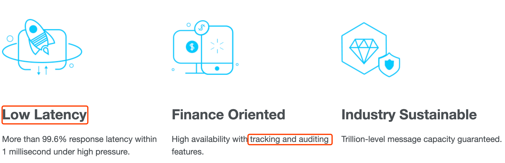

#临界知识
查看官网定位
[](https://kafka.apache.org/)

[](https://rocketmq.apache.org/)

#kafka vs rocketmq对比
##场景定位
```asp
Kafka给自己的定位是流处理平台

rocketmq给自己的定位是轻量级数据处理平台:
1.低延时(高压下1毫秒内响应延迟超过99.6%)
2.跟踪和审计功能的高可用性(金融导向)
3.批量传输与泛洪吞吐量的多功能集成
```
##技术实现
```asp
kafka:Batch 模式，为了海量日志场景
定位是流处理平台,批量写,批量读,消费性能强,吞吐高

租户
流式计算:https://github.com/apache/rocketmq-streams/blob/main/README-Chinese.md

kafka 节点都是主节点,只有分区有主从的概念,节点没有主从概念
topic的分区应该位于不同节点上,每个分区对应一个消费者
topic太多会变成随机写
topic的分区有多个主分区，位于不同broker,follow分区可以位于其他主分区的broker上
producer生产消息到主分区,消费者去主分区消费
不同topic写入不同文件
broker向zookeeper注册
支持同步异步ack
支持广播,集群方式
支持全局有序,部分有序
```

```asp
rocketmq:
金融领域,写性能强,读性能差

rocketmq节点有主从概念,多个主,只有主可用,
一个topic的多个队列(类似分区)可以放在同一个主上,多个消费者可以消费同一个主
topic可以很多,不受限,都写入一个文件
topic的队列可以在一个节点或者多个节点
producer生产消息到master,消费者可以去slave消费,可靠性保证(来源于所有topic写入同一个log)

nameserver:元数据管理,类似eureka,
每个broker向所有nameserver汇报
支持同步异步ack
支持广播,集群方式

支持tag,子主题tpoic
提供了properties<k,v>,topic,tag,实现RPC,request-reply
支持全局有序,部分有序
```
##低延时
```asp
kafka批处理,需要一定延时
Kafka使用短轮询方式，实时性取决于轮询间隔时间
```
```asp
rocketmq低延时原理
RocketMQ使用长轮询，同Push方式实时性一致，消息的投递延时通常在几个毫秒
```
[](https://juejin.cn/post/6844904131514073102#heading-7)
##高可用
```asp
kafka使用zookeeper
```
```asp
rocketmq使用nameserver
```
##高可靠
```asp
rocket
```
##金融属性
```asp
kafka不支持定时任务
Kafka不支持消息查询
Kafka不支持Broker端的消息过滤
kafka不支持事务消息
kafka没有重试队列，死信队列
```
```asp
rocketmq:High availability with tracking and auditing features.
rocketmq提供顺序、延迟、定时、重投、死信、事务消息、会话消息等功能，可以更好地适配电商、金融等多样的业务场景
RocketMQ支持定时消息
RocketMQ支持根据Message Id查询消息，也支持根据消息内容查询消息
rocketmq支持事务消息
rocketmq支持消息轨迹,[消息轨迹]
rocketmq高可用的跟踪和审计
RocketMQ支持Broker端消息过滤方式,根据Message Tag来过滤，相当于子topic概念
重试队列，死信队列
```
[消息轨迹,官网中文文档 msg_trace](https://miludeer.github.io/2019/06/30/source-note-rocket-mq-message-trace/)
##吞吐
##事务性
[kafka事务 VS rocketmq事务](https://juejin.cn/post/6867040340797292558#heading-6)
```asp
kafka事务
```
```asp
rocketmq事务
```

##EOS恰好一次

##生态
rocketmq

[](https://www.cnblogs.com/arthinking/p/15590677.html?hmsr=joyk.com&utm_source=joyk.com&utm_medium=referral)

##相关技术
dubbo,zk,tfs,nacos,euraka,


#kafka vs pulsar对比
