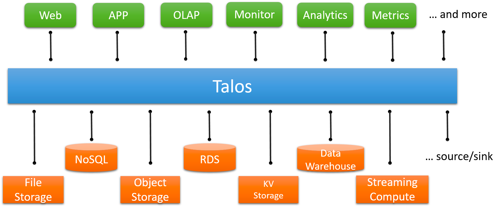

#临界知识
存储与计算分离
#talos
流式数据平台

存储计算分离

/27%E4%B8%A8Pulsar%E7%9A%84%E5%AD%98%E5%82%A8%E8%AE%A1%E7%AE%97%E5%88%86%E7%A6%BB%E8%AE%BE%E8%AE%A1%EF%BC%9A%E5%85%A8%E6%96%B0%E7%9A%84%E6%B6%88%E6%81%AF%E9%98%9F%E5%88%97%E8%AE%BE%E8%AE%A1%E6%80%9D%E8%B7%AF.html)

