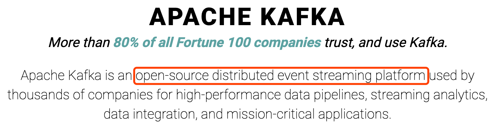
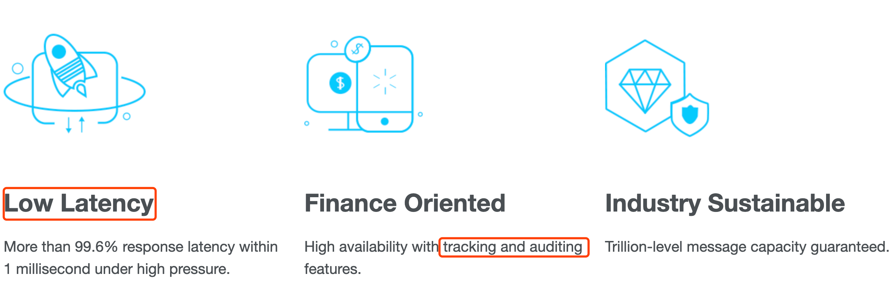
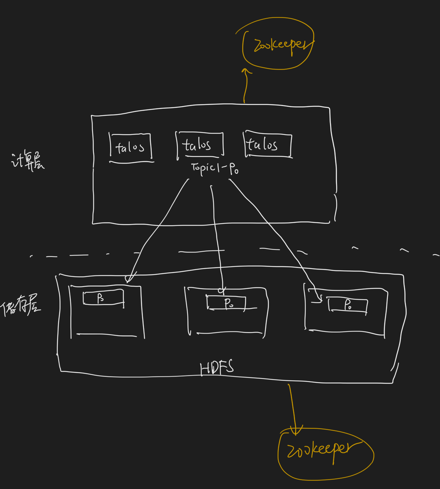
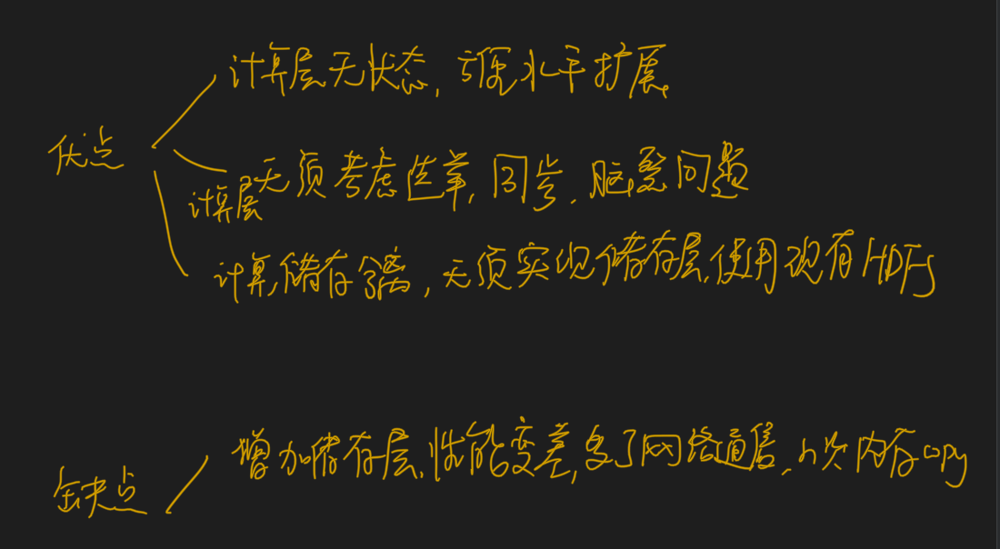
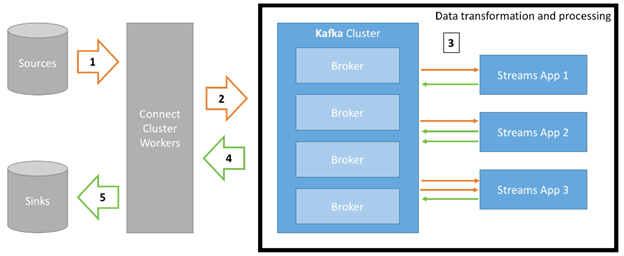
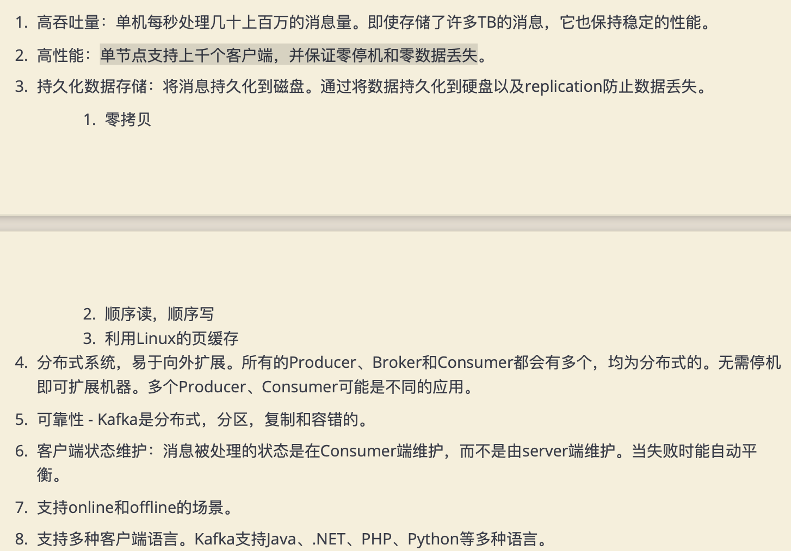
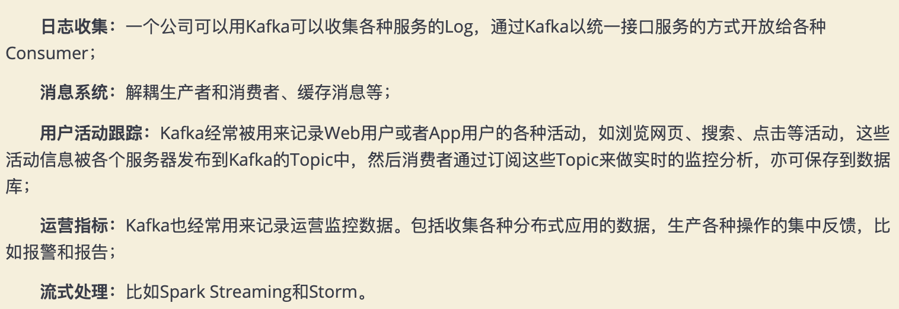
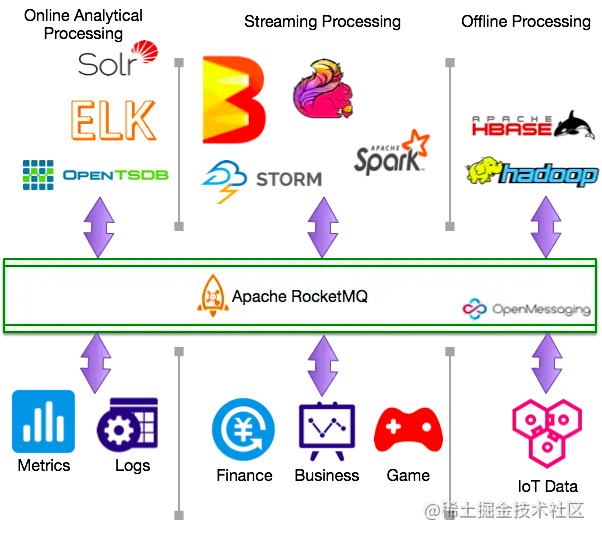
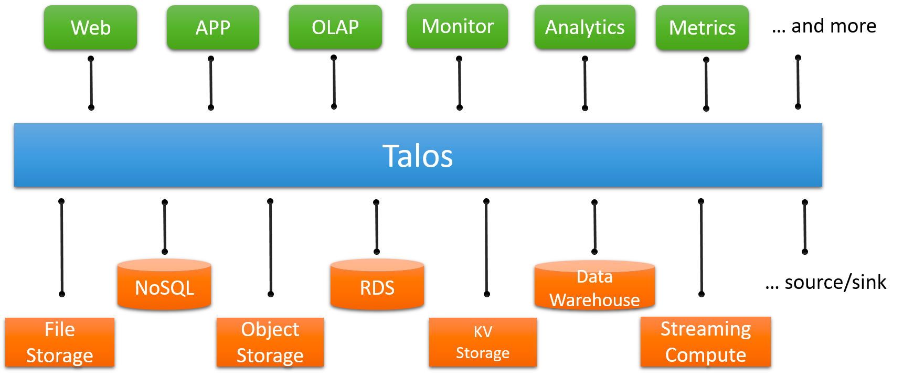

#临界知识
查看官网定位
[](https://kafka.apache.org/)

[](https://rocketmq.apache.org/)

[](https://segmentfault.com/a/1190000019547121)

存储与计算分离


[湖仓一体](https://www.aliyun.com/activity/bigdata/maxcompute-lakehouse)
[湖仓一体](https://zhuanlan.zhihu.com/p/298428529)

#定位(流处理平台)

[](https://www.cnblogs.com/zackstang/p/11522194.html)
[](https://github.com/apache/kafka/blob/1.0/streams/examples/src/main/java/org/apache/kafka/streams/examples/temperature/TemperatureDemo.java)


#kafka vs rocketmq对比
##场景定位
```asp
Kafka给自己的定位是流处理平台

rocketmq给自己的定位是轻量级数据处理平台:
1.低延时(高压下1毫秒内响应延迟超过99.6%)
2.跟踪和审计功能的高可用性(金融导向)
3.批量传输与泛洪吞吐量的多功能集成
```
##技术实现
```asp
kafka:Batch 模式，为了海量日志场景
定位是流处理平台,批量写,批量读,消费性能强,吞吐高

租户
流式计算:https://github.com/apache/rocketmq-streams/blob/main/README-Chinese.md

kafka 节点都是主节点,只有分区有主从的概念,节点没有主从概念
topic的分区应该位于不同节点上,每个分区对应一个消费者
topic太多会变成随机写
topic的分区有多个主分区，位于不同broker,follow分区可以位于其他主分区的broker上
producer生产消息到主分区,消费者去主分区消费
不同topic写入不同文件
broker向zookeeper注册
支持同步异步ack
支持广播,集群方式
支持全局有序,部分有序
```

```asp
rocketmq:
金融领域,写性能强,读性能差

rocketmq节点有主从概念,多个主,只有主可用,
一个topic的多个队列(类似分区)可以放在同一个主上,多个消费者可以消费同一个主
topic可以很多,不受限,都写入一个文件
topic的队列可以在一个节点或者多个节点
producer生产消息到master,消费者可以去slave消费,可靠性保证(来源于所有topic写入同一个log)

nameserver:元数据管理,类似eureka,
每个broker向所有nameserver汇报
支持同步异步ack
支持广播,集群方式

支持tag,子主题tpoic
提供了properties<k,v>,topic,tag,实现RPC,request-reply
支持全局有序,部分有序
```
##低延时
```asp
kafka批处理,需要一定延时
Kafka使用短轮询方式，实时性取决于轮询间隔时间
```
```asp
rocketmq低延时原理
RocketMQ使用长轮询，同Push方式实时性一致，消息的投递延时通常在几个毫秒
```
[](https://juejin.cn/post/6844904131514073102#heading-7)
##高可用
```asp
kafka使用zookeeper
```
```asp
rocketmq使用nameserver
```
##高可靠
```asp
rocket
```
##金融属性
```asp
kafka不支持定时任务
Kafka不支持消息查询
Kafka不支持Broker端的消息过滤
kafka不支持事务消息
kafka没有重试队列，死信队列
```
```asp
rocketmq:High availability with tracking and auditing features.
rocketmq提供顺序、延迟、定时、重投、死信、事务消息、会话消息等功能，可以更好地适配电商、金融等多样的业务场景
RocketMQ支持定时消息
RocketMQ支持根据Message Id查询消息，也支持根据消息内容查询消息
rocketmq支持事务消息
rocketmq支持消息轨迹,[消息轨迹]
rocketmq高可用的跟踪和审计
RocketMQ支持Broker端消息过滤方式,根据Message Tag来过滤，相当于子topic概念
重试队列，死信队列
```
[](https://help.aliyun.com/document_detail/43357.html)
##吞吐
##事务性
[kafka事务 VS rocketmq事务](https://juejin.cn/post/6867040340797292558#heading-6)
```asp
kafka事务
```
```asp
rocketmq事务
```

##EOS恰好一次

##生态
rocketmq

[](https://www.cnblogs.com/arthinking/p/15590677.html?hmsr=joyk.com&utm_source=joyk.com&utm_medium=referral)

##相关技术
dubbo,zk,tfs,nacos,euraka,


#kafka vs pulsar对比

#talos(pulsar存储计算分离)
流式数据平台


[](https://cloud.mioffice.cn/#/product/community/article/detail?id=84&_k=67ham8)
[](https://xiaomi.f.mioffice.cn/file/boxk4qnRto9mos6s4MnLWfZrWLd)

[](https://www.kancloud.cn/kancloud/log-real-time-datas-unifying/58708)

[](https://time.geekbang.org/column/article/140913)
##优点
1.存储节点只负责数据存储，而计算节点只负责计算，也就是执行业务逻辑。这样一种设计，称为存储计算分离。存储计算分离设计并不新鲜，它的应用其实是非常广泛的
2.所有的大数据系统，包括 Map Reduce 这种传统的批量计算，和现在比较流行的 Spark、Flink 这种流计算，它们都采用的存储计算分离设计。数据保存在 HDFS 中，
也就是说 HDFS 负责存储，而负责计算的节点，无论是用 YARN 调度还是 Kubernetes 调度，都只负责“读取 - 计算 - 写入”这样一种通用的计算逻辑，不保存任何数据
我们每天都在开发的各种 Web 应用和微服务应用，绝大多数也采用的是存储计算分离的设计。数据保存在数据库中，微服务节点只负责响应请求，执行业务逻辑。
也就是说，数据库负责存储，微服务节点负责计算
3.节点就变成了无状态的（Stateless）节点。一个由无状态节点组成的集群，管理、调度都变得非常简单了。集群中每个节点都是一样的，天然就支持水平扩展。
任意一个请求都可以路由到集群中任意一个节点上，负载均衡策略可以做得非常灵活，可以随机分配，可以轮询，也可以根据节点负载动态分配等等。
故障转移（Failover）也更加简单快速，如果某个节点故障了，直接把请求分配给其他节点就可以了。

##缺点
1.ZooKeeper 这样存储计算不分离的系统，它们的故障转移就非常麻烦，一般需要用复杂的选举算法，选出新的 leader，提供服务之前，可能还需要进行数据同步，
确保新的节点上的数据和故障节点是完全一致之后，才可以继续提供服务。这个过程是非常复杂而且漫长的。
2.依然要解决数据一致性、节点故障转移、选举、数据复制等等这些问题。并且，存储计算分离之后，原来一个集群变成了两个集群，整个系统其实变得更加复杂
3.存储计算分离之后，系统的性能也会有一些损失。比如，从 Pulsar 的 Broker 上消费一条消息，Broker 还需要去请求 BookKeeper 集群读取数据，
然后返回给客户端，这个过程至少增加了一次网络传输和 n 次内存拷贝。相比于直接读本地磁盘，性能肯定是要差一些的。
