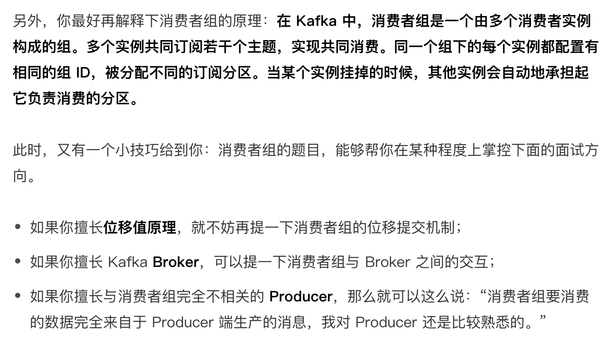
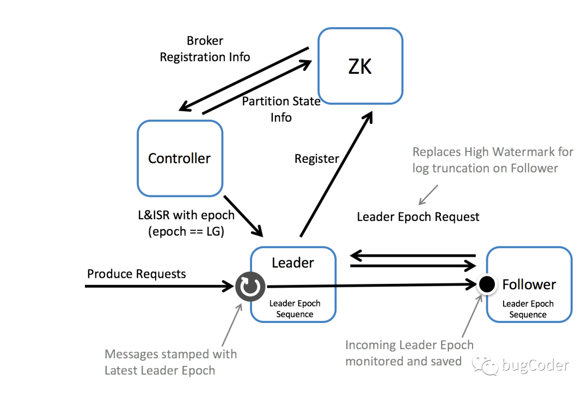
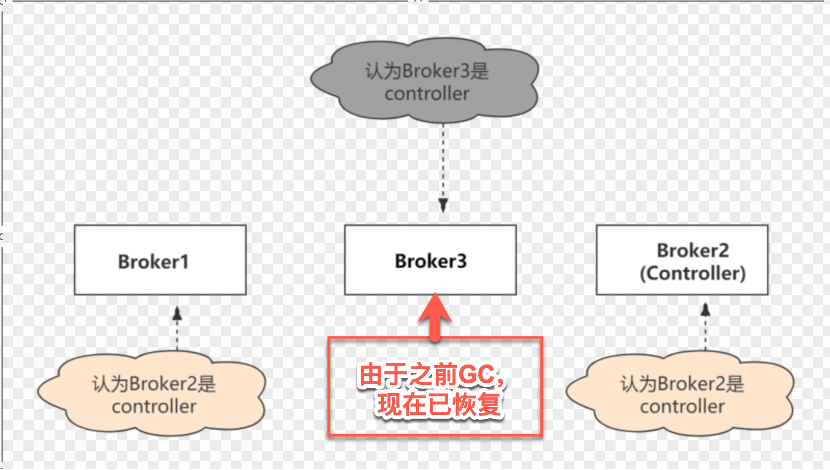
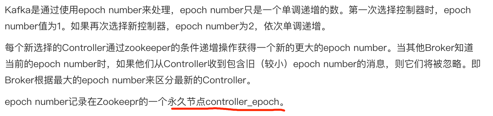

#临界知识
是什么->定位问题
[](https://github.com/Snailclimb/JavaGuide/blob/main/docs/high-performance/message-queue/kafka%E7%9F%A5%E8%AF%86%E7%82%B9&%E9%9D%A2%E8%AF%95%E9%A2%98%E6%80%BB%E7%BB%93.md)
#Kafka 是什么(定位问题)?主要应用场景有哪些？
kafka是消息引擎系统，也是[分布式流处理平台](https://blog.csdn.net/weixin_48185778/article/details/111321994?ops_request_misc=&request_id=&biz_id=102&utm_term=kafka%2520stream%25E4%25B8%258Econsumer&utm_medium=distribute.pc_search_result.none-task-blog-2~all~sobaiduweb~default-2-111321994.first_rank_v2_pc_rank_v29#11_Kafka_Stream_6)
LinkedIn 最开始有强烈的数据强实时处理方面的需求，其内部的诸多子系统要执行多种类型的数据处理与分析，
主要包括业务系统和应用程序性能监控，以及用户行为数据处理等
Kafka 系统的写性能很强
```asp
提供一套 API 实现生产者和消费者；
降低网络传输和磁盘存储开销；
实现高伸缩性架构
```
#什么是消费者组？
官网上的介绍言简意赅，即消费者组是 Kafka 提供的可扩展且具有容错性的消费者机制。

#Kafka的优势在哪里？
#kafka为什么是主读主写?
[](https://time.geekbang.org/column/article/246934)
#kafka中如何实现端到端的Exactly Once
#kafka的事务
#项目中的问题
##公司kafka吞吐
单机百万消息/s
单个broker可以轻松处 理数千个分区以及每秒百万级的消息量
##公司的生产者消费者比例
##公司生产者配置
##项目中怎么配置的kafka消费者提交方式?
##flink中kafka ack配置?
##flink消费者拉取时间间隔?
#kafka为啥快?
Kafka速度快是因为:
1. partition顺序读写，充分利用磁盘特性，这是基础;
2. Producer生产的数据持久化到broker，采用mmap文件映射，实现顺序的快速写入;
3. Customer从broker读取数据，采用sendfile，将磁盘文件读到OS内核缓冲区后，直接转到socket buffer进
行网络发送。
4. 生产者批量写,使用压缩算法gzip,消费端批量读,解压
#kafka默认分区策略
生产者消息:轮询
消费者rebalance:范围除法
#如何确定需要多少分区?
计算TPS,峰值,压测生产者消费者TPS,
TPS/生产者TPS=生产者个数
TPS/消费者TPS=消费者个数
#使用kfaka实现延时队列&重试队列?
新增延时队列topic
新增重试队列topic
#Kafka 为什么不像 Redis 和 MySQL 那样支持读写分离？
[](https://time.geekbang.org/column/article/222085)
#一致性保证(hw->epoch)
#kafka怎么选举的?
[](https://blog.51cto.com/u_15127573/2899602)
##controller选举
##分区选举
ISR中随机选一个
显然通过ISR，kafka需要的冗余度较低，可以容忍的失败数比较高。假设某个topic有f+1个副本，kafka可以容忍f个服务器不可用。
#kafka如何分区的?
[](https://blog.csdn.net/lizhitao/article/details/41778193)
#kafka同步原理(epoch变更完成截断的一致性,不丢失)
[](https://mp.weixin.qq.com/s?__biz=MjM5NzgyODc1Mw==&mid=2647754415&idx=1&sn=3dd59403fb1391a41d3f024f17cba7e3&chksm=bef127518986ae47f8382c8a171591345bd84ef96fbff4523b373728b79d0f3c953fbd471b9f&token=647212035&lang=zh_CN#rd)

[LeaderEpoch => StartOffset]
follower副本会从leader副本所有的Leader Epoch向量集合中获取一个合适的leader epoch，用来截断那些在leader副本中不存在的数据。
领导者副本可以根据Leader Epoch有效的告诉追随者副本需要截断到哪个偏移量。
```asp
Leader Epoch:一个32位单调递增的数字，代表每一个Leader副本时代，存储于每一条消息。
Leader Epoch Start Offset:每一个Leader副本时代的第一条消息的位移。

Leader Epoch Sequence File: 一个序列文件，每一个Leader副本时代，Leader Epoch Start Offset的变化记录存储在改文件中。

Leader Epoch Request: follower副本通过该请求获取Leader副本的第一条消息的位移，如果Leader副本所在分区不存在序列文件，获取的是Leader副本的Log End Offset。
```
#zookeeper导致的kafka controller脑裂,羊群,过载?
##脑裂(无多数机制,仅凭zookeeper心跳判断,epoch区分新老controller)


[](https://cloud.tencent.com/developer/news/863931)
```asp
如果Controller所在的Broker故障，Kafka集群必须有新的Controller，否则集群将无法正常工作。这儿存在一个问题。很难确定Broker是宕机还是只是暂时的故障。
但是，为了使集群正常运行，必须选择新的Controller。如果之前更换的Controller又正常了，不知道自己已经更换了，那么集群中就会出现两个Controller。

其实这种情况是很容易发生的。例如，由于垃圾回收（GC），一个Controller被认为是死的，并选择了一个新的控制器。
在GC的情况下，在原Controller眼里没有任何变化，Broker甚至不知道自己已经被暂停了。因此，它将继续充当当前Controller，这在分布式系统中很常见，称为裂脑。
```
##羊群(一个目录竞争)
zookeeper中,controller选举、分区选举都竞争一个目录
##过载
所有分区的offset提交都是通过zookeeper
