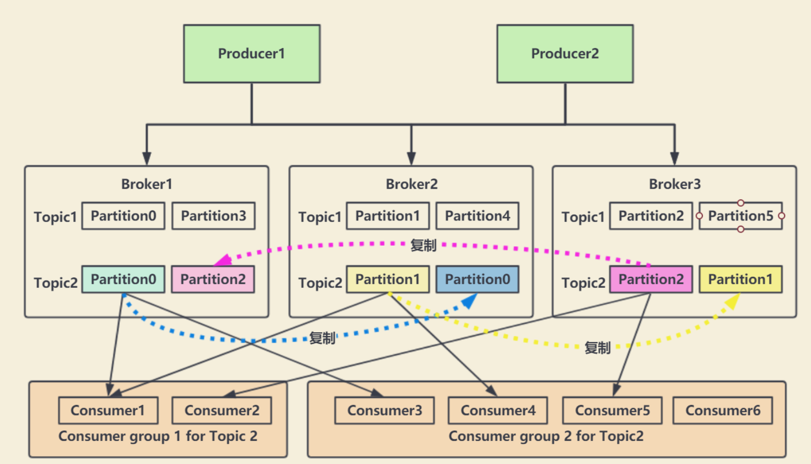
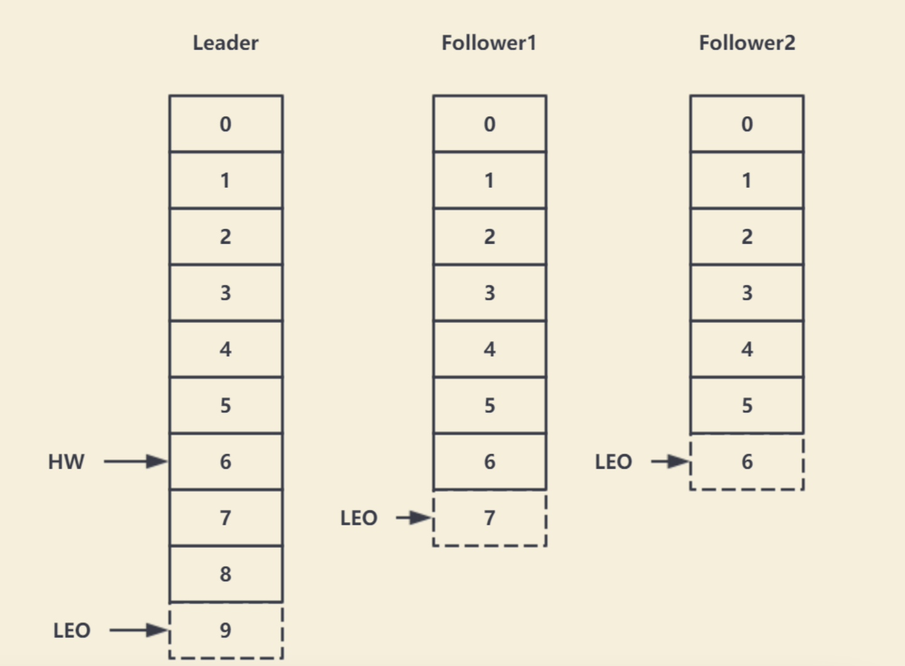
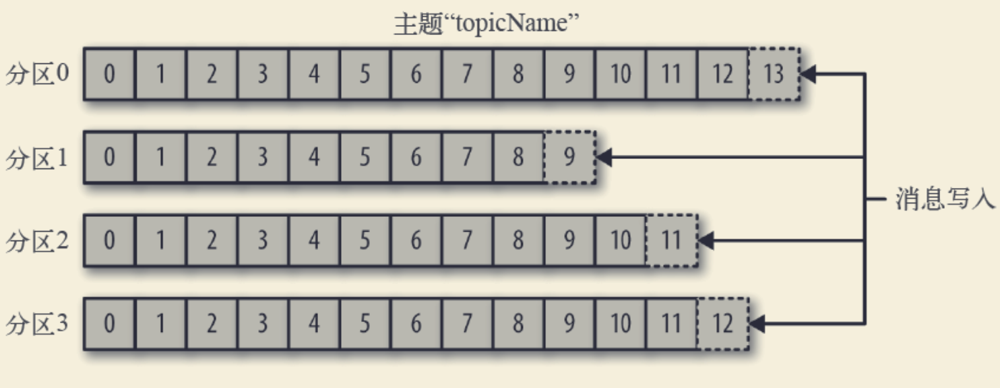
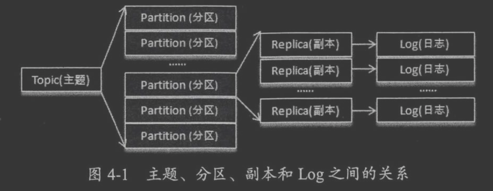
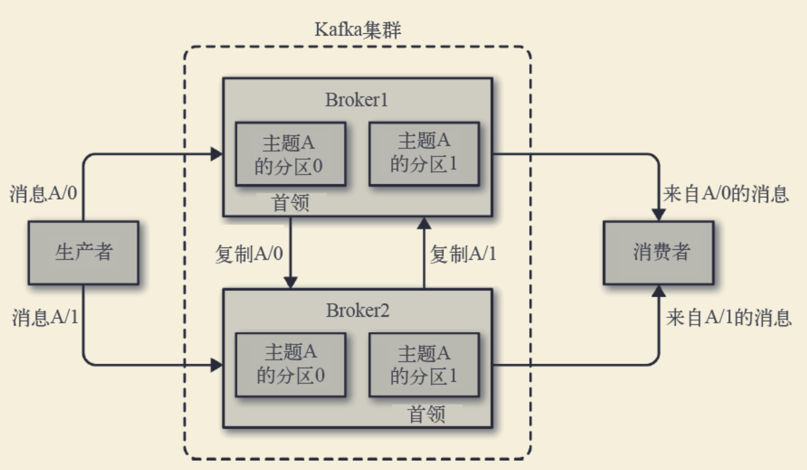
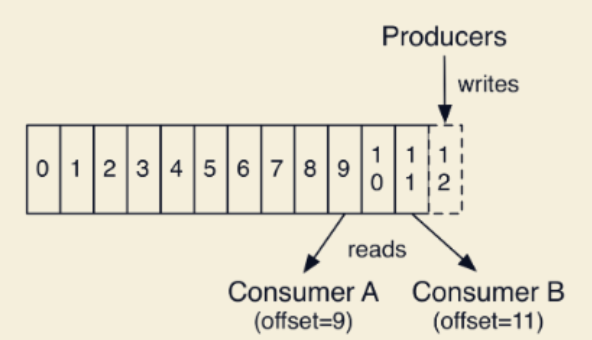
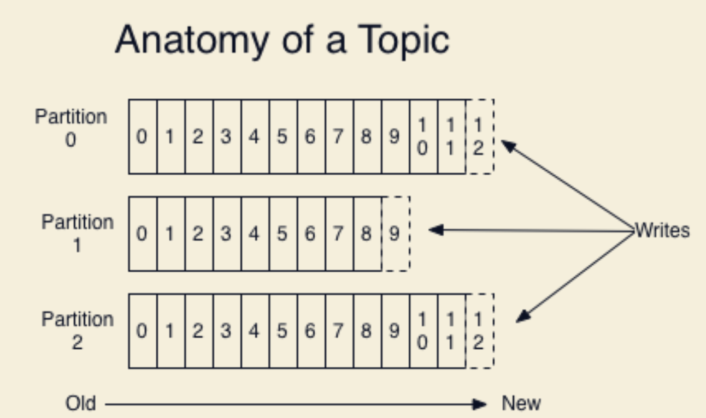
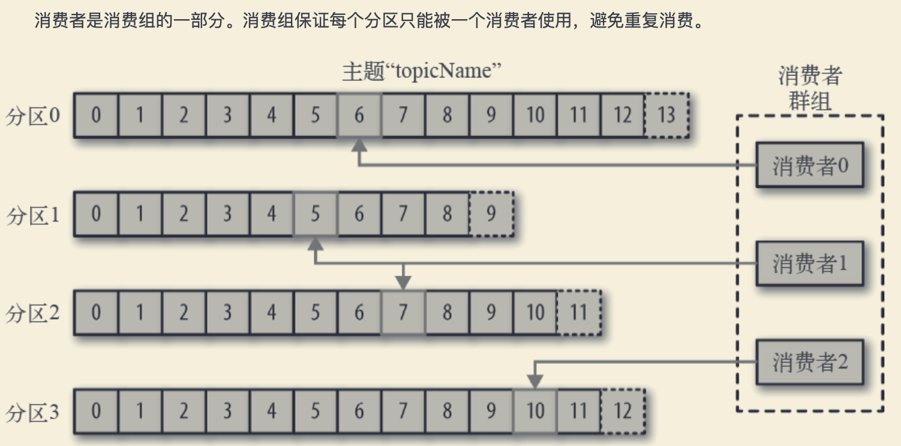
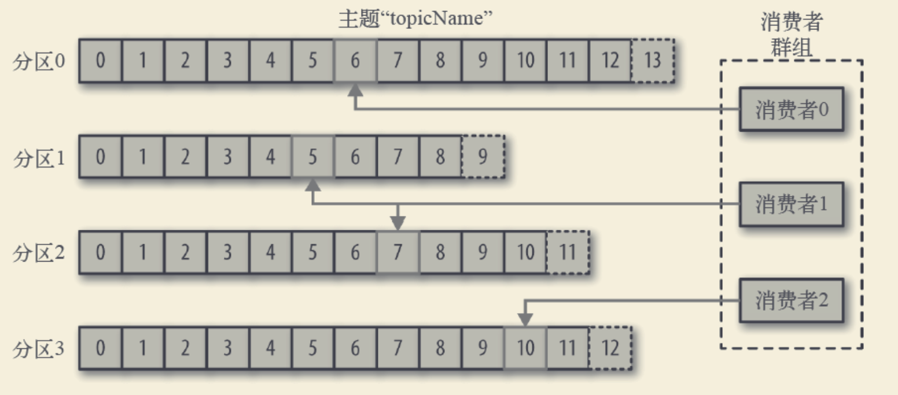
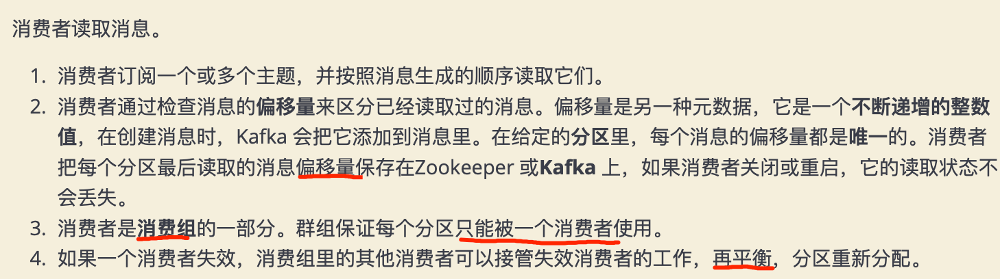

#拓扑

#领域术语
##AR=ISR+OSR
分区中的所有副本统称为AR(Assigned Repllicas)。
###ISR

所有与leader副本保持一定程度同步的副本(包括Leader)组成ISR(In-Sync Replicas)，ISR集合是AR集合中 的一个子集。消息会先发送到leader副本，
然后follower副本才能从leader副本中拉取消息进行同步，同步期间内 follower副本相对于leader副本而言会有一定程度的滞后。前面所说的“一定程度”是指可以忍受的滞后范围，
这个范围 可以通过参数进行配置。

###OSR
与leader副本同步滞后过多的副本(不包括leader)副本，组成OSR(Out-Sync Relipcas)。在正常情况下，所有 的follower副本都应该与leader副本保持一定程度的同步，
即AR=ISR,OSR集合为空。
##HW

HW是High Watermak的缩写， 俗称高水位，它表示了一个特定消息的偏移量(offset)，消费之只能拉取到这 个offset之前的消息。
##LEO
LEO是Log End Offset的缩写，它表示了当前日志文件中下一条待写入消息的offset。
#Zookeeper
#broker(controller)
```asp
broker 为消费者提供服务，对读取分区的请求作出响应，返回已经提交到磁盘上的消息。
1. 如果某topic有N个partition，集群有N个broker，那么每个broker存储该topic的一个partition。
2. 如果某topic有N个partition，集群有(N+M)个broker，那么其中有N个broker存储该topic的一个partition，
剩下的M个broker不存储该topic的partition数据。
3. 如果某topic有N个partition，集群中broker数目少于N个，那么一个broker存储该topic的一个或多个
partition。在实际生产环境中，尽量避免这种情况的发生，这种情况容易导致Kafka集群数据不均衡。
```
##controller
每个集群都有一个broker是集群控制器(自动从集群的活跃成员中选举出来)
控制器负责管理工作，包括将分区分配给broker 和监控broker。
#topic 、partition(分区)、replication(副本因子)
[深入理解kafka]


可伸缩性,水平扩展,多副本冗余扩展
分区多个副本
Kafka集群中按照主题分类管理，一个主题可以有多个分区，一个分区可以有多个副本分区
##partition(分区)

每个集群都有一个broker是集群控制器(自动从集群的活跃成员中选举出来)。 控制器负责管理工作:
将分区分配给broker 监控broker
集群中一个分区属于一个broker，该broker称为分区首领。 一个分区可以分配给多个broker，此时会发生分区复制。 
分区的复制提供了消息冗余，高可用。副本分区不负责处理消息的读写
```asp
1. 主题可以被分为若干个分区，一个分区就是一个提交日志。
2. 消息以追加的方式写入分区，然后以先入先出的顺序读取。
3. 无法在整个主题范围内保证消息的顺序，但可以保证消息在单个分区内的顺序。 4. Kafka 通过分区来实现数据冗余和伸缩性。
5. 在需要严格保证消息的消费顺序的场景下，需要将partition数目设为1。
```
###leader 分区
leader 处理 partition 的所有读写请求
###follower
期地去复制leader上的数据
###offset


1.消息写入的时候，每一个分区都有一个offset，这个offset就是生产者的offset，同时也是这个分区的最新最大的 offset。
2.这是某一个分区的offset情况，生产者写入的offset是最新最大的值是12，而当Consumer A进行消费时，从0开 始消费，一直消费到了9，
消费者的offset就记录在9，Consumer B就纪录在了11。等下一次他们再来消费时，他们可 以选择接着上一次的位置消费，当然也可以选择从头消费，
或者跳到最近的记录并从“现在”开始消费
###segment

#生产者
生产者在默认情况下把消息均衡地分布到主题的所有分区上:
1. 直接指定消息的分区
2. 根据消息的key散列取模得出分区 
3. 轮询指定分区
#消费者(偏移量,rebalance)
消费者通过偏移量来区分已经读过的消息，从而消费消息



##consumer
##consumer group
#消息&批次(压缩)
每个记录由一个键，一个值和一个时间戳组成
为了提高效率，消息被分批写入Kafka。批次就是一组消息，这些消息属于同一个主题和分区。
  把消息分成批次可以减少网络开销。批次越大，单位时间内处理的消息就越多，单个消息的传输时间就越⻓。批
次数据会被压缩，这样可以提升数据的传输和存储能力，但是需要更多的计算处理。
#模式
