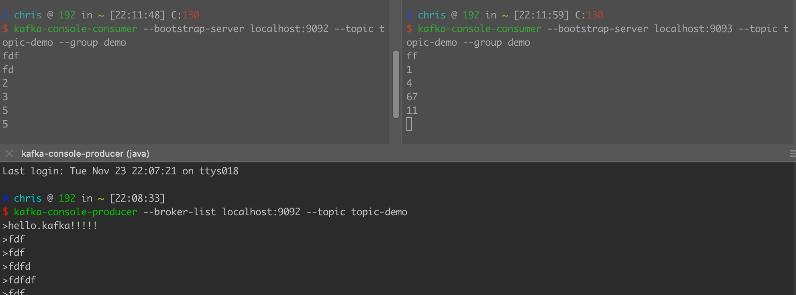

#kafka集群搭建
[](https://zhuanlan.zhihu.com/p/278252465)
[深入理解kafka 核心设计与实践原理1.2]
[/Users/chris/workspace/kafka-cluster]
```asp
3台broker,每台更改这些配置
broker.id=0
listeners=PLAINTEXT://localhost:9092
zookeeper.connect=localhost:2181,localhost:2182,localhost2183/kafka
log.dirs=/tmp/kafka-logs/broker0
```
```asp
zkCli
查看/kafka目录
[zk: localhost:2181(CONNECTED) 0] ls /kafka
[cluster, controller_epoch, controller, brokers, admin, isr_change_notification, consumers, log_dir_event_notification, latest_producer_id_block, config]
```
```asp
创建topic
kafka-topics --zookeeper localhost:2181/kafka --create --topic topic-demo --replication-factor 3 --partitions 3
查看topic分区
kafka-topics --zookeeper localhost:2181/kafka --describe --topic topic-demo

Topic:topic-demo	PartitionCount:3	ReplicationFactor:3	Configs:
	Topic: topic-demo	Partition: 0	Leader: 1	Replicas: 1,0,2	Isr: 1,0,2
	Topic: topic-demo	Partition: 1	Leader: 2	Replicas: 2,1,0	Isr: 2,1,0
	Topic: topic-demo	Partition: 2	Leader: 0	Replicas: 0,2,1	Isr: 0,2,1
```

```asp
kafka-console-consumer --bootstrap-server localhost:9092 --topic topic-demo --group demo
kafka-console-consumer --bootstrap-server localhost:9092 --topic topic-demo
```


#分区重分配
```asp
kafka-preferred-replica-election --zookeeper localhost:2181/kafka
```
#kafka性能测试
[深入理解kafka 4.4.1]
kafka-producer-perf-test --topic topic-demo2 --num-records 1000000 --record-size 1024 --throughput -1 --producer-props bootstrap.servers=localhost:9092  acks=1
```
46066 records sent, 9200.3 records/sec (8.98 MB/sec), 1881.6 ms avg latency, 2957.0 ms max latency.
113700 records sent, 22740.0 records/sec (22.21 MB/sec), 1342.3 ms avg latency, 2690.0 ms max latency.
104490 records sent, 20835.5 records/sec (20.35 MB/sec), 1231.0 ms avg latency, 3673.0 ms max latency.
76315 records sent, 15259.9 records/sec (14.90 MB/sec), 1781.0 ms avg latency, 5495.0 ms max latency.
69655 records sent, 13931.0 records/sec (13.60 MB/sec), 1876.1 ms avg latency, 6332.0 ms max latency.
78375 records sent, 15522.9 records/sec (15.16 MB/sec), 2016.5 ms avg latency, 6503.0 ms max latency.
98712 records sent, 19726.6 records/sec (19.26 MB/sec), 1769.5 ms avg latency, 6012.0 ms max latency.
90585 records sent, 18102.5 records/sec (17.68 MB/sec), 1644.9 ms avg latency, 5302.0 ms max latency.
123991 records sent, 24793.2 records/sec (24.21 MB/sec), 1361.6 ms avg latency, 5069.0 ms max latency.
138531 records sent, 27706.2 records/sec (27.06 MB/sec), 1184.3 ms avg latency, 3854.0 ms max latency.
1000000 records sent, 19118.996635 records/sec (18.67 MB/sec), 1546.53 ms avg latency, 6503.00 ms max latency, 699 ms 50th, 5561 ms 95th, 6300 ms 99th, 6456 ms 99.9th.
```

#查看kafka配置
zkCli
ls /kafka
[cluster, controller_epoch, controller, brokers, feature, admin, isr_change_notification, consumers, log_dir_event_notification, latest_producer_id_block, config]
