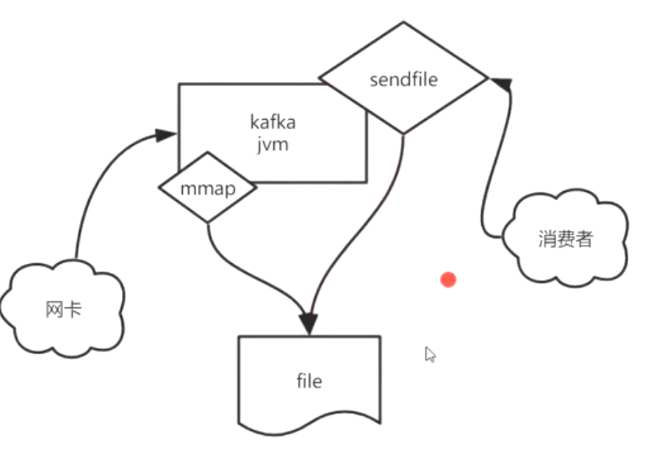

##临界知识
两层缓冲,磁盘/网卡->页缓存->应用缓存
kafka数据处理方式:mmap+sendfile
批处理:减少网络通信的耗时占比(redis pipeline,select io复用)
顺序读写:磁盘io=寻址+读写数据,减少寻址的占比

##零拷贝
kafka jvm消费队列:
文件->mmap内存映射->pagecache->sendfile->socket缓冲->消费者
##批处理
异步批量发送消息
##顺序读写磁盘io
