#临界知识
通信方式:同步,异步
负载均衡器,broker列表
kafka生产者分层:业务层->序列化层->分区->网络层
#流程(缓存,批次)
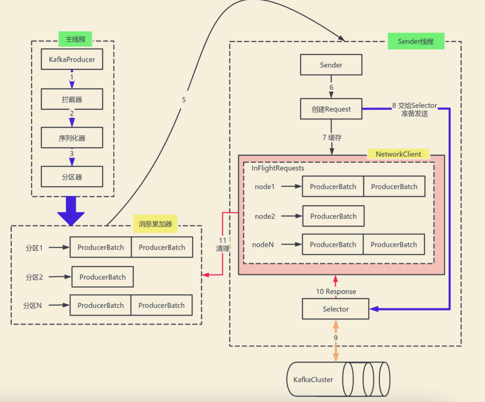
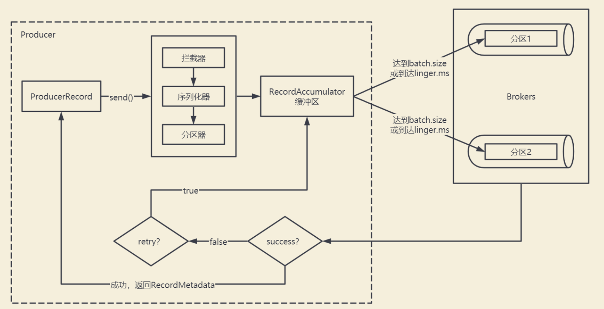

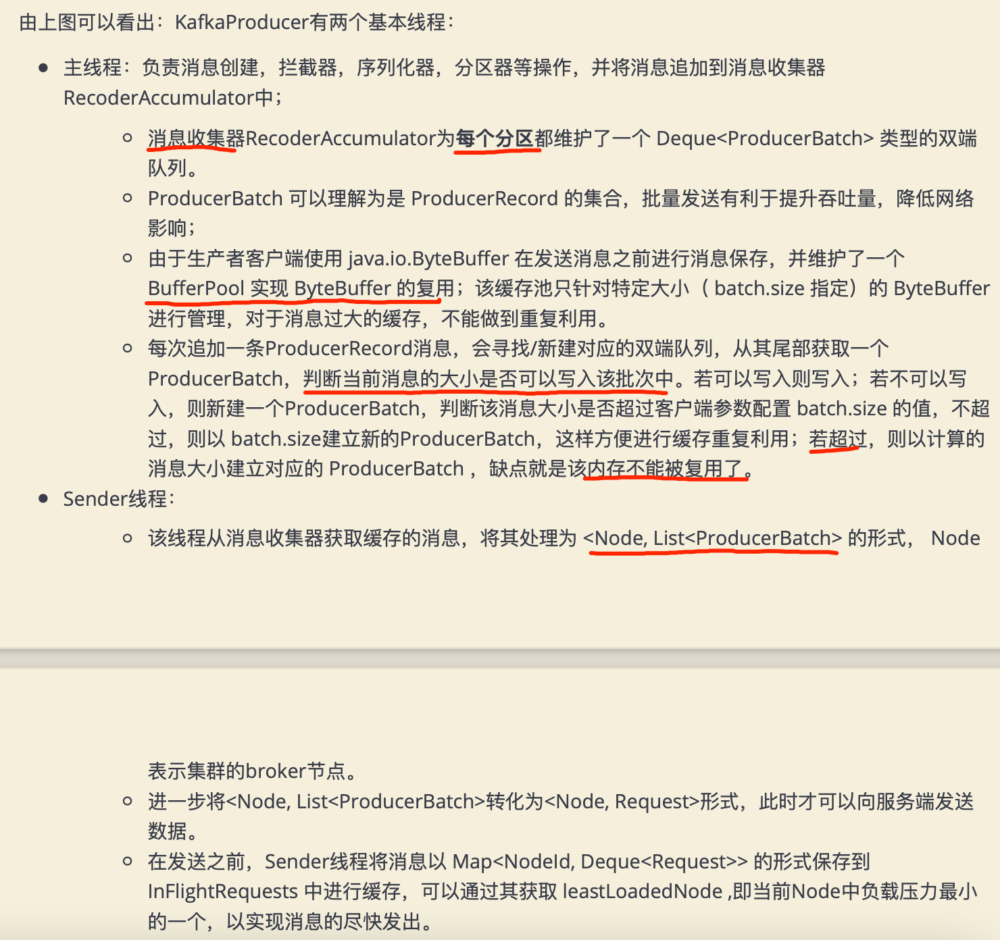
生产者主要的对象有: KafkaProducer ， ProducerRecord 。
其中 KafkaProducer 是用于发送消息的类， ProducerRecord 类用于封装Kafka的消息
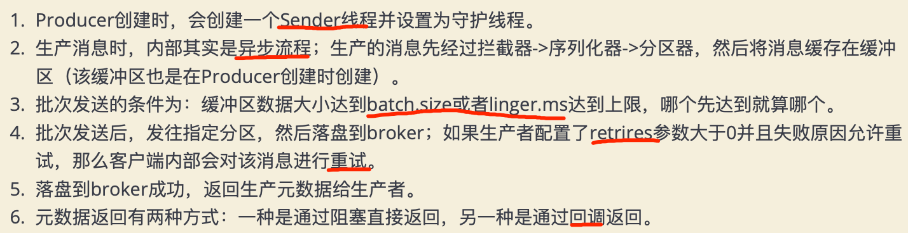
#配置调优
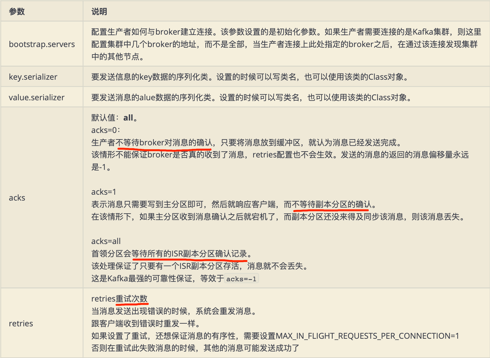
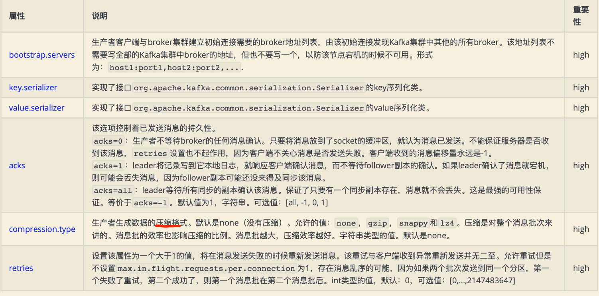
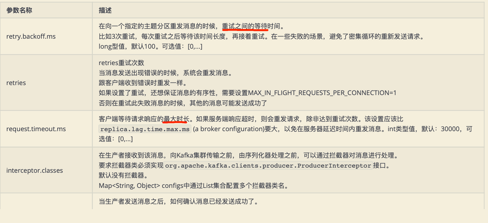
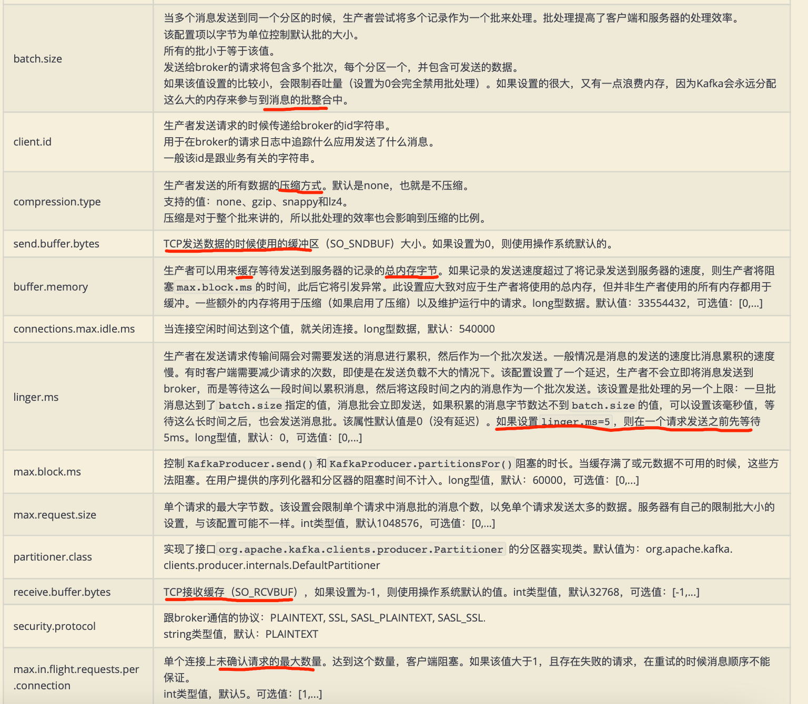
#元数据拓扑
生产者从broker列表中获取所有分区和node的拓扑关系

[深入理解kafka核心设计2.3]
#KafkaProducer实现

##线程安全
可以多线程共享一个实例
##消息发送顺序保证
单线程消息发送顺序保证

##消息重试
retries,网络故障/leader副本选举导致发送失败
```asp
消息重试还能保证消息发送的顺序吗?
```

##批量消息
recordAccumulator:bufferpool=1:1
recordAccumulator:分区=1:n
分区:producerBatch=1:m(批数据size)


max.in.flight
##关闭等待

##二进制编码
close
##发送等待时间
linger.ms类似tcp的nagle
#消息发送方式
[深入理解kafka核心设计与实现]
[kafka_book_demo]第二章
##同步(可超时的阻塞)
future.get
阻塞等待一条消息发送后再发送下一条
##异步
future+callback,
##一次性
#序列化
由于Kafka中的数据都是字节数组，在将消息发送到Kafka之前需要先将数据序列化为字节数组。 序列化器的作用就是用于序列化要发送的消息的
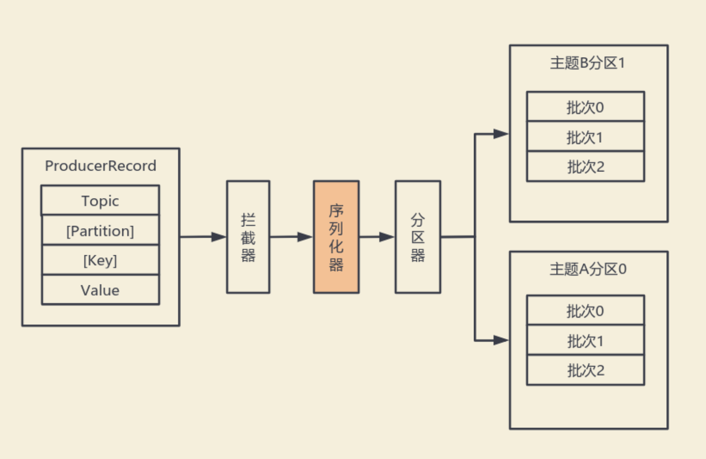
#分区器
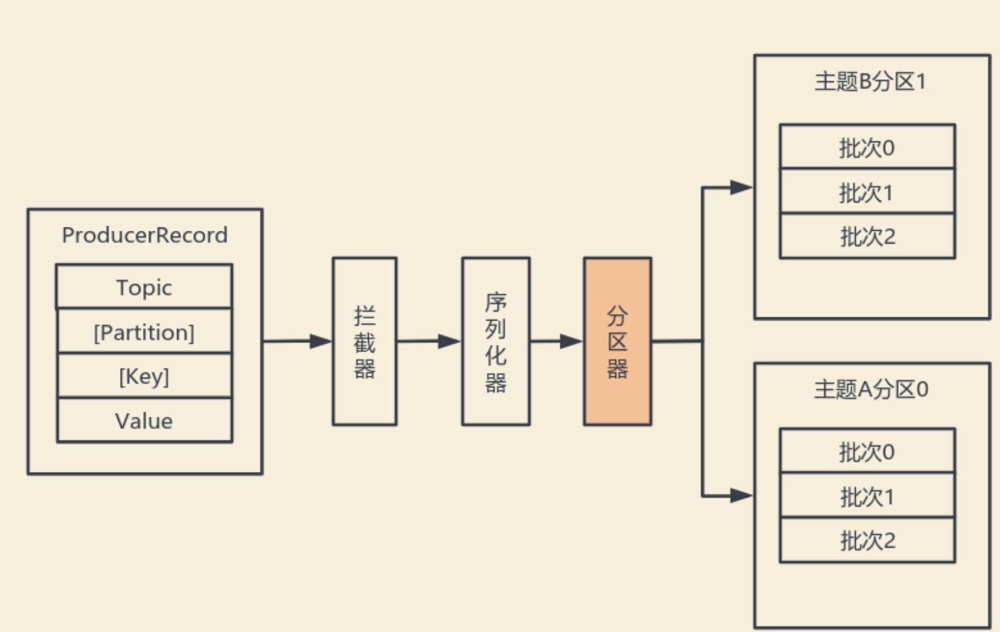
有key,MurmurHash2算法
无key轮询发送

默认(DefaultPartitioner)分区计算:
1. 如果record提供了分区号，则使用record提供的分区号
2. 如果record没有提供分区号，则使用key的序列化后的值的hash值对分区数量取模 
3. 如果record没有提供分区号，也没有提供key，则使用轮询的方式分配分区号。
1. 会首先在可用的分区中分配分区号
2. 如果没有可用的分区，则在该主题所有分区中分配分区号。
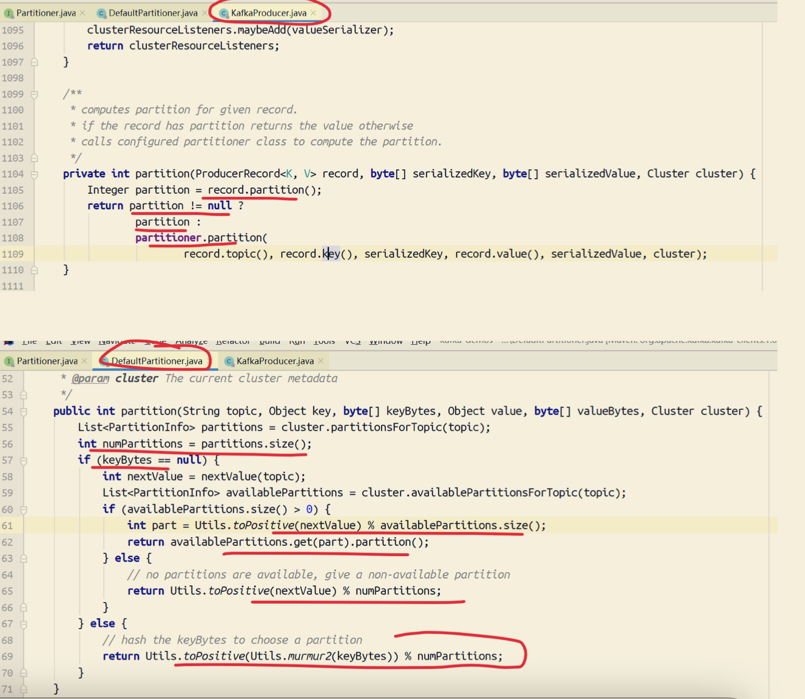
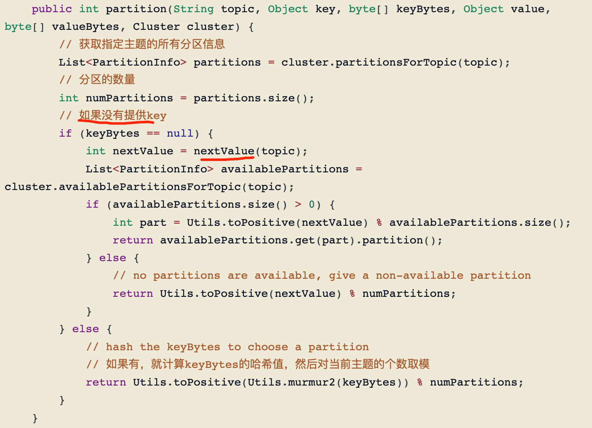
##topic增加分区导致映射关系改变

#消息ack
批量消息请求的确认,而不是一条消息的确认
##acks=1
leader确认即可
##acks=0
发送后生产者无需等待
##acks=-1/acks=all
ISR配置的所有副本需要确认


#线程:生产者=1:n&生产者:分区=n:1
##多线程
生产者KafkaProducer是线程安全对象，所以我们建议KafkaProducer采用单例模式,多个线程共享一个实例
[](https://blog.csdn.net/charry_a/article/details/79621324)
##多生产者

