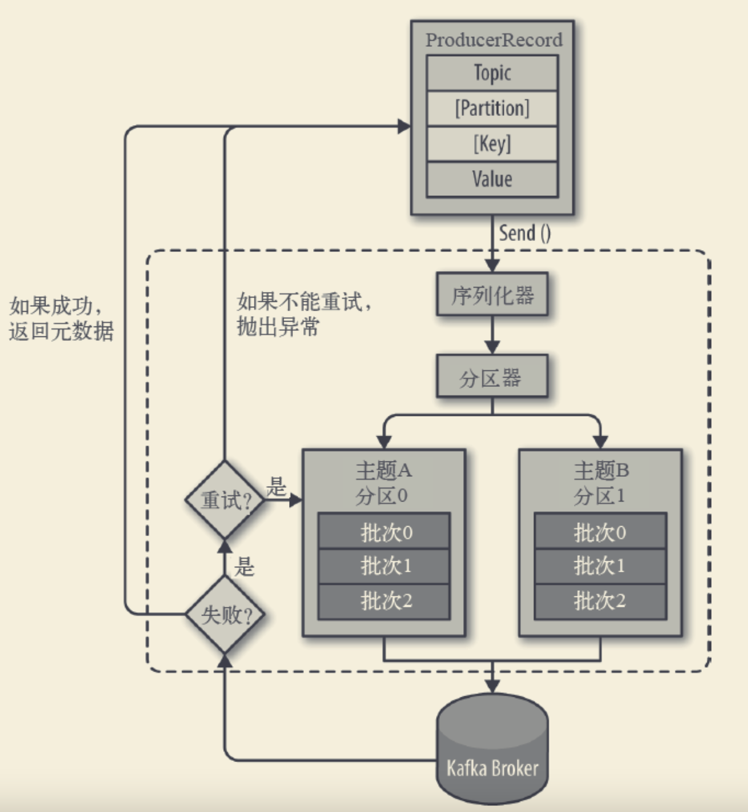

#临界知识
通信方式:同步,异步
负载均衡器,broker列表
kafka生产者分层:业务层->序列化层->分区->网络层
#流程

#元数据拓扑
生产者从broker列表中获取所有分区和node的拓扑关系

[深入理解kafka核心设计2.3]
#KafkaProducer实现

##线程安全
可以多线程共享一个实例
##消息发送顺序保证
单线程消息发送顺序保证

##消息重试
retries,网络故障/leader副本选举导致发送失败
```asp
消息重试还能保证消息发送的顺序吗?
```

##批量消息
recordAccumulator:bufferpool=1:1
recordAccumulator:分区=1:n
分区:producerBatch=1:m(批数据size)


max.in.flight
##关闭等待

##二进制编码
close
##发送等待时间
linger.ms类似tcp的nagle
#消息发送方式
[深入理解kafka核心设计与实现]
[kafka_book_demo]第二章
##同步(可超时的阻塞)
future.get
阻塞等待一条消息发送后再发送下一条
##异步
future+callback,
##一次性
#序列化
#分区器
有key,MurmurHash2算法
无key轮询发送
##topic增加分区导致映射关系改变

#消息ack
批量消息请求的确认,而不是一条消息的确认
##acks=1
leader确认即可
##acks=0
发送后生产者无需等待
##acks=-1/acks=all
ISR配置的所有副本需要确认


#连接管理
