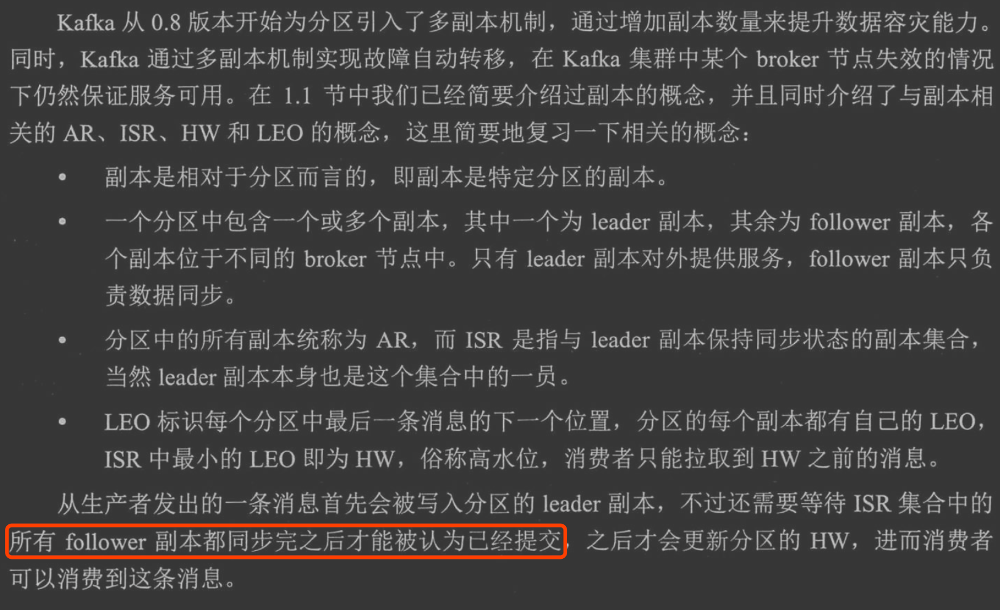

#
rebalance
#消费组和分区的拓扑

每个分区只能被一个消费组内的一个消费组消费

[深入理解kafka3.1]


##消费者和分区映射策略
#订阅方式

##自动topic
##自动模板
##手动assign(不能rebalance)
#HW

#消息拉取(批量)


#消费位移
按分区提交,offset和分区相关

##自动提交
##异步提交

##同步提交
##批量提交
##重复消费
##消息丢失
##指定位移消费
```asp
指定位移方式:lastest、earlist
指定时间
```
#消费者宕机rebalance
#消费顺序
#消费者两种多线程方案
消费者io:线程=1：1
单线程io:多线程work=1:n
[](https://time.geekbang.org/column/article/108512)
rocketmq多线程怎么维护offset
##Flink多线程维护offset

```
多线程+管理offset
Spark Streaming和Flink
```
##队列维护
```asp
对于第二种方案，可以添加一个共享的队列，消费线程消费完一个记录，就写入队列，然后主线程可以读取这个队列，然后依次提交小号的offset

```
[深入理解kafka核心设计3.2.10]
