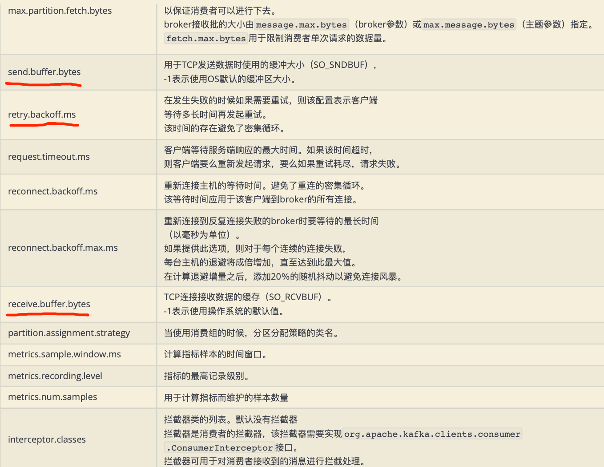

#消费组和分区的拓扑

每个分区只能被一个消费组内的一个消费组消费

[深入理解kafka3.1]


##消费者和分区映射策略
#订阅方式

##自动topic
##自动模板
##手动assign(不能rebalance)

#消息拉取(批量)


consumer 采用 pull 模式从 broker 中读取数据。
采用 pull 模式，consumer 可自主控制消费消息的速率， 可以自己控制消费方式(批量消费/逐条消费)，还可以
选择不同的提交方式从而实现不同的传输语义。
#消费位移_consumer_offset topic(默认50个,<groupID+Topic+partition,offset>)
__consumers_offsets 主题配置了compact策略，使得它总是能够保存最新的位移信息，既控制了该topic总体 的日志容量，也能实现保存最新offset的目的。

[](https://segmentfault.com/a/1190000021230196)
按分区提交,offset和分区相关


```asp

{"version":1, "partitions":[
 {"topic":"__consumer_offsets","partition":0,"replicas":[0,1,2]}, 
  {"topic":"__consumer_offsets","partition":1,"replicas":[0,2,1]},
  {"topic":"__consumer_offsets","partition":2,"replicas":[1,0,2]},
  {"topic":"__consumer_offsets","partition":3,"replicas":[1,2,0]},
  ...
  {"topic":"__consumer_offsets","partition":49,"replicas":[0,1,2]}
]}`
```
[](https://blog.csdn.net/weixin_43855694/article/details/105359181)
##offset一直提交导致_consumer_offset topic太大?
清理压缩,
##自动提交(默认,重复消费)
```asp
自动提交是最简单的提交方式，通过设置参数，可以开启自动提交也可以设置提交的时间间隔。缺点就是，当消费了一些数据后，还未达到自动的提交时间，
这个时候，有新的消费者加入，或者当前消费者挂掉，会出现分区再均衡操作，之后消费者重新在上一次提交的Offset开始消费，造成重复消费。
虽然可以缩短自动提交间隔，但是还是无法解决这个问题。
```


##异步提交


##同步提交

##批量提交

##指定位移消费
```asp
指定位移方式:lastest、earlist
指定时间
```
#消费者rebalance(心跳机制,超时,消费者组&组提交offset在相同broker)


[](https://cloud.tencent.com/developer/article/1530498)

[](https://www.kancloud.cn/nicefo71/kafka/1473378)
##心跳机制( GroupCoordinator )
消费者group协调者

##如何确定coordinator?
首先对group id 进行hash，接着对__consumer_offsets的分区数量进行取模，默认分区数量是50
__consumer_offsets的分区数量可以通过offsets.topic.num.partitions来设置，找到分区以后，这个分区所在的broker机器就是coordinator机器。
```asp
group id = “group1”

“group1” .hash() % 50 =5

这个时候我们得到了5，那么我们就去看看这个8号分区在那一台机器，然后我们这个group1下的所有消费者就知道了提交offset的时候是往哪个分区去提交offset
```

[](https://blog.csdn.net/weixin_43704599/article/details/107742641)


##Rebalance Generation


##协议

##再均衡过程
```asp
再均衡分为2步:Join和Sync
1. Join， 加入组。所有成员都向消费组协调器发送JoinGroup请求，请求加入消费组。一旦所有成员都发送了 JoinGroup请求，
协调i器从中选择一个消费者担任Leader的⻆色，并把组成员信息以及订阅信息发给 Leader。
2. Sync，Leader开始分配消费方案，即哪个消费者负责消费哪些主题的哪些分区。一旦完成分配
，Leader会 将这个方案封装进SyncGroup请求中发给消费组协调器，非Leader也会发SyncGroup请求，只是内容为空。
```

注意:在协调器收集到所有成员请求前，它会把已收到请求放入一个叫purgatory(炼狱)的地方。然后是分发分配 方案的过程，即SyncGroup请求:

##coordinator宕机
[](https://www.modb.pro/db/86270)
consumer会任意请求一个broker，发送ConsumerMetadataRequest请求，broker会按照上面说的方法，选出这个consumer对应coordinator的地址
```asp
1、看offset保存在那个partition
2、该partition leader所在的broker就是被选定的coordinator

这里我们可以看到，consumer group的coordinator，和保存consumer group offset的partition leader是同一台机器。
```
##避免重复消费

##rebalance危害
[](https://cloud.tencent.com/developer/article/1645596)
session.timout.ms:而在kafka消费者场景中， session.timout.ms参数就是规定这个超时时间是多少
heartbeat.interval.ms:这个参数控制发送心跳的频率
max.poll.interval.ms:

因为重平衡过程中，消费者无法从kafka消费消息，这对kafka的TPS影响极大，而 如果kafka集内节点较多，比如数百个，那重平衡可能会耗时极多。
数分钟到数小时都有可能，而这段时间kafka基本 处于不可用状态。所以在实际环境中，应该尽量避免重平衡发生
#消费顺序
#消费者两种多线程方案
消费者io:线程=1：1
单线程io:多线程work=1:n
[](https://time.geekbang.org/column/article/108512)
rocketmq多线程怎么维护offset
##Flink多线程维护offset

```
多线程+管理offset
Spark Streaming和Flink
```
##滑动窗口(环形缓冲区)


[深入理解kafka核心设计3.2.10]

#重要配置



