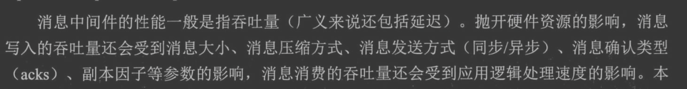

#临界知识
controller选举leader副本
分区同步
#控制器controller

```asp
[zk: localhost:2181(CONNECTED) 2] get /kafka/controller
{"version":1,"brokerid":0,"timestamp":"1638705506265"}
cZxid = 0x1300000016
ctime = Sun Dec 05 19:58:26 CST 2021
mZxid = 0x1300000016
mtime = Sun Dec 05 19:58:26 CST 2021
pZxid = 0x1300000016
cversion = 0
dataVersion = 0
aclVersion = 0
ephemeralOwner = 0x2000ec33d6b0000
dataLength = 54
numChildren = 0
```


#Leader选举
[深入理解kafka4.3]
leader对外读写,follow内部消息同步

```asp
kafka-topics --zookeeper localhost:2181/kafka --describe --topic topic-demo2
Topic:topic-demo2	PartitionCount:3	ReplicationFactor:3	Configs:
	Topic: topic-demo2	Partition: 0	Leader: 0	Replicas: 0,1,2	Isr: 0,1,2
	Topic: topic-demo2	Partition: 1	Leader: 1	Replicas: 1,2,0	Isr: 1,2,0
	Topic: topic-demo2	Partition: 2	Leader: 2	Replicas: 2,0,1	Isr: 2,0,1
```
broker2宕机
```asp
kafka-topics --zookeeper localhost:2181/kafka --describe --topic topic-demo2
Topic:topic-demo2	PartitionCount:3	ReplicationFactor:3	Configs:
	Topic: topic-demo2	Partition: 0	Leader: 0	Replicas: 0,1,2	Isr: 0,2
	Topic: topic-demo2	Partition: 1	Leader: 2	Replicas: 1,2,0	Isr: 2,0
	Topic: topic-demo2	Partition: 2	Leader: 2	Replicas: 2,0,1	Isr: 2,0
```


#分区同步
##OSR失效副本


#分区重分配
##分区不平衡率
不平衡率=非优先副本的leader个数/分区总数
手动重分配

#分区性能


#分区分配策略
##RangeAssignor

RangeAssignor策略的原理是按照消费者总数和分区总数进行整除运算来获得一个跨度，然后将分区按照跨度进 行平均分配，以保证分区尽可能均匀地分配给所有的消费者。
对于每一个Topic，RangeAssignor策略会将消费组内所 有订阅这个Topic的消费者按照名称的字典序排序，然后为每个消费者划分固定的分区范围，如果不够平均分配，那么 字典序靠前的消费者会被多分配一个分区。
#zookeeper vs Kraft
#可靠性保证
#一致性保证
#_consumer_offset
