#临界知识
controller选举leader副本
分区同步
#zookeeper作用&弊端(controller选举,同步,元数据量大,分区太多)
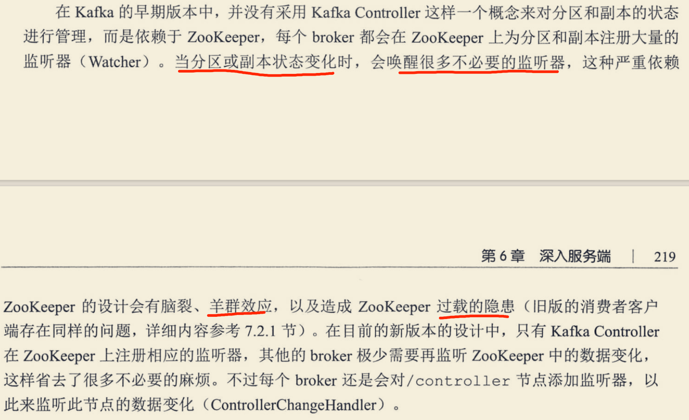
##弊端
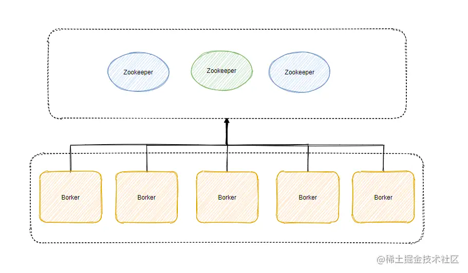
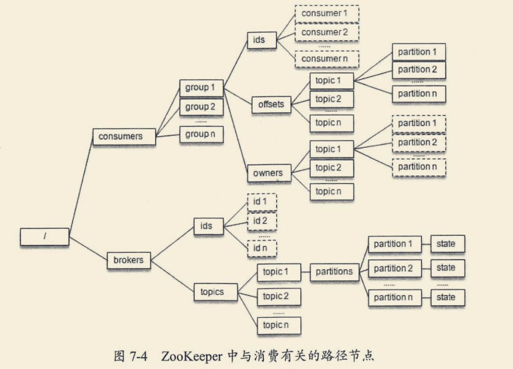
1.如果 ZooKeeper 集群的某个节点的数据发生变更，则会通知其它 ZooKeeper 节点同时执行更新，就得等着大家（超过半数）都写完了才行，这写入的性能就比较差了
2.如果写入的数据量过大，ZooKeeper 的性能和稳定性就会下降，可能导致 Watch 的延时或丢失。所以在 Kafka 集群比较大，分区数很多的时候，ZooKeeper 存储的元数据就会很多，性能就差了
3.ZooKeeper 也是分布式的，也需要选举，它的选举也不快，而且发生选举的那段时候是不提供服务的！
4.以前 Consumer 的位移数据是保存在 ZooKeeper 上的，所以当提交位移或者获取位移的时候都需要访问 ZooKeeper ，这量一大 ZooKeeper 就顶不住
5.在之前基于 Zookeeper 实现的单个 Controller 在分区数太大的时候还有个问题，故障转移太慢了。当 Controller 变更的时候，
需要重新加载所有的元数据到新的 Controller 身上，并且需要把这些元数据同步给集群内的所有 Broker
#zookeeper vs Kraft
[](https://juejin.cn/post/6960485225998598158)
#控制器controller(分区选举)
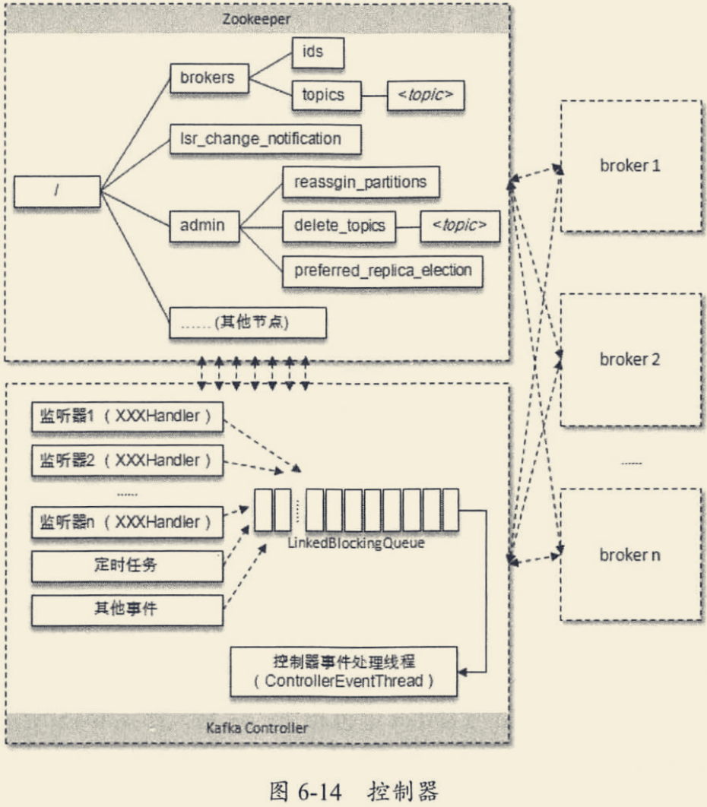
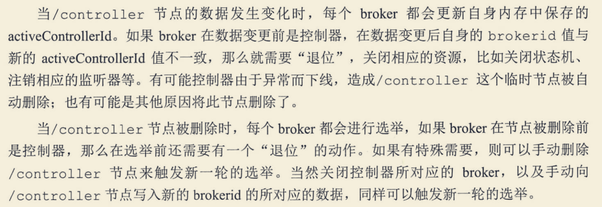
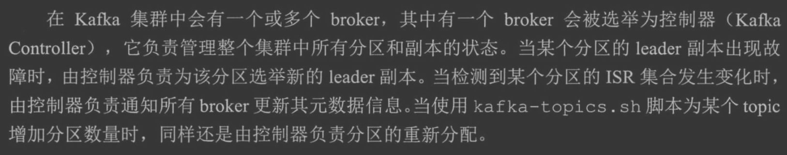
```asp
[zk: localhost:2181(CONNECTED) 2] get /kafka/controller
{"version":1,"brokerid":0,"timestamp":"1638705506265"}
cZxid = 0x1300000016
ctime = Sun Dec 05 19:58:26 CST 2021
mZxid = 0x1300000016
mtime = Sun Dec 05 19:58:26 CST 2021
pZxid = 0x1300000016
cversion = 0
dataVersion = 0
aclVersion = 0
ephemeralOwner = 0x2000ec33d6b0000
dataLength = 54
numChildren = 0
```
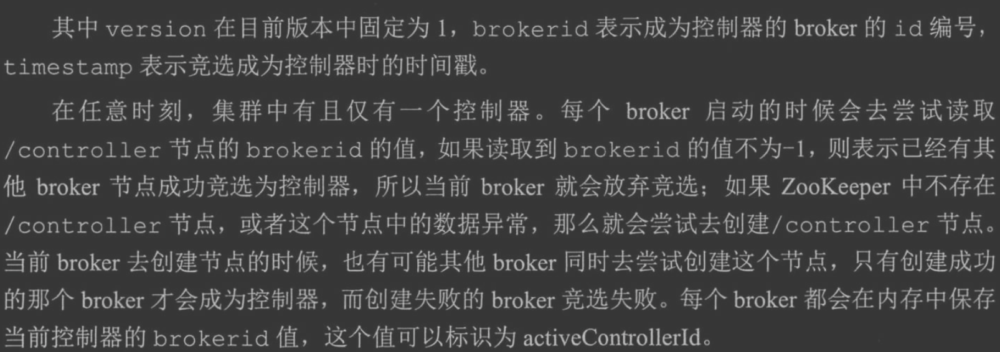

#Leader分区选举
[](https://blog.51cto.com/u_15127573/2899602)
从 AR 中挑选首个在 ISR 中的副本，作为新 Leader。当然，个别策略有些微小差异。不过，回答到这种程度，应该足以应付面试官了。毕竟，微小差别对选举 Leader 这件事的影响很小。
[深入理解kafka4.3]
leader对外读写,follow内部消息同步
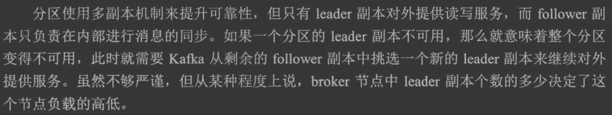
```asp
kafka-topics --zookeeper localhost:2181/kafka --describe --topic topic-demo2
Topic:topic-demo2	PartitionCount:3	ReplicationFactor:3	Configs:
	Topic: topic-demo2	Partition: 0	Leader: 0	Replicas: 0,1,2	Isr: 0,1,2
	Topic: topic-demo2	Partition: 1	Leader: 1	Replicas: 1,2,0	Isr: 1,2,0
	Topic: topic-demo2	Partition: 2	Leader: 2	Replicas: 2,0,1	Isr: 2,0,1
```
broker2宕机
```asp
kafka-topics --zookeeper localhost:2181/kafka --describe --topic topic-demo2
Topic:topic-demo2	PartitionCount:3	ReplicationFactor:3	Configs:
	Topic: topic-demo2	Partition: 0	Leader: 0	Replicas: 0,1,2	Isr: 0,2
	Topic: topic-demo2	Partition: 1	Leader: 2	Replicas: 1,2,0	Isr: 2,0
	Topic: topic-demo2	Partition: 2	Leader: 2	Replicas: 2,0,1	Isr: 2,0
```

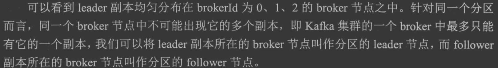
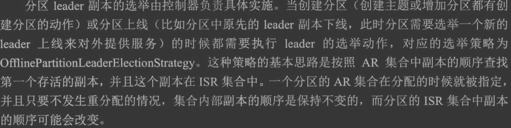
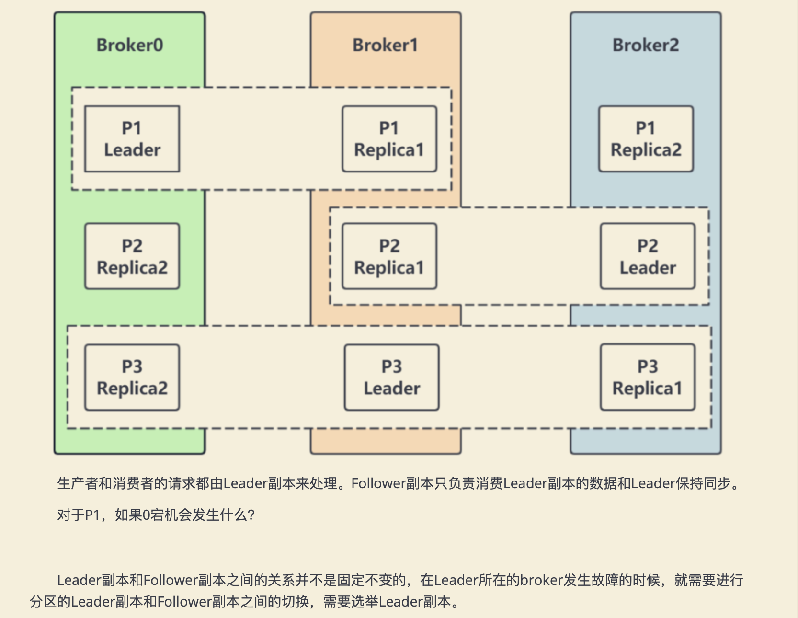
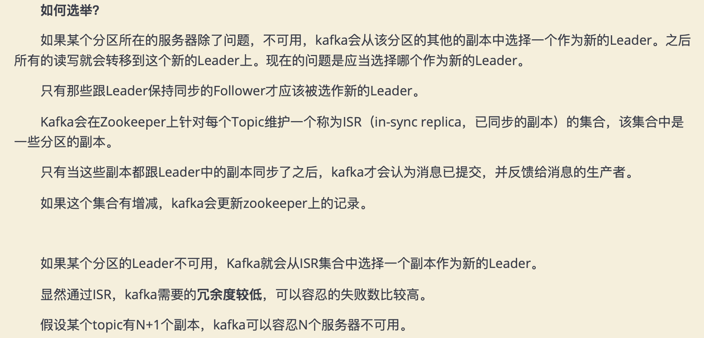
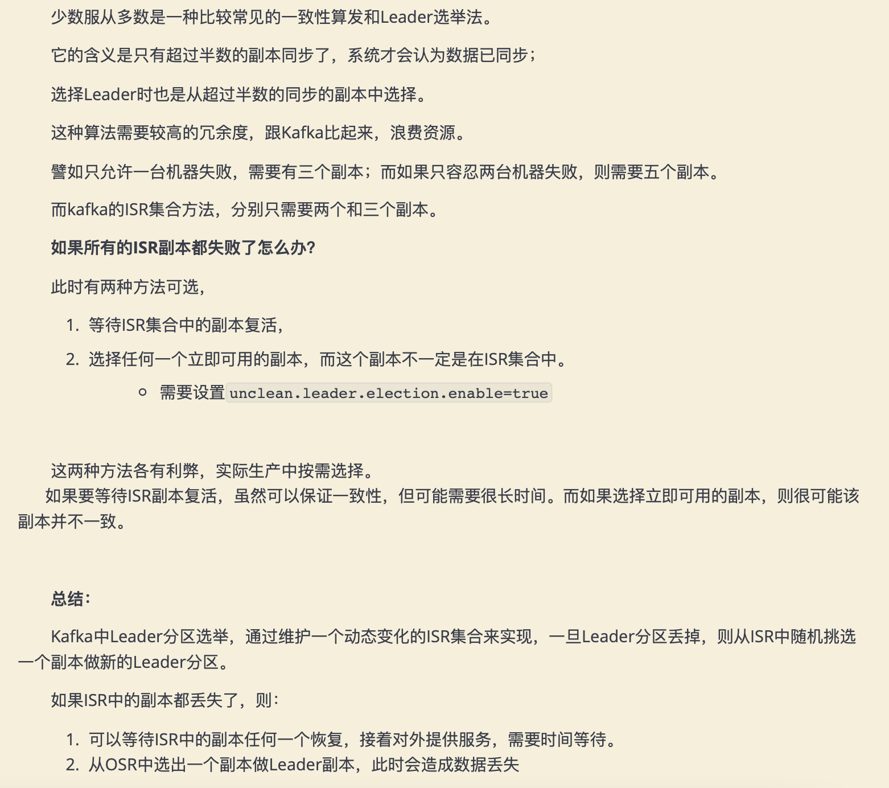
##如何发现leader宕机?
##如何选举?
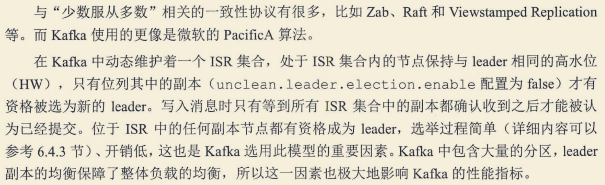
#分区同步
##OSR失效副本
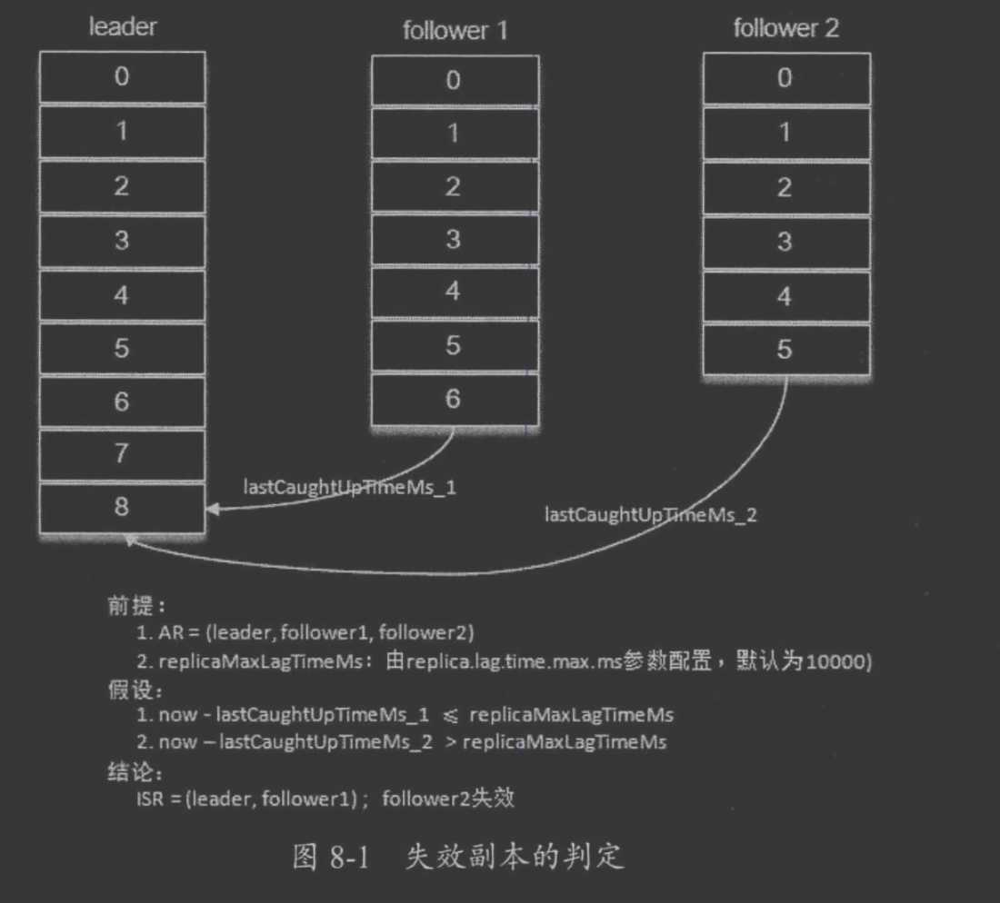
#分区同步截断(数据丢失,截断问题)
##leader epoch
#分区重分配
##分区不平衡率
不平衡率=非优先副本的leader个数/分区总数
手动重分配

#分区分配策略
##RangeAssignor
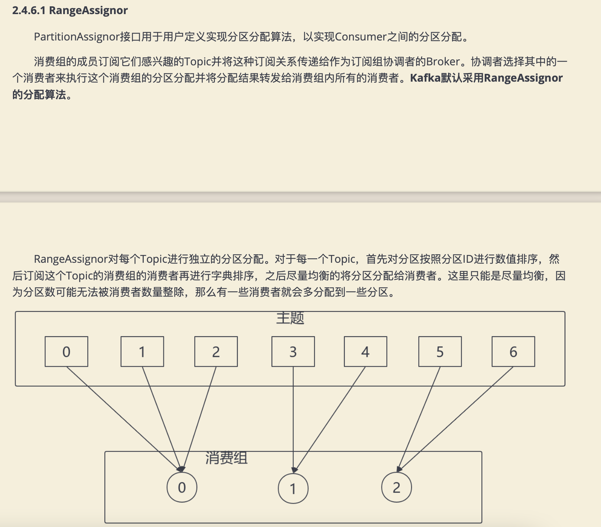
RangeAssignor策略的原理是按照消费者总数和分区总数进行整除运算来获得一个跨度，然后将分区按照跨度进 行平均分配，以保证分区尽可能均匀地分配给所有的消费者。
对于每一个Topic，RangeAssignor策略会将消费组内所 有订阅这个Topic的消费者按照名称的字典序排序，然后为每个消费者划分固定的分区范围，如果不够平均分配，那么 字典序靠前的消费者会被多分配一个分区。

#可靠性保障
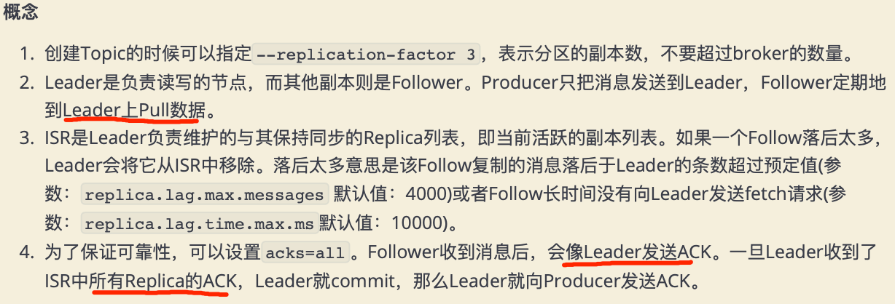
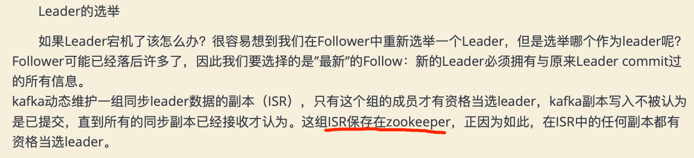
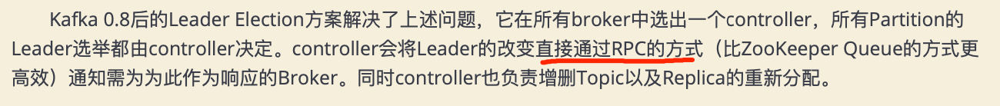
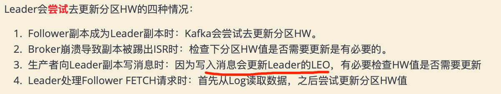
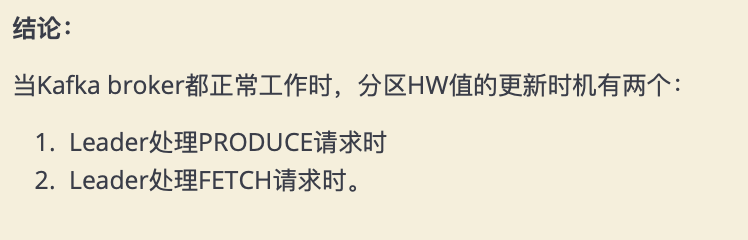
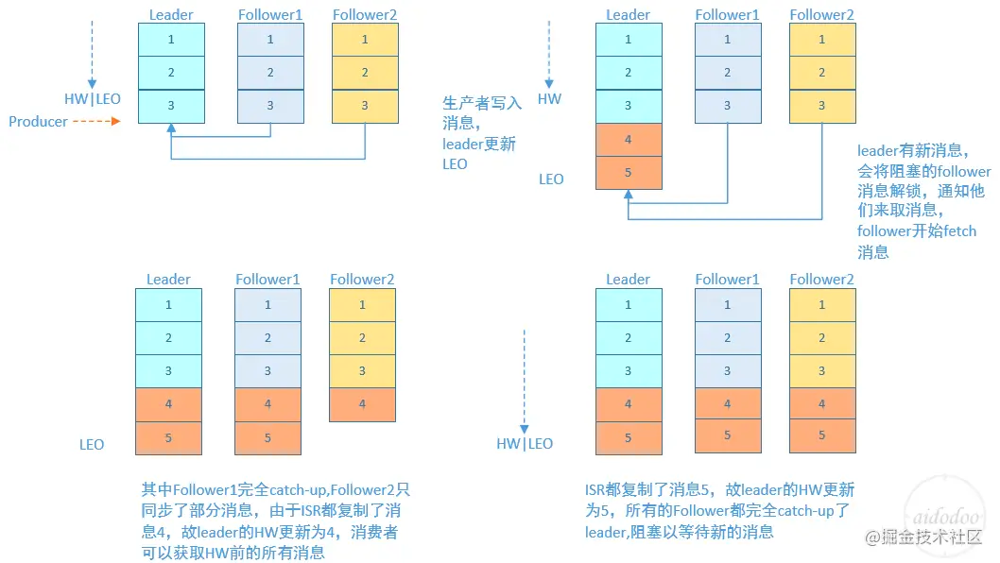
当Kafka broker都正常工作时，分区HW值的更新时机有两个: 
1. Leader处理PRODUCE请求时
2. Leader处理FETCH请求时。

Kafka使用HW值来决定副本备份的进度，而HW值的更新通常需要额外一轮FETCH RPC才能完成。但这种设计是
有问题的，可能引起的问题包括: 
1. 备份数据丢失
2. 备份数据不一致


造成上述两个问题的根本原因在于
1. HW值被用于衡量副本备份的成功与否。
2. 在出现失败重启时作为日志截断的依据。


但HW值的更新是异步延迟的，特别是需要额外的FETCH请求处理流程才能更新，故这中间发生的任何崩溃都可能导致HW值的过期。


leader epoch 
