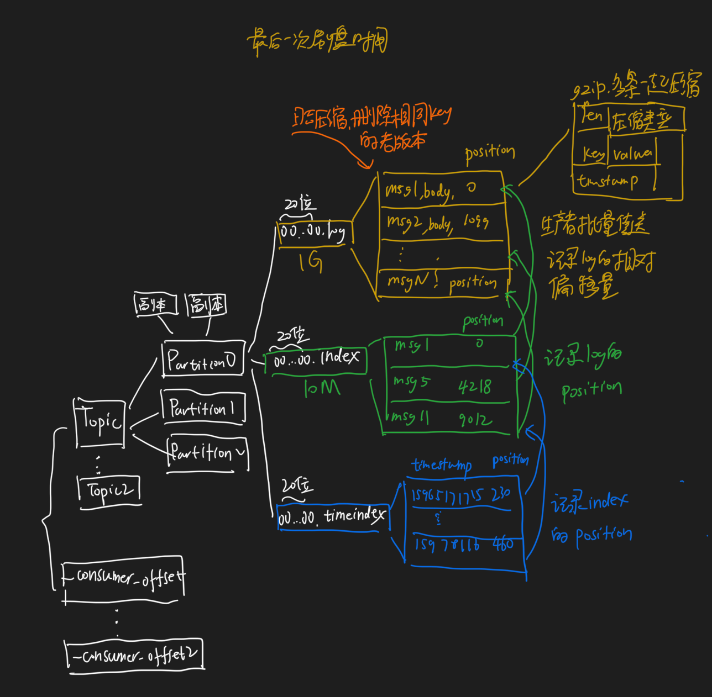
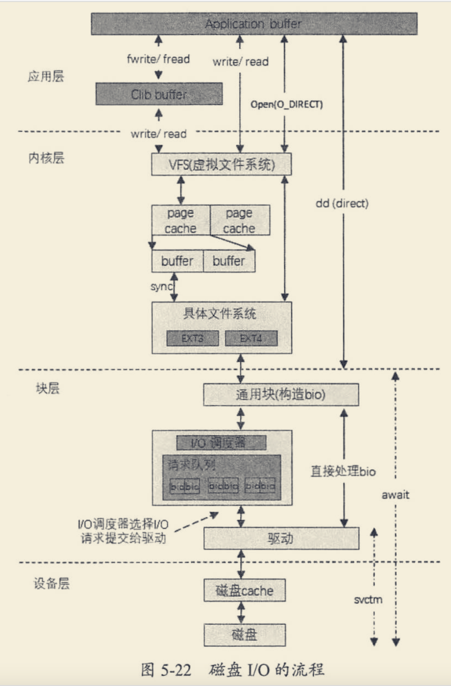

#物理存储
消息先被写入⻚缓存，由操作系统负责刷盘任务
当使用⻚缓存的时候，即使Kafka服务重启， ⻚缓存还是会保持有效，然而进程内的缓存却需要重建。这样也极 大地简化了代码逻辑，
因为维护⻚缓存和文件之间的一致性交由操作系统来负责，这样会比进程内维护更加安全有 效。
```asp
当一个进程准备读取磁盘上的文件内容时:
1. 操作系统会先查看待读取的数据所在的⻚ (page)是否在⻚缓存(pagecache)中，如果存在(命中)则直接返回数 据，从而避免了对物理磁盘的 I/O 操作;
2. 如果没有命中，则操作系统会向磁盘发起读取请求并将读取的数据⻚存入⻚缓存，之后再将数据返回给进 程。
  如果一个进程需要将数据写入磁盘:
1. 操作系统也会检测数据对应的⻚是否在⻚缓存中，如果不存在，则会先在⻚缓存中添加相应的⻚，最后将数 据写入对应的⻚。
2. 被修改过后的⻚也就变成了脏⻚，操作系统会在合适的时间把脏⻚中的数据写入磁盘，以保持数据的一致 性。

```
#读写加锁
##页缓存page cache
##磁盘io
直接io

##零拷贝
mmap,生产时
sendfile,消息消费时
KAFKA的索引文件使用mmap+write 方式，data文件使用sendfile 。
##顺序读写
寻址1ms,读写1G/S
