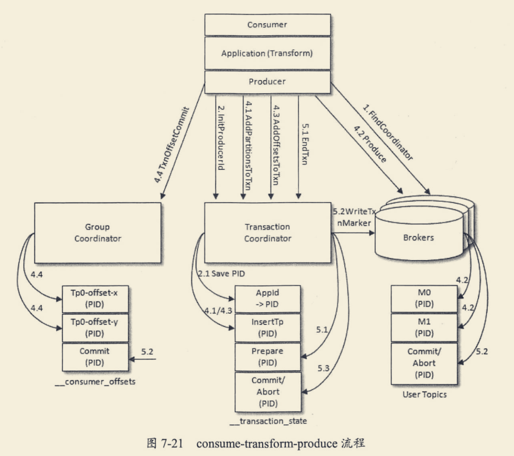

#事务场景

kafka的应用场景经常是应用先消费一个topic，然后做处理再发到另一个topic，这个consume-transform- produce过程需要放到一个事务里面，比如在消息处理或者发送的过程中如果失败了，消费偏移量也不能提 交

我们变量监控使用的就是exactly once,有的变量数据量小,重复消费影响波动大,使用的就是flink+kafka 端到端一次
#kafka事务
[深入理解kafka]

#事务拓扑
##at most once
消费者先回复再处理
##at least once
生产者重复发送
##exactly once
<session,分区>幂等+kafka两阶段事务
##kafka幂等(session+pid+分区级别的幂等,高吞吐前提下尽力满足)

生产者幂等=true
broker端维护了hashmap,key为<pid,分区>,value:最大的SequenceNumber,
ProducerID:在每个新的Producer初始化时，会被分配一个唯一的ProducerID，这个ProducerID对客户端 使用者是不可⻅的
SequenceNumber:对于每个ProducerID，Producer发送数据的每个Topic和Partition都对应一个从0开始 单调递增的SequenceNumber值

##kafka事务

1.pid,生产者从broker获取的生产者id,用于幂等
2.transactional.id(生产者自定义名称)
3.epoch,生产者从事务协调器获得的事务版本,小于此epoch的事务消息都被拒绝
4.read_committed,消费者缓存事务消息,直到收到事务的commit消息,(commit消息由事务协调器推送得到)

5._transaction_state,事务topic,默认50个分区,生产者默认分到的分区:transactional.id%事务topic分区数,如何找到该分区?请求controller
6.事务协调器,生产者被分配到事务topic的某个分区后,会寻找对应的broker,然后使用该broker上的事务协调器
7.开启事务后,请求事务协调器保存pid,transactional.id

8.生产者将消息发往各个业务topic分区,并将各业务消息所在分区通过消息发送给事务协调器,并保存在_transaction_state

9.生产者发送commit消息到_transaction_state的对应分区,事务协调器向业务topic各分区leader写入控制消息controlbatch
10.消费端缓存事务消息,收到控制消息后开始消费缓存的事务消息,并回复ack,broker没收到ack
#相关问题
##kafka事务消息消费端的不稳定性?

##flink 内部精确一次
flink barrier
##flink端到端精确一次(flink barrier+kafka 事务)
##flink为啥自己不能保证精确一次?
checkpoint异步,可能多次消费
##kafka事务为啥还需要幂等支持?
一个事务中可能有多个消息发送出来,也有可能一个消息重复发送,可以使用幂等性去重
##协调器挂了咋办?
