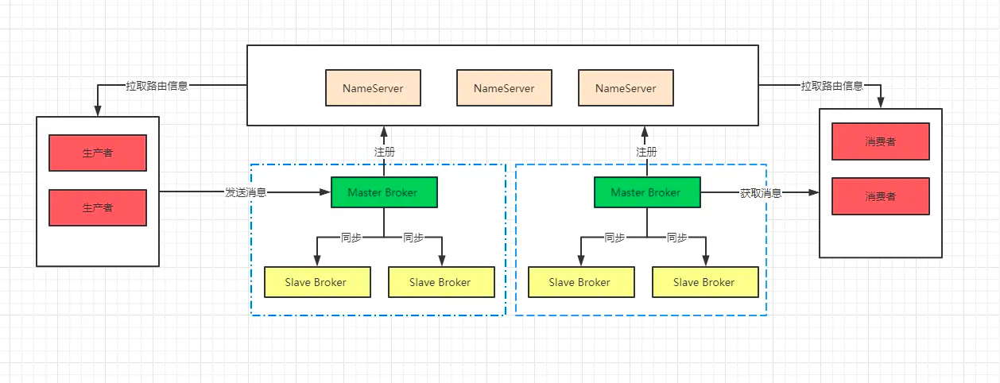
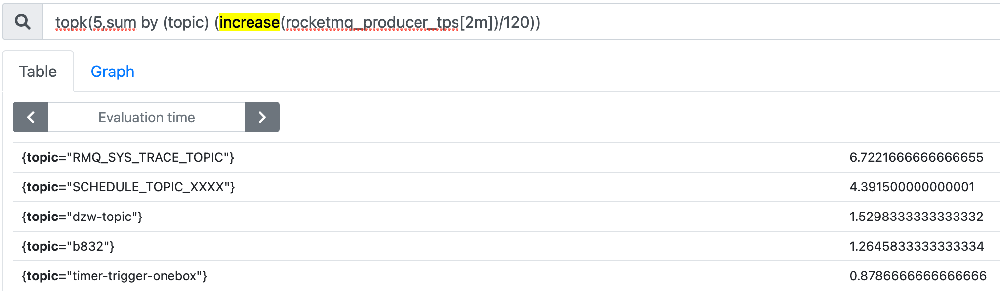
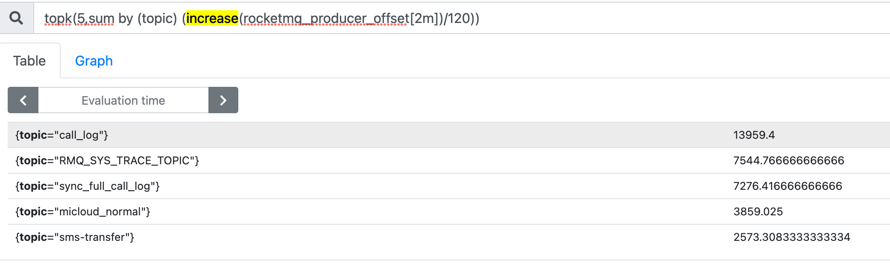
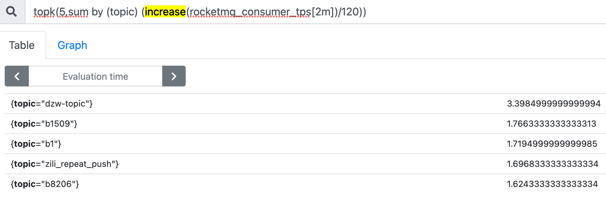
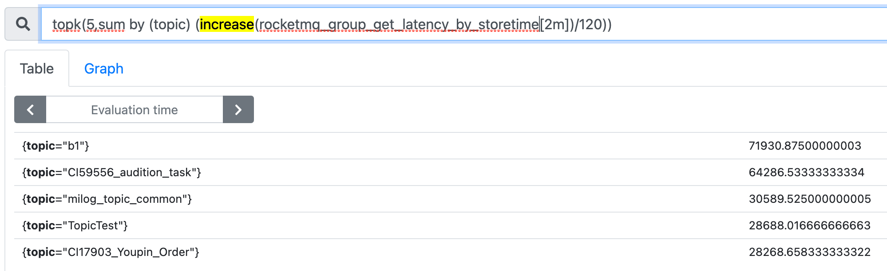
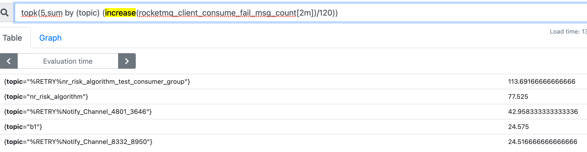

##Dleger集群搭建

集群目录:/Users/chris/workspace/rocketmq-cluster
配置文件:/Users/chris/workspace/rocketmq-cluster/rocketmq-4.9.1/conf/dledger
start/stop脚本:/Users/chris/workspace/rocketmq-cluster/rocketmq-4.9.1/bin/dledger/fast-try.sh
[](https://juejin.cn/post/6844904199805730824#heading-10)
[](https://blog.51cto.com/u_15281317/3008349#4_DlegerrokcetMQ_586)
[四种集群模式](https://segmentfault.com/a/1190000038318572)

##常用命令
###查看集群选举情况
sh bin/mqadmin clusterList -n 127.0.0.1:9876
brokerId=0代表leader
###查看集群启动日志
tail -f ~/logs/rocketmqlogs/namesrv.log
tail -f ~/logs/rocketmqlogs/broker.log
###控制台
java -jar /Users/chris/Downloads/RocketMQ/rocketmq-console-ng-1.0.1.jar   --rocketmq.config.namesrvAddr=127.0.0.1:9876
###查看topic列表
./mqadmin topicList -n localhost:9876
```asp
$ ./mqadmin topicList -n localhost:9876
RocketMQLog:WARN No appenders could be found for logger (io.netty.util.internal.InternalThreadLocalMap).
RocketMQLog:WARN Please initialize the logger system properly.
RMQ_SYS_TRANS_HALF_TOPIC
RaftCluster
BenchmarkTest
OFFSET_MOVED_EVENT
TBW102
SELF_TEST_TOPIC
RaftCluster_REPLY_TOPIC
SCHEDULE_TOPIC_XXXX
%RETRY%consumer_grp_01
%RETRY%consumer_grp_02
tp_demo_02
tp_demo_01
RaftNode00
%RETRY%TOOLS_CONSUMER
```
###查看topic进度
./mqadmin topicStatus -n localhost:9876 -t tp_demo_02
###查看borker信息
./mqadmin brokerStatus -n localhost:9876 -b localhost:30931
./mqadmin getBrokerConfig -n localhost:9876 -b localhost:30931
###扩容

##日志目录
查看配置
/Users/chris/workspace/rocketmq-cluster/rocketmq-4.9.1/conf/dledger/broker-n0.conf
查看目录
```asp
storePathRootDir=/tmp/rmqstore/node00
storePathCommitLog=/tmp/rmqstore/node00/commitlog
```

##性能监控
RocketMQ	<10ms	3w+,1s 300W+






