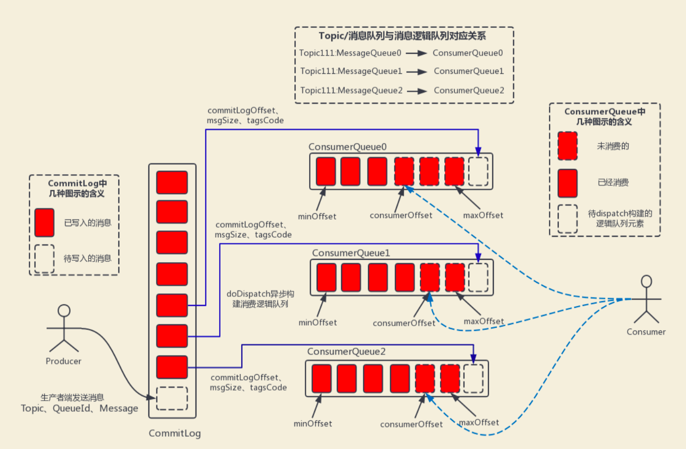

[rocketmq面试问题](https://github.com/Snailclimb/JavaGuide/blob/main/docs/high-performance/message-queue/rocketmq-questions.md)
#项目
##warden
#kafka vs rocketmq
#项目
##公司吞吐
写入性能达到300w+的TPS
目前的高性能磁盘，顺序写速度可以达到600MB/s， 超过了一般网卡的传输速度
但是磁盘随机写的速度只有大概100KB/s，和顺序写的性能相差6000倍!
实际生产者每秒10+TPS
##消息积压怎么办?

假设当只有1个消费实例的时候，会负责消费全部的分区，而当这个消费实例达到消费能力瓶颈时，便可以通过增加实例个数，使多个实例根据策略去分配这些分区，
从而提高消费组的消费能力。但要注意的是，消费实例个数不能大于分区个数， 否则会造成部分实例消费不到消息
##如何确定分区数?

#什么是流量控制
#如何提高写入性能?

#rocketmq高性能体现在哪里?
##顺序写
1) 消息存储
目前的高性能磁盘，顺序写速度可以达到600MB/s， 超过了一般网卡的传输速度。 
但是磁盘随机写的速度只有大概100KB/s，和顺序写的性能相差6000倍! 
因为有如此巨大的速度差别，好的消息队列系统会比普通的消息队列系统速度快多个数量级。 RocketMQ的消息用顺序写,保证了消息存储的速度。
##存储结构(ConsumeQueue,CommitLog)
RocketMQ消息的存储是由ConsumeQueue和CommitLog配合完成 的，消息真正的物理存储文件 是CommitLog，ConsumeQueue是消息的逻辑队列，
类似数据库的索引文件，存储的是指向物理存储 的地址。每 个Topic下的每个Message Queue都有一个对应的ConsumeQueue文件。

#jvm和进程直接内存为啥还需要拷贝?
外设之所以要把jvm堆里的数据copy出来再操作，不是因为操作系统不能直接操作jvm内存，而是 因为jvm在进行gc(垃圾回收)时，会对数据进行移动，
一旦出现这种问题，外设就会出现数据错乱的 情况。
#说说什么是零拷贝技术?
#rocket选举过程？

#生产者和消费者的负载均衡&rebalance和kafka的区别?
1.生产者轮询发送队列,自定义发送队列
2.消费者向所有broker广播自己,然后随机选一台获取消费组的一致性视图
消费者减少,消费者增加

Kafka：会在消费者组的多个消费者实例中，选出一个作为Group Leader，由这个Group Leader来进行分区分配，分配结果通过Cordinator(特殊角色的broker)同步给其他消费者。相当于Kafka的分区分配只有一个大脑，就是Group Leader。

RocketMQ：每个消费者，自己负责给自己分配队列，相当于每个消费者都是一个大脑。
#rocketmq读的这么快,会出现内存溢出吗?
不会

1.TCP拥有流量控制机制，是可以确保接收缓冲区不会溢出的。TCP是不会丢包的
2.page cache有LRU
3.速度可以达到 300M 每秒左右，而线上的网卡 一般都为千兆 网卡，写磁盘速度明显快于数据网络入口速度，那么是否可以做到写完内存就向用户返 回，由后台线程刷盘呢?
  由于磁盘速度大于网卡速度，那么刷盘的进度肯定可以跟上消息的写入速度。
  万一由于此时系统压力过大，可能堆积消息，除了写入 IO，还有读取 IO，万一出现磁盘读取
  落后情况， 会不会导致系统内存溢出，答案是否定的，原因如下:
  写入消息到 PageCache时，如果内存不足，则尝试丢弃干净的 PAGE，腾出内存供新消息使 用，策略是LRU 方式。
  如果干净页不足，此时写入 PageCache会被阻塞，系统尝试刷盘部分数据，大约每次尝试 32 个 PAGE , 来找出更多干净 PAGE。
    综上，内存溢出的情况不会出现。

#延时队列&重试队列&死信队列实现?
#如何实现全局有序消息和局部有序?

#rocketmq事务消息 vs kafka事务消息

#rocketmq的金融属性?
##事务消息
##延时/定时消息
##死信队列
##消息轨迹
