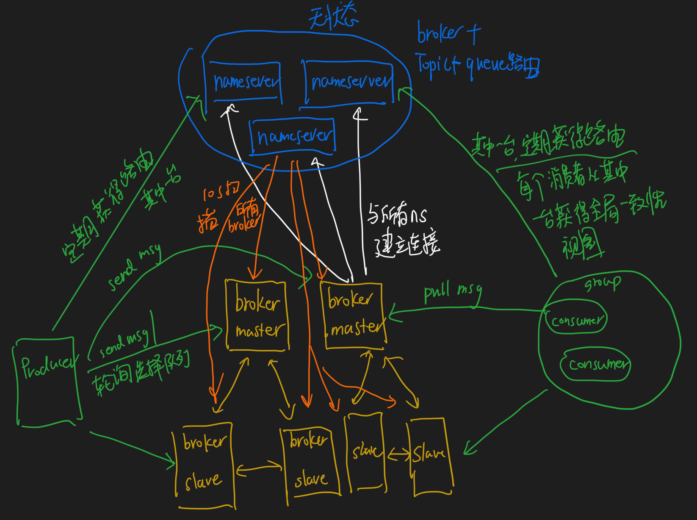
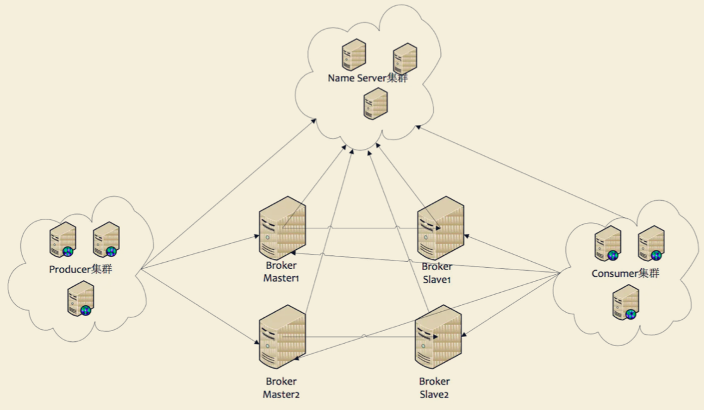
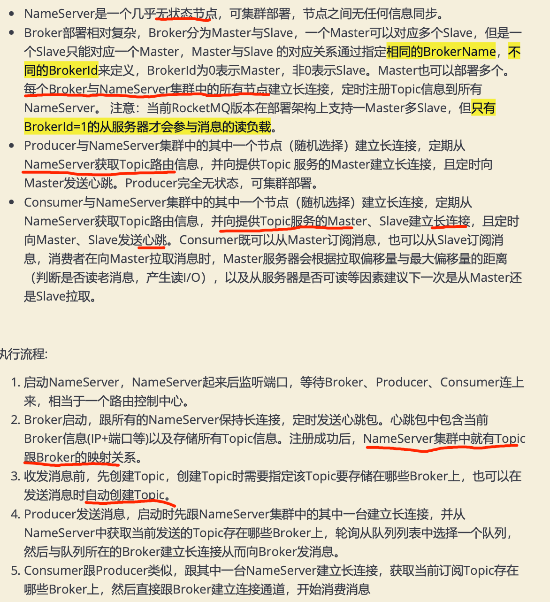
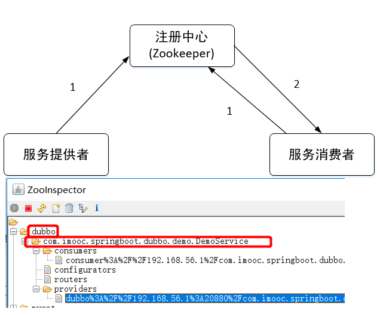
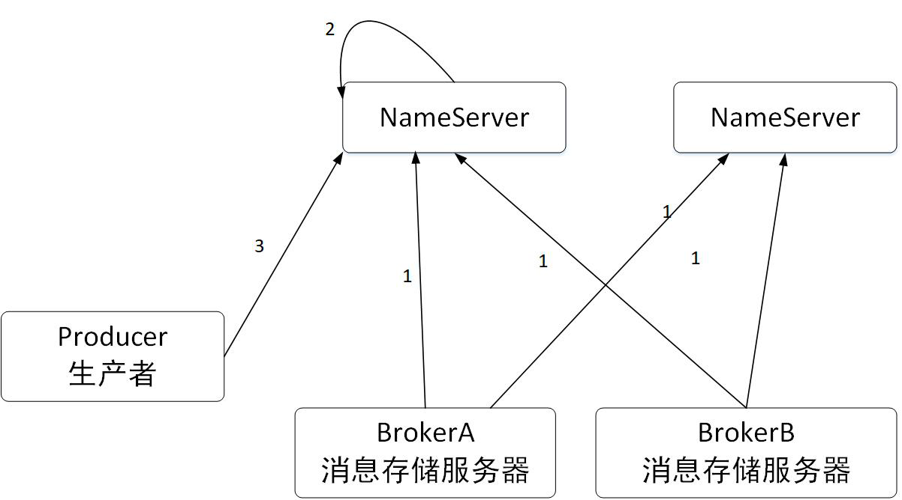
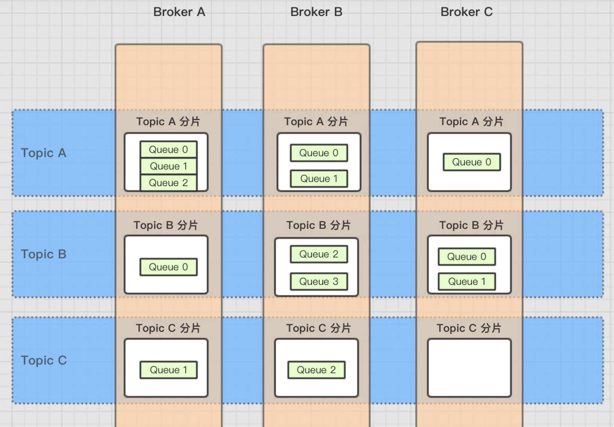
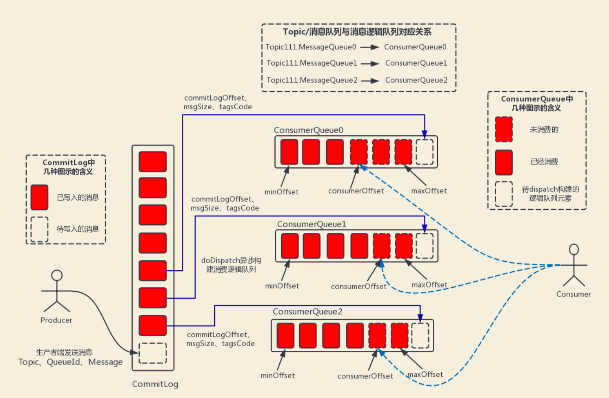

#临界知识
热变更

#集群模式Dledger(raft,CAP)

```asp
使用 Dledger 技术要求至少由三个 Broker 组成 ，一个 Master 和两个 Slave，这样三个 Broker 就可以组成一个 Group ，也就是三个 Broker
可以分组来运行。一但 Master 宕机，Dledger 就可以从剩下的两个 Broker 中选举一个 Master 继续对外提供服务
```
#nameserver(AP,pull,无状态)

[](http://learn.lianglianglee.com/%E4%B8%93%E6%A0%8F/RocketMQ%20%E5%AE%9E%E6%88%98%E4%B8%8E%E8%BF%9B%E9%98%B6%EF%BC%88%E5%AE%8C%EF%BC%89/25%20RocketMQ%20Nameserver%20%E8%83%8C%E5%90%8E%E7%9A%84%E8%AE%BE%E8%AE%A1%E7%90%86%E5%BF%B5.md)
是一个几乎无状态节点，可集群部署，节点之间无任何信息同步
NameServer每隔 10s扫描一次 Broker， 移除处于不激活状态的 Broker
所有的broker向每一个nameserver进行注册
```asp
nameserver做了什么?不需要记录持久化信息?
Nameserver 在 RocketMQ 整体架构中所处的位置就相当于 ZooKeeper、Dubbo 服务化架构体系中的位置，即充当“注册中心”，在 RocketMQ 中路由
信息主要是指主题（Topic）的队列信息，即一个 Topic 的队列分布在哪些Broker中
```
##zookeeper(push,一致性,实时性)
rocketmq使用的nameserver感觉就是无状态的服务注册中心，没有用任何共识算法。而dubbo用的zookeeper是leader型共识算法。
基于 ZooKeeper 的注册中心一个最大的优点是其实时性。但其内部实现非常复杂，ZooKeeper 是基于 CP 模型，可以看出是强一致性，
往往就需要吸收其可用性，例如如果 ZooKeeper 集群触发重新选举或网络分区，此时整个 ZooKeeper 集群将无法提供新的注册与订阅服务，影响用户的使用

在服务注册领域服务数据的一致性其实并不是那么重要，例如回到 Dubbo 服务的注册与订阅场景来看，其实客户端（消息消费端）就算获得服务提供者列表不一致，
也不会造成什么严重的后果，最多是在一段时间内服务提供者的负载不均衡，只要最终能达到一致即可
##nameserver(pull,无状态)

Broker 每 30s 向 Nameserver 发送心跳包，心跳包中包含主题的路由信息（主题的读写队列数、操作权限等），Nameserver 会通过 HashMap 更新 Topic 的路由信息，并记录最后一次收到 Broker 的时间戳。
Nameserver 以每 10s 的频率清除已宕机的 Broker，Nameserver 认为 Broker 宕机的依据是如果当前系统时间戳减去最后一次收到 Broker 心跳包的时间戳大于 120s。
消息生产者以每 30s 的频率去拉取主题的路由信息，即消息生产者并不会立即感知 Broker 服务器的新增与删除。
##nameserver导致的路由信息不一致
RocketMQ 的设计者采取的方案是不解决，即为了保证 Nameserver 的高性能，允许存在这些缺陷，这些缺陷由其使用者去解决
#broker集群(CP,leader,raft)
[](https://segmentfault.com/a/1190000038318572)
```asp
Broker部署相对复杂，Broker分为Master与Slave，一个Master可以对应多个Slave，但是一 个Slave只能对应一个Master，Master与Slave 的对应
关系通过指定相同的BrokerName，不 同的BrokerId来定义，BrokerId为0表示Master，非0表示Slave。Master也可以部署多个。 
每个Broker与NameServer集群中的所有节点建立长连接，定时注册Topic信息到所有 NameServer。 注意:当前RocketMQ版本在部署架构上支持一Master多Slave，
但只有 BrokerId=1的从服务器才会参与消息的读负载
```

```asp
topic扩容时更新broker,每个broker同步给nameserver,nameserver相当于汇总,
broker没有同步给nameserver,则nameserver没有信息,无状态
```

#TOPIC

#QUEUE

#Producer集群
```asp
Producer与NameServer集群中的其中一个节点(随机选择)建立长连接，定期从 NameServer获取Topic路由信息，并向提供Topic 服务的Master建立长连接，
且定时向 Master发送心跳。Producer完全无状态，可集群部署

通过集群中的其中一个节点（随机选择）建立长连接，获得Topic的路由信息，包括Topic下面有哪些Queue，这些Queue分布在哪些Broker上等
接下来向提供Topic服务的Master建立长连接，且定时向Master发送心跳
```
#Consumer集群
```asp
Consumer与NameServer集群中的其中一个节点(随机选择)建立长连接，定期从 NameServer获取Topic路由信息，并向提供Topic服务的Master、Slave建立长连接，
且定时 向Master、Slave发送心跳。Consumer既可以从Master订阅消息，也可以从Slave订阅消 息，消费者在向Master拉取消息时，Master服务器会根据拉取偏移量
与最大偏移量的距离 (判断是否读老消息，产生读I/O)，以及从服务器是否可读等因素建议下一次是从Master还 是Slave拉取。

消息的消费者，通过NameServer集群获得Topic的路由信息，连接到对应的Broker上消费消息。
注意，由于Master和Slave都可以读取消息，因此Consumer会与Master和Slave都建立连接
```
