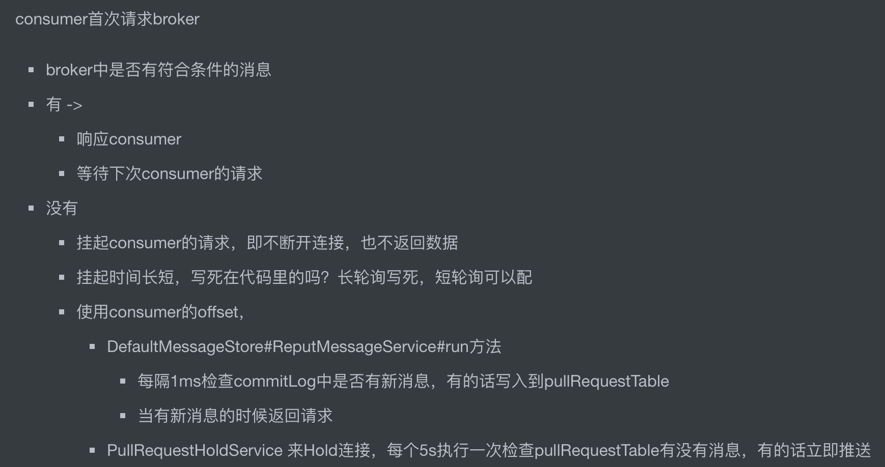

#临界知识
推送/拉取
长链接
长轮询
消费者负载均衡
#集群消息
```asp
- 每条消息只需要被处理一次，broker只会把消息发送给消费集群中的一个消费者
- 在消息重投时，不能保证路由到同一台机器上
- 消费状态由broker维护
```

#广播消息
```asp
- 消费进度由consumer维护

- 保证每个消费者消费一次消息

- 消费失败的消息不会重投

只有在消息模式为MessageModel.CLUSTERING集群模式时，Broker才会自动进行重试，广播消息不重试

```


#并行消费
#pull vs push
##push
及时,但是如果客户端消息消费慢,不好控制,容易堆积,
##pull
客户端控制自己的消费速度,但是轮询时间不好控制,时间太长访问不及时,时间太短容易对服务端造成性能影响
##长轮询(rocketmq使用)
[](https://segmentfault.com/a/1190000023854950)
```asp
长轮询本质上仍旧是轮询，它与轮询不同之处在于，当服务端接收到客户端的请求后，服务端不会立即将数据返回给客户端，而是会先将这个请求hold住，
判断服务器端数据是否有更新。如果有更新，则对客户端进行响应，如果一直没有数据，则它会在长轮询超时时间之前一直hold住请求并检测是否有数据更新，直到有数据或者超时后才返回
```

[](http://wuwenliang.net/2019/09/22/%E8%B7%9F%E6%88%91%E5%AD%A6RocektMQ%E4%B9%8B%E7%90%86%E8%A7%A3%E9%95%BF%E8%BD%AE%E8%AF%A2%E6%9C%BA%E5%88%B6/)
##长链接
连接一旦建立，永远不断开，push方式推送
#消费消息
一个队列只能被一个消费者消费
##提高消费并行度
```asp
在同一个ConsumerGroup下(Clustering方式)，可以通过增加Consumer实例的数量来提
高并行度。 通过加机器，或者在已有机器中启动多个Consumer进程都可以增加Consumer实例数。
注意:总的Consumer数量不要超过Topic下Read Queue数量，超过的Consumer实例接收 不到消息。
此外，通过提高单个Consumer实例中的并行处理的线程数，可以在同一个Consumer内增加 并行度来提高吞吐量(设置方法是修改consumeThreadMin和consumeThreadMax)
```
##以批量方式进行消费
```asp
多条消息同时处理的时间会大大小于逐个处理的时间总和，比如消费消息中
涉及update某个数据库，一次update10条的时间会大大小于十次update1条数据的时间。
可以通过批量方式消费来提高消费的吞吐量。实现方法是设置Consumer的 consumeMessageBatchMaxSize这个参数，默认是1，如果设置为N，
在消息多的时候每次 收到的是个长度为N的消息链表。
```

##负载均衡
RocketMQ默认使用平均负载策略

###消费倾斜
consumer的数量最好和Message Queue的数量对等或者是倍数，不然可能会有消费倾斜


##消费进度
集群模式下以主题与消费组为键保存 该主题所有队列的消费进度
##重复消费
