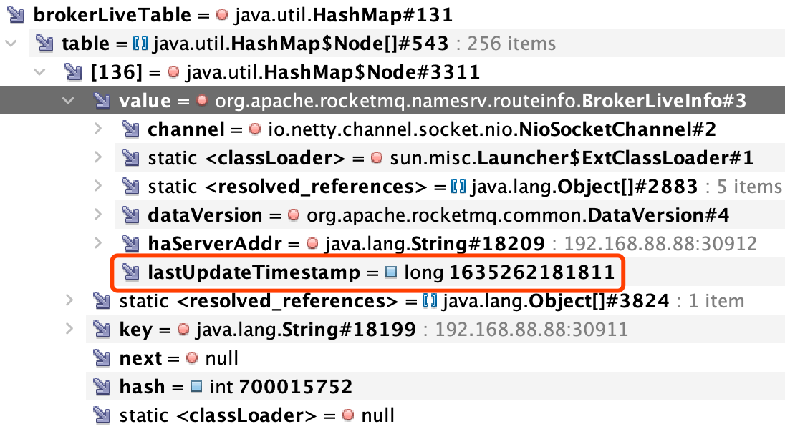
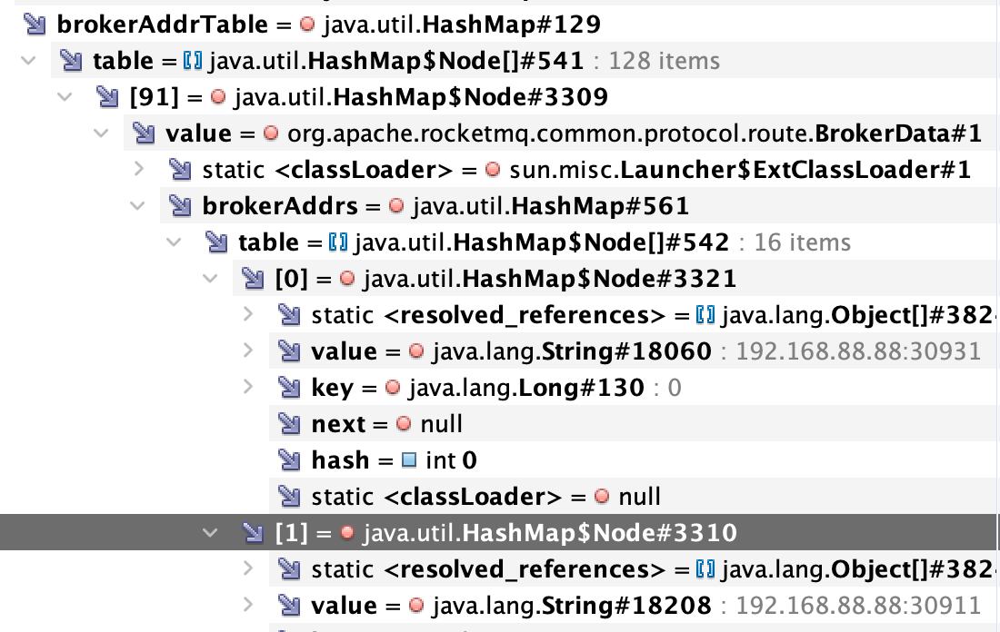
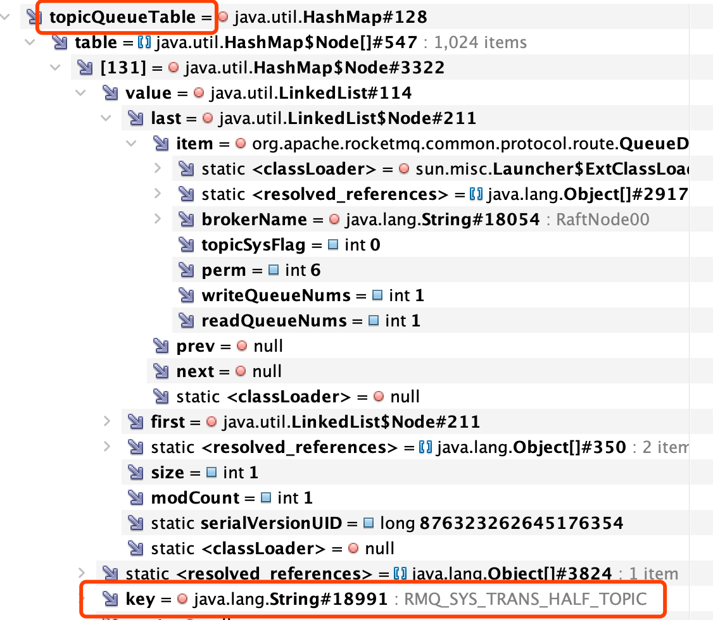

#临界知识
nameserver健康监控broker
nameserver无状态
topic&queue路由

#nameserver与broker


定时任务 I: NameServer每隔 30s扫描一次 Broker， 移除处于不激活状态的 Brokerc
```asp
this.scheduledExecutorService.scheduleAtFixedRate(new Runnable() {

            @Override
            public void run() {
                NamesrvController.this.routeInfoManager.scanNotActiveBroker();
            }
        }, 5, 10, TimeUnit.SECONDS);
```
brokerLiveTable: Broker 状态信息 。 NameServer 每次 收到心跳包时会 替换该信 息 
```asp
RocketMQ路由注册是通过 Broker与 NameServer的心跳功能实现的。 Broker启动时 向 集群中 所有的 NameServ巳r发送 心跳 语句，每隔 30s 向
 集群 中所 有 NameServer 发送心 跳包，NameServer收到Broker心跳包时会更新brokerLiveTable缓存中BrokerLivelnfo的 lastUpdateTimestamp，
 然后 Nam巳 Server每隔 10s扫描 brokerLiveTable，如果连续 !20s没 有收到心跳包， NameServer将移除该 Broker的路由信息同时关闭 Socket连接
```
```asp
this.scheduledExecutorService.scheduleAtFixedRate(new Runnable() {

            @Override
            public void run() {
                try {
                    BrokerController.this.registerBrokerAll(true, false, brokerConfig.isForceRegister());
                } catch (Throwable e) {
                    log.error("registerBrokerAll Exception", e);
                }
            }
        }, 1000 * 10, Math.max(10000, Math.min(brokerConfig.getRegisterNameServerPeriod(), 60000)), TimeUnit.MILLISECONDS);

```
#路由信息
topicQueueTable: Topic 消息队列路由信息，消息发送时根据路由表进行负 载均衡
RoutelnfoManager


#nameserver与client
RocketMQ 路由发现 是非实 时的，当 Topic 路由 出现变化后， NameServer不主动推送给客户端 ， 而 是由客户端定时拉取主题最新的路由 。 根据主题名 称拉取路由信息的命令编码为: GET ROUTEINTO BY_TOPIC。 
