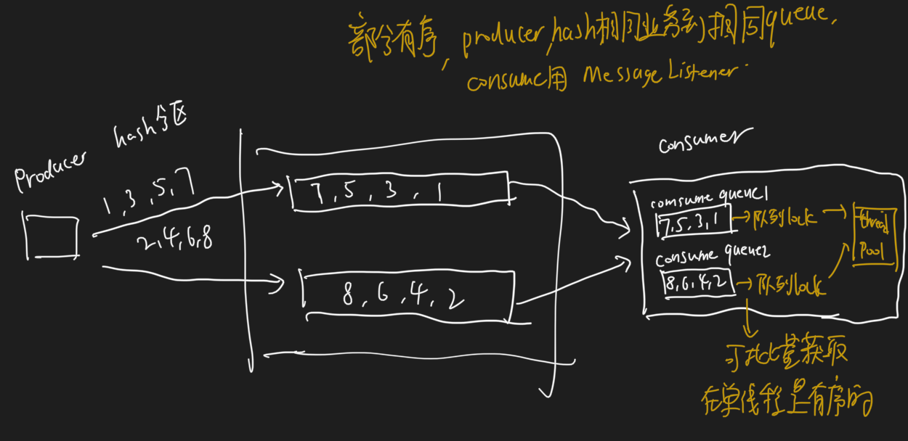

#临界知识
超时重试/超时回滚
二阶段提交事务消息
中间topic
负载均衡
数据倾斜
producer集群无状态
消息高可用
批量消息一致性



#生产者定义
MQClientinstance:客户端,jvm全局唯一,负责所有生产者消息的发送,即网络通信,clientId=ip+pid

```
this.eventLoopGroupWorker = new NioEventLoopGroup(1, new ThreadFactory() {
            private AtomicInteger threadIndex = new AtomicInteger(0);

            @Override
            public Thread newThread(Runnable r) {
                return new Thread(r, String.format("NettyClientSelector_%d", this.threadIndex.incrementAndGet()));
            }
        });

```


DefaultMQProducer:生产者,一个jvm只允许相同group中的一个生产者

```asp
public boolean registerProducer(final String group, final DefaultMQProducerImpl producer) {
        if (null == group || null == producer) {
            return false;
        }

        MQProducerInner prev = this.producerTable.putIfAbsent(group, producer);
        if (prev != null) {
            log.warn("the producer group[{}] exist already.", group);
            return false;
        }

        return true;
    }
```
#topic与group与生产者
topic指消息类型,可以被多个生产者消费,可以被多个group消费
每个group可以有多个生产者
#消息结构体


#messageid
#同步发送vs异步发送vs单向消息
#事务消息

二阶段提交
##一阶段消息写入RMQ_SYS_TRANS_HALF_TOPIC topic
如果消息是half消息，将备份原消息的主题与消息消费队列，然后 改变主题为RMQ_SYS_TRANS_HALF_TOPIC。由于消费组未订阅该主题，故消费端无法消
费half类型的 消息。然后二阶段会显示执行提交或者回滚half消息(逻辑删除)
##二阶段消息从RMQ_SYS_TRANS_HALF_TOPIC topic写回原始topic
为了防止二阶段操作失败， RocketMQ会开启一个定时任务，从Topic为RMQ_SYS_TRANS_HALF_TOPIC中拉取消息进行消费，根 据生产者组获取一个服务
提供者发送回查事务状态请求，根据事务状态来决定是提交或回滚消息
###Commit和Rollback操作
```asp
在完成一阶段写入一条对用户不可见的消息后，二阶段如果是Commit操作，则需要让消息对用户 可见;如果是Rollback则需要撤销一阶段的消息。
先说Rollback的情况。对于Rollback，本身一阶段的 消息对用户是不可见的，其实不需要真正撤销消息(实际上RocketMQ也无法去真正的删除一条消息， 
因为是顺序写文件的)。但是区别于这条消息没有确定状态(Pending状态，事务悬而未决)，需要一 个操作来标识这条消息的最终状态。
```
###op消息记录事务信息
用Op消息标识 事务消息已经确定的状态(Commit或者Rollback)。如果一条事务消息没有对应的Op消息，说明这个 事务的状态还无法确定(可能是二阶段失败了)。
引入Op消息后，事务消息无论是Commit或者 Rollback都会记录一个Op操作。Commit相对于Rollback只是在写入Op消息前创建Half消息的索引
Op消息的内容为对应的Half消息的存储的Offset，这样通过Op消息能索引到 Half消息进行后续的回查操作

###恢复原始topic
```asp
在执行二阶段Commit操作时，需要构建出Half消息的索引。一阶段的Half消息由于是写到一个特 殊的Topic，所以二阶段构建索引时需要读取出Half消息，
并将Topic和Queue替换成真正的目标的 Topic和Queue，之后通过一次普通消息的写入操作来生成一条对用户可见的消息。所以RocketMQ事 务消息二阶段
其实是利用了一阶段存储的消息的内容，在二阶段时恢复出一条完整的普通消息，然后走 一遍消息写入流程。
```
###补偿机制消息回查
```
如果在RocketMQ事务消息的二阶段过程中失败了，例如在做Commit操作时，出现网络问题导致 Commit失败，那么需要通过一定的策略使这条消息最终被Commit。
RocketMQ采用了一种补偿机制， 称为“回查”。Broker端对未确定状态的消息发起回查，将消息发送到对应的Producer端(同一个Group 的Producer)，
由Producer根据消息来检查本地事务的状态，进而执行Commit或者Rollback。 Broker端通过对比Half消息和Op消息进行事务消息的回查并且推进
CheckPoint(记录那些事务消息的 状态是确定的)。
值得注意的是，rocketmq并不会无休止的的信息事务状态回查，默认回查15次，如果15次回查还 是无法得知事务状态，rocketmq默认回滚该消息。
```
#消息重试

##顺序消息的重试
```asp
对于顺序消息，当消费者消费消息失败后，消息队列 RocketMQ 会自动不断进行消息重试(每次 间隔时间为 1 秒)，这时，应用会出现消息消费被阻塞的情况
```
##无序消息的重试

```asp
对于无序消息(普通、定时、延时、事务消息)，当消费者消费消息失败时，您可以通过设置返回
状态达到消息重试的结果。
无序消息的重试只针对集群消费方式生效;广播方式不提供失败重试特性，即消费失败后，失败消 息不再重试，继续消费新的消息

按照消费端的GroupName来分组重试队列，如果消费端消费失败，消息将被发往重试队列中，比如图中的%RETRY%ConsumerGroupA

重试失败后broker才返回异常给生产者,broker并将消息放入死信队列,%DLQ%+消费组
```
#延时消息
```asp
定时消息会暂存在名为SCHEDULE_TOPIC_XXXX的topic中，并根据delayTimeLevel存入特定的 queue，queueId = delayTimeLevel – 1，
即一个queue只存相同延迟的消息，保证具有相同发送延迟 的消息能够顺序消费。broker会调度地消费SCHEDULE_TOPIC_XXXX，将消息写入真实的topic。
```
#顺序消息
```asp
顺序消息分为全局顺序消息和部分顺序消息:
1. 全局顺序消息指某个Topic下的所有消息都要保证顺序;
2. 部分顺序消息只要保证每一组消息被顺序消费即可，比如上面订单消息的例子，只要保证同一
个订单ID的三个消息能按顺序消费即可。
```
##全局有序
一个队列,生产有序,消费端有序
```asp
要保证全局顺序消息，需要先把Topic的读写队列数设置为一，然后Producer和Consumer的并发 设置也要是一。简单来说，
为了保证整个Topic的全局消息有序，只能消除所有的并发处理，各部分都 设置成单线程处理
```
##部分有序
```asp
要保证部分消息有序，需要发送端和消费端配合处理。在发送端，要做到把同一业务ID的消息发送 到同一个Message Queue;在消费过程中，要做到从同
一个Message Queue读取的消息不被并发处 理，这样才能达到部分有序。消费端通过使用MessageListenerOrderly类来解决单Message Queue的 消息被并发处理的问题。
```
队列内有序
```asp
队列先天支持FIFO模型，单一生产和消费者下只要保证使用`MessageListenerOrderly`监听器即可

顺序消费表示消息消费的顺序同生产者为每个消息队列发送的顺序一致，所以如果正在处理全局顺序是强制性的场景，需要确保使用的主题只有一个消息队列。

并行消费不再保证消息顺序，消费的最大并行数量受每个消费者客户端指定的线程池限制。

那么只要顺序的发送，再保证一个线程只去消费一个队列上的消息，那么他就是有序的。


跟普通消息相比，顺序消息的使用需要在producer的send()方法中添加MessageQueueSelector接口的实现类，并重写select选择使用的队列，因为顺序消息局部顺序，需要将所有消息指定发送到同一队列中。
```

#提高发送性能
```asp
1. 客户端发送请求到服务器。 
2. 服务器处理该请求。
3. 服务器向客户端返回应答
```
##异步刷盘
```asp
在一些对速度要求高，但是可靠性要求不高的场景下，比如日志收集类应用， 可以采用Oneway方
式发送
Oneway方式只发送请求不等待应答，即将数据写入客户端的Socket缓冲区就返回，不等待对方返 回结果。
```
##并发写
另一种提高发送速度的方法是增加Producer的并发量，使用多个Producer同时发送，
我们不用担心多Producer同时写会降低消息写磁盘的效率，RocketMQ引入了一个   ，在窗 口内消息可以并发地写入DirectMem中，
然后异步地将连续一段无空洞的数据刷入文件系统当中。
#负载均衡/路由


```asp
如何选择一个broker达到负载均衡

• 1.尽量不要选择刚刚选择过的broker

• 2.不要选择延迟容错内的broker

随机选择broker
```
```asp
public MessageQueue selectOneMessageQueue(final TopicPublishInfo tpInfo, final String lastBrokerName) {
        if (this.sendLatencyFaultEnable) {
            try {
                int index = tpInfo.getSendWhichQueue().incrementAndGet();
                for (int i = 0; i < tpInfo.getMessageQueueList().size(); i++) {
                    int pos = Math.abs(index++) % tpInfo.getMessageQueueList().size();
                    if (pos < 0)
                        pos = 0;
                    MessageQueue mq = tpInfo.getMessageQueueList().get(pos);
                    if (latencyFaultTolerance.isAvailable(mq.getBrokerName()))
                        return mq;
                }

                final String notBestBroker = latencyFaultTolerance.pickOneAtLeast();
                int writeQueueNums = tpInfo.getQueueIdByBroker(notBestBroker);
                if (writeQueueNums > 0) {
                    final MessageQueue mq = tpInfo.selectOneMessageQueue();
                    if (notBestBroker != null) {
                        mq.setBrokerName(notBestBroker);
                        mq.setQueueId(tpInfo.getSendWhichQueue().incrementAndGet() % writeQueueNums);
                    }
                    return mq;
                } else {
                    latencyFaultTolerance.remove(notBestBroker);
                }
            } catch (Exception e) {
                log.error("Error occurred when selecting message queue", e);
            }

            return tpInfo.selectOneMessageQueue();
        }

        return tpInfo.selectOneMessageQueue(lastBrokerName);
    }
```
#group的作用
group producer:可以通过运维工具查询这个发送消息应用下有多个Producer实例
发送分布式事务消息时，如果Producer中途意外宕机，Broker会主动回调Producer Group内的任意一台机器来确认事务状态
#消息丢失
[](https://www.cnblogs.com/goodAndyxublog/p/12563813.html)
#消息查询

