#临界知识
推送/拉取
长链接
长轮询
消费者负载均衡
消息消费方式(Pull和Push)
消息消费的模式(广播模式和集群模式)
流量控制(可以结合sentinel来实现，后面单独讲) 
并发线程数设置
消息的过滤(Tag、Key) TagA||TagB||TagC * null
#集群消息
```asp
- 每条消息只需要被处理一次，broker只会把消息发送给消费集群中的一个消费者
- 在消息重投时，不能保证路由到同一台机器上
- 消费状态由broker维护
```
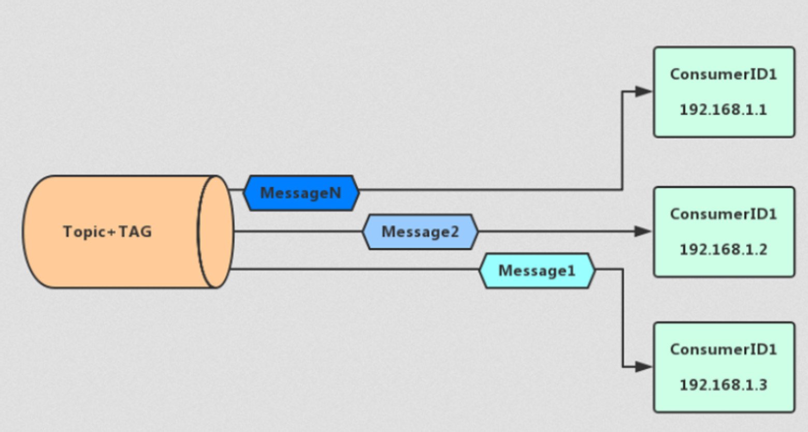
#广播消息
```asp
- 消费进度由consumer维护

- 保证每个消费者消费一次消息

- 消费失败的消息不会重投

只有在消息模式为MessageModel.CLUSTERING集群模式时，Broker才会自动进行重试，广播消息不重试

```
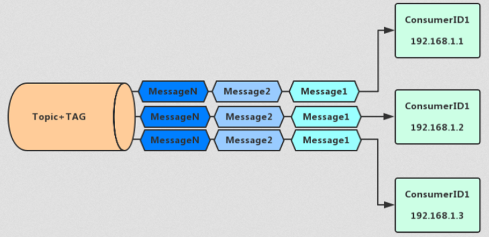

#并行消费
#pull vs push
##push
及时,但是如果客户端消息消费慢,不好控制,容易堆积,
##pull
客户端控制自己的消费速度,但是轮询时间不好控制,时间太长访问不及时,时间太短容易对服务端造成性能影响
##长轮询(rocketmq使用)
[](https://segmentfault.com/a/1190000023854950)
```asp
长轮询本质上仍旧是轮询，它与轮询不同之处在于，当服务端接收到客户端的请求后，服务端不会立即将数据返回给客户端，而是会先将这个请求hold住，
判断服务器端数据是否有更新。如果有更新，则对客户端进行响应，如果一直没有数据，则它会在长轮询超时时间之前一直hold住请求并检测是否有数据更新，直到有数据或者超时后才返回
```
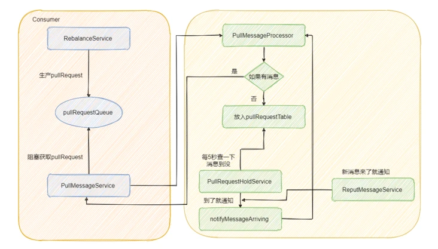
[](http://wuwenliang.net/2019/09/22/%E8%B7%9F%E6%88%91%E5%AD%A6RocektMQ%E4%B9%8B%E7%90%86%E8%A7%A3%E9%95%BF%E8%BD%AE%E8%AF%A2%E6%9C%BA%E5%88%B6/)
##长链接
连接一旦建立，永远不断开，push方式推送
#消费消息
一个队列只能被一个消费者消费

##负载均衡&Rebalance
###一致性视图(每个消费者对所有broker发送心跳获取一致性视图,获取自己分配的队列)
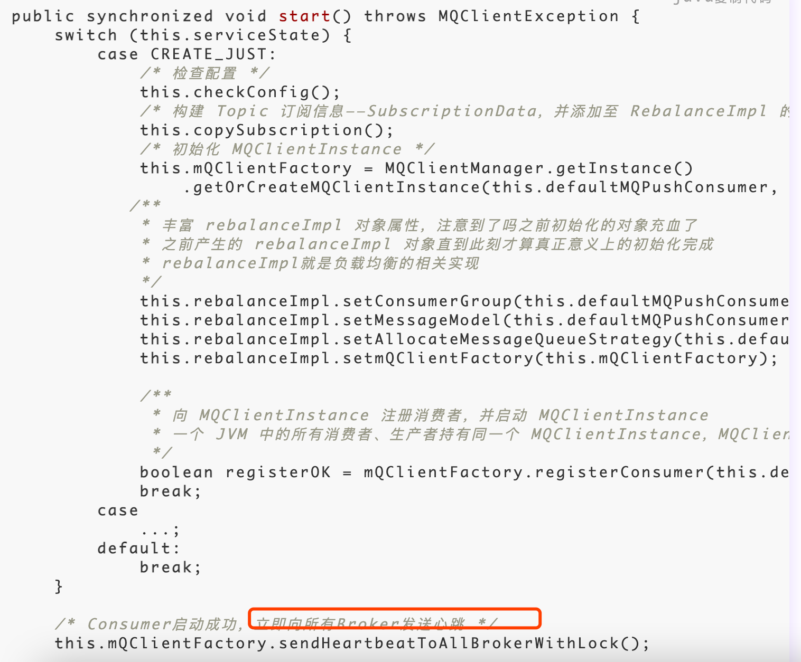
RocketMQ默认使用平均负载策略
在RocketMQ中，负载均衡或者消息分配是在Consumer端代码中完成的，Consumer从Broker处 获得全局信息，然后自己做负载均衡，只处理分给自己的那部分消息。
DefaultMQPushConsumer的负载均衡过程不需要使用者操心，客户端程序会自动处理，每个 DefaultMQPushConsumer启动后，会马上会触发一个doRebalance动作;而且在同一个 ConsumerGroup里加入新的DefaultMQPush-Consumer时，各个Consumer都会被触发 doRebalance动作。
负载均衡的分配粒度只到Message Queue，把Topic下的所有Message Queue分配到不同的 Consumer中
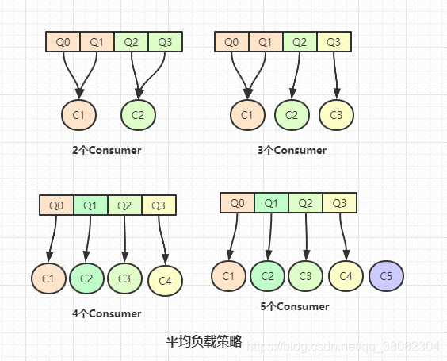
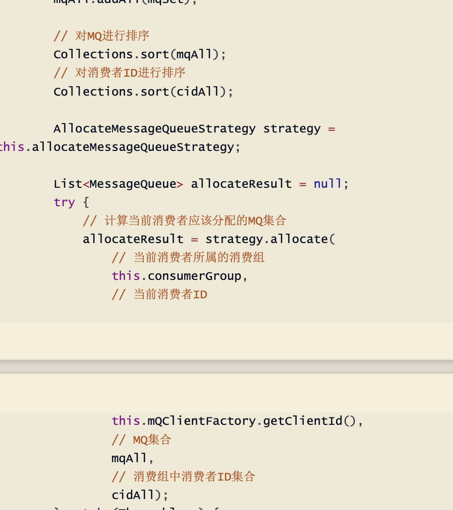
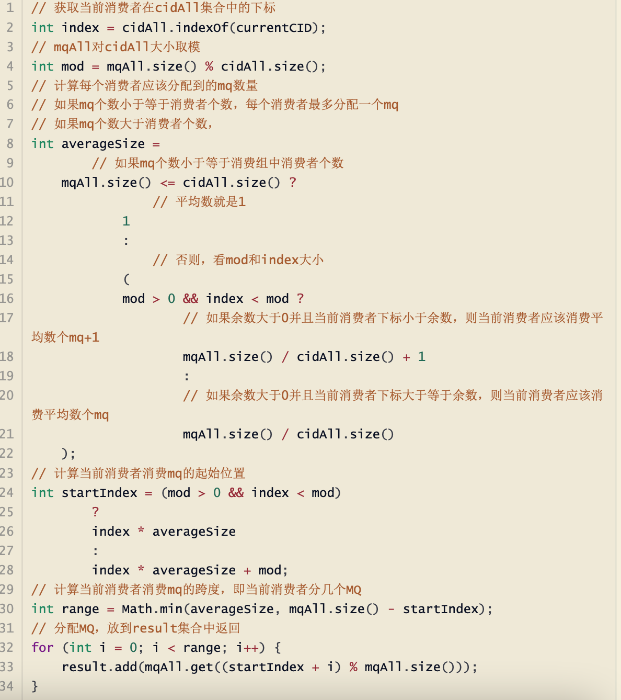
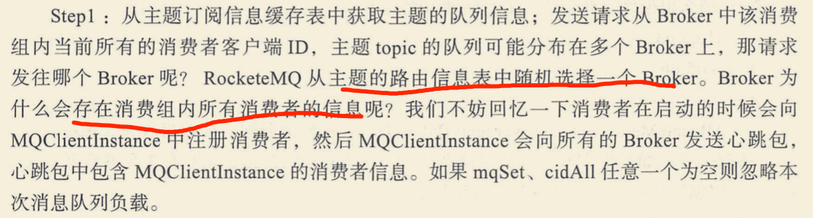
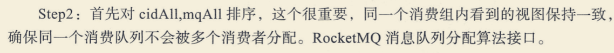
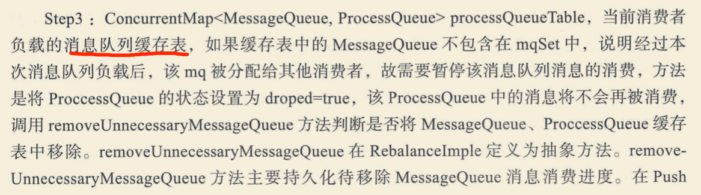
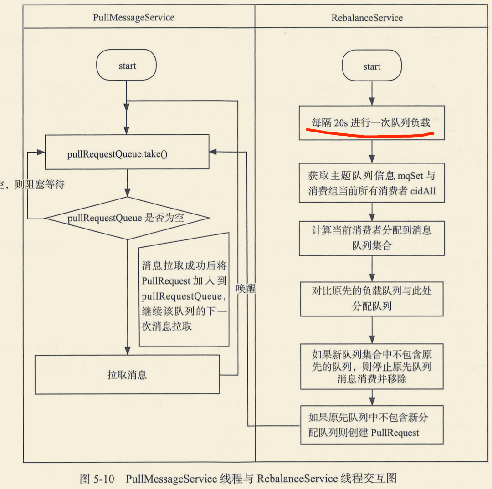
###rebalance
[](http://www.tianshouzhi.com/api/tutorials/rocketmq/409)
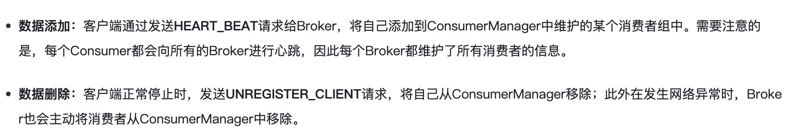
[](http://www.tianshouzhi.com/api/tutorials/rocketmq/409)
###消费倾斜
consumer的数量最好和Message Queue的数量对等或者是倍数，不然可能会有消费倾斜
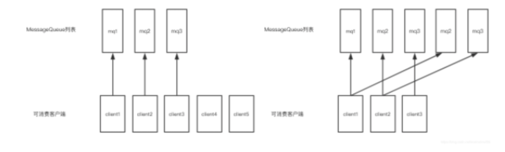
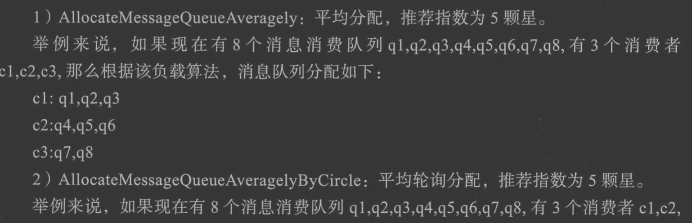
##消费进度
集群模式下以主题与消费组为键保存 该主题所有队列的消费进度
##重复消费
##消息重试
###有序(阻塞)
对于顺序消息，当消费者消费消息失败后，消息队列 RocketMQ 会自动不断进行消息重试(每次 间隔时间为 1 秒)，这时，应用会出现消息消费被阻塞的情况。
因此，在使用顺序消息时，务必保证应 用能够及时监控并处理消费失败的情况，避免阻塞现象的发生。
###无效
无序消息的重试只针对集群消费方式生效;广播方式不提供失败重试特性，即消费失败后，失败消 息不再重试，继续消费新的消息
消息队列 RocketMQ 默认允许每条消息最多重试 16 次，每次重试的间隔时间如下:

#死信消息
```asp
%DLQ%Notify_Channel_56_592
%DLQ%charity_push_three
%RETRY%Notify_Channel_757_1
%RETRY%Notify_Channel_1059_1254
%RETRY%Notify_Channel_428_2
%RETRY%Notify_Channel_104_1224
%DLQ%Notify_Channel_917_1110
```
```asp
RocketMQ中消息重试超过一定次数后(默认16次)就会被放到死信队列中，在消息队列 RocketMQ 中，这种正常情况下无法被消费的消息称为死信消息(Dead-Letter Message)，
存储死信 消息的特殊队列称为死信队列(Dead-Letter Queue)。可以在控制台Topic列表中看到“DLQ”相关的 Topic，默认命名是:
%RETRY%消费组名称(重试Topic) %DLQ%消费组名称(死信Topic) 死信队列也可以被订阅和消费，并且也会过期
```
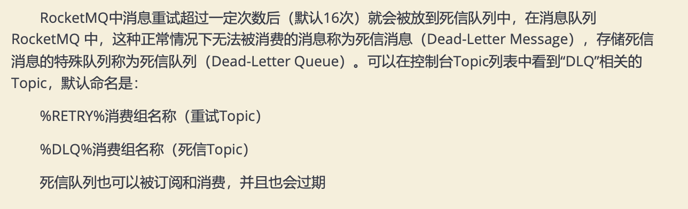
死信消息具有以下特性
不会再被消费者正常消费。
有效期与正常消息相同，均为 3 天，3 天后会被自动删除。因此，请在死信消息产生后的 3 天内及时处理。
死信队列具有以下特性:
一个死信队列对应一个 Group ID， 而不是对应单个消费者实例。
如果一个 Group ID 未产生死信消息，消息队列 RocketMQ 不会为其创建相应的死信队列。 一个死信队列包含了对应 Group ID 产生的所有死信消息，不论该消息属于哪个 Topic。
#幂等
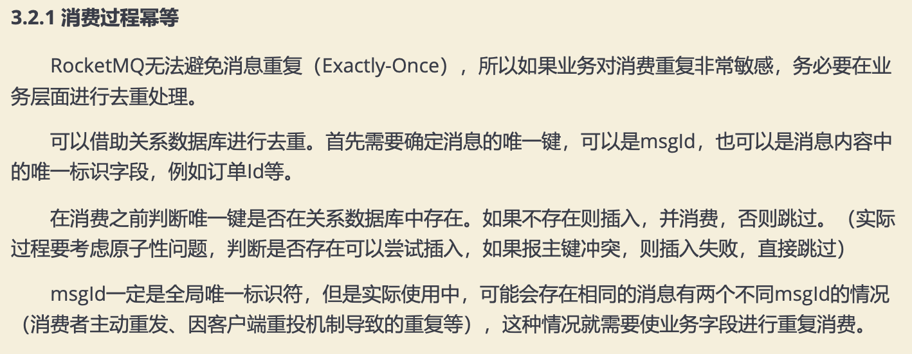
