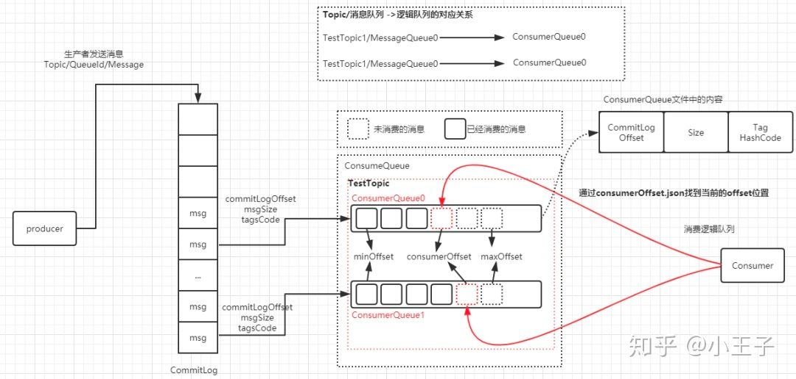
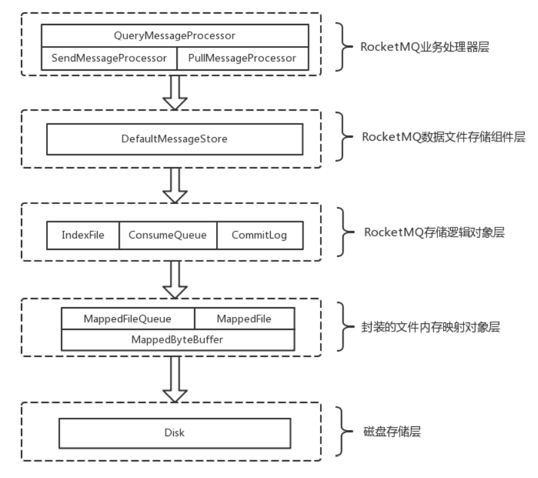
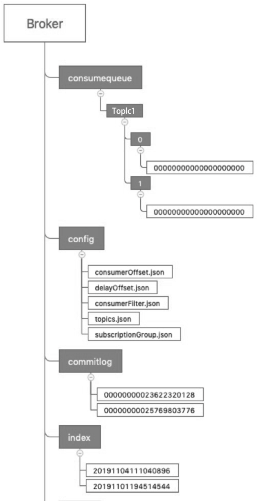
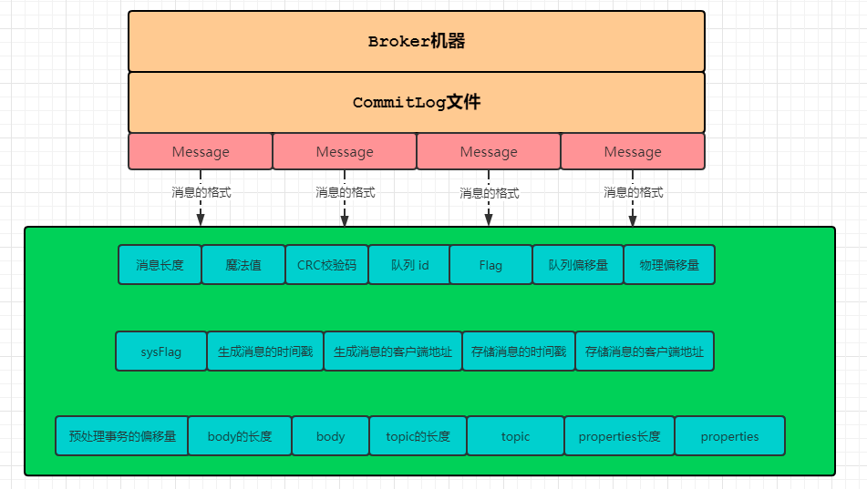
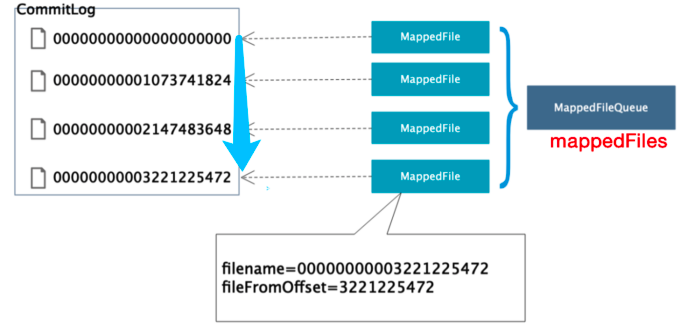
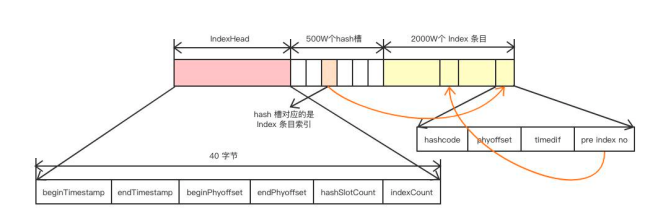
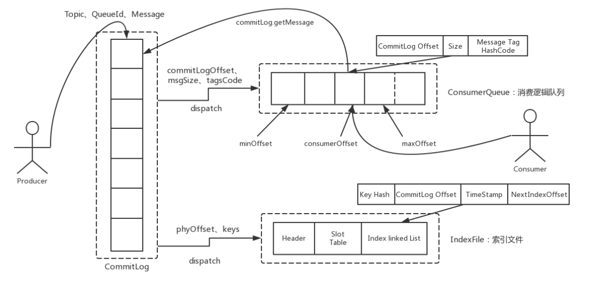

##临界知识
持久化存储方式:文件存储,键值对存储,数据库结构化存储
顺序写磁盘速度很快
同步落盘,异步落盘
linux磁盘随机读
文件逻辑队列索引
文件hash索引
内存映射文件机制
commitlog与Consumerqueue数据同步
零拷贝


##落盘策略
##文件存储对象

###commitLog

顺序写速度可以达到600MB/s
磁盘随机写的速度只有大概100KB/s

每个commitLog文件的大小是1G，一般情况下第一个 CommitLog 的起始偏移量为 0，第二个 CommitLog 的起始偏移量为 1073741824（1G = 1073741824byte）
####写
最大的特点顺序写入，所有的topic的消息都存储到commitLog文件中，顺序写入可以充分的利用磁盘顺序减少了IO争用数据存储的性能  
顺序的写入文件也就不需要太多的去考虑写入的位置，直接找到文件往后放就可以了，而取数据的时候，也是和数组一样，我们可以通过文件的大小去精准的定位到哪一个文件，
然后再精准的定位到文件的位置
####读
取数据的时候，也是和数组一样，我们可以通过文件的大小去精准的定位到哪一个文件，然后再精准的定位到文件的位置
###Consumerqueue(逻辑队列)
消费者通过broker保存的offset（offsetTable.offset json文件中保存的ConsumerQueue的下标）可以在ConsumeQueue中获取消息，
从而快速的定位到commitLog的消息位置，由于每个消息的大小是不一样的，也可以通过size获取到消息的大小，从而读取完整的消息
####写时机
在Broker中，构建ComsummerQueue不是存储完CommitLog就马上同步构建的，而是通过一个线程任务异步的去做这个事情。  
而每个topic下的queue队列都会对应一个Consumerqueue文件，例如Topic中有三个队列，每个队列中的消息索引都会有一个编号，编号从0开始，往上递增。
并由此一个逻辑队列offset的概念，有了这个概念，就可以对Consumer端的消费情况进行队列定义
消息消费完成后，需要将消费进度存储起来，即前面提到的offset
####索引规则
####读进度

#####集群模式进度
Consumeroffset.json
#####广播模式进度

###indexfile
[](https://www.codenong.com/cs109720179/)
[](https://jishuin.proginn.com/p/763bfbd690f3)
RocketMQ还支持通过MessageID或者MessageKey来查询消息，使用ID查询时，因为ID就是用broker+offset生成的（这里msgId指的是服务端的），
所以很容易就找到对应的commitLog文件来读取消息。
对于用MessageKey来查询消息，MessageStore通过构建一个index来提高读取速度


####写
在indexfile中的slot中放的是最新的index的指针，因为一般查询的时候大概率是优先查询最近的消息  
每个slot中放的指针值是索引在indexfile中的偏移量，也就是后面index的位置，而index中存放的就是该消息在commitlog文件中的offset，每个index的大小是20字节
####读
```asp
由于indexHeader，slot，index都是固定大小，所以：
公式1：第n个slot在indexFile中的起始位置是这样:40+(n-1)*4
公式2：第s个index在indexFile中的起始位置是这样:40+5000000*4+(s-1)*20
查询的传入值除了key外，还包含一个时间起始值以及截止值
```

###abort文件
导致CommitLog、ConsumerQueue、IndexFile文件数据不一 致导致CommitLog、ConsumerQueue、IndexFile文件数据不一 致
判断上一次是否异常退出。实现机制是Broker在启动时创建abort文件，在退出时通过JVM钩子函 数删除abort文件。如果下次启动时存在abort文件。
说明Broker时异常退出的，CommitLog与 ConsumerQueue数据有可能不一致，需要进行修复

##文件刷盘机制
RocketMQ的存储是基于JDK NIO的内存映射机制(MappedByteBuffer)的，消息存储首先将消
息追加到内存，再根据配置的刷盘策略在不同时间进行刷写磁盘
###同步机制
消息追加到内存后，立即将数据刷写到磁盘文件
###异步机制
在消息追加到内存后，立即返回给消息发送端。如果开启transientStorePoolEnable，RocketMQ 会单独申请一个与目标物理文件(commitLog)同样大小的堆外内存，
该堆外内存将使用内存锁定，确 保不会被置换到虚拟内存中去，消息首先追加到堆外内存，然后提交到物理文件的内存映射中，然后刷 写到磁盘。
如果未开启transientStorePoolEnable，消息直接追加到物理文件直接映射文件中，然后刷 写到磁盘中。
####transientStorePoolEnable
