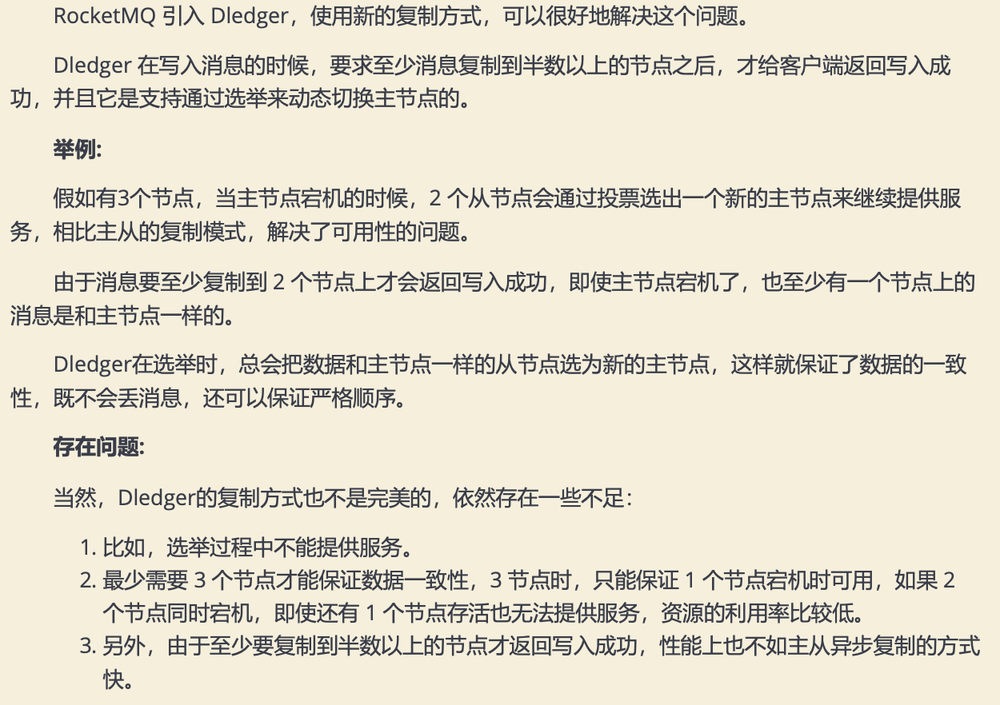

#同步复制和异步复制

#数据同步
#选举(raft)

#raft vs zookeeper
利用 raft 协议来完成一个自动选主，raft 协议相比前者的优点是不需要引入外部组件，自动选主逻辑集成到各个节点的进程中，节点之间通过通信就可以完成选主
RocketMQ选择用 「raft」 协议来解决这个问题，而 「DLedger 就是一个基于 raft 协议的 commitlog 存储库」，也是 RocketMQ 实现新的高可用多副本架构的关键
#netty

