# 配货
##标题
##SKU
##品牌
##URL
##描述
例如：产品类别、图案、颜色、材质、结构、形状、尺寸、功能
像品牌、货号、是否进口、主要下游平台、是否跨境专供等均可删除

图片尺寸1600*1600
##要点编辑
（1）产品是什么、
（2）产品的作用、
（3）产品的功能、
（4）产品的材质、
（5）产品的尺寸、
（6）产品的优势，对产品进行描述
# 定价(重要)
产品定价计算公式：
采购成本=采购价+国内快递费
国际物流费用={（产品重量x运费）+挂号费} x中转仓服务费1.15
利润 小件30  大件50

（采购成本+国际物流费用+利润）÷汇率÷佣 金0.85=产品最终售价

(5[商品价格]+6[运费]+   (((0.10[跨境包裹重量]+0.09[外包装重量])*87)+18[挂号费])*1.15+       30[利润])/7/0.85[亚马逊提成]

(6.3[商品价格]+5[运费] +   ((MAX(0.6,0.78)[跨境包裹重量]+0.3[外包装重量])*87+9[挂号费])*1.15  +  30[利润])/7/0.85[亚马逊提成]
##商品进货价格
2.38
##快递费
3.5
##国际物流费
(商品重量+快递重量)*价格表
[z_00_国际物流表8.3.xlsx]
商品重量=max(商品重量,体积重)
有商品详情时计算体积重
(0.06+0.05)*117

体积不超过60*40*35,

体积重:
长*宽*高/8000
实际收费:max(实际重量0.5kg,20*30*20/8000=1.5kg)=1.5kg
###商品重量
###包装袋/包装盒重量
###
##挂号费
18
##中转仓服务费
*1.15
##亚马逊佣金
0.85

# 选品
避免侵权,避免禁忌,了解禁售
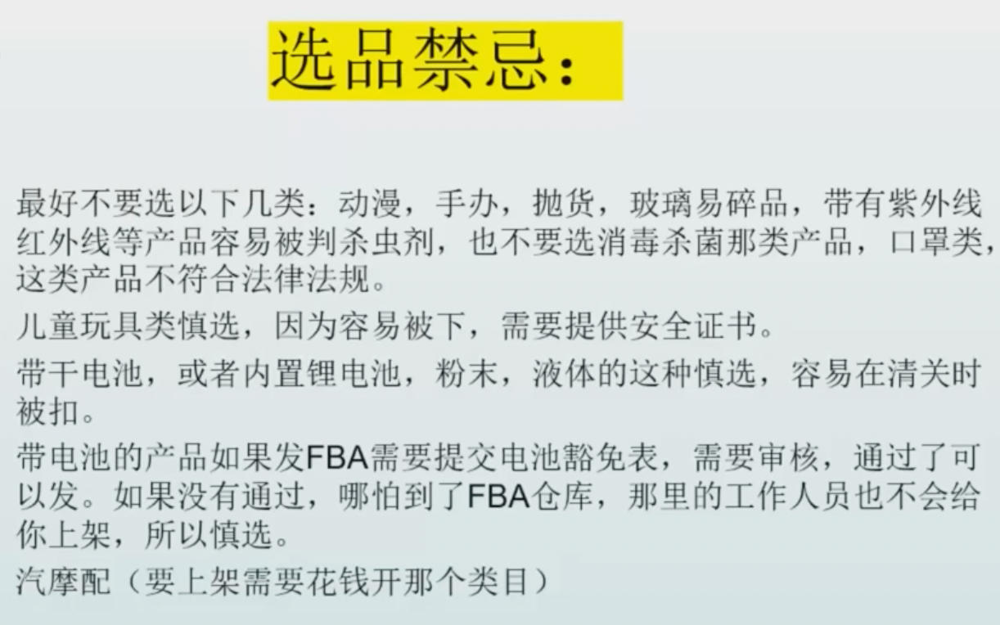

【厨房用品】：碗，勺子，刷子，垫子，餐具，烹饪锅，桌布，储物罐，糕点刀
【装饰类的家庭小摆件】：相框、彩带等，这些节日必备的装饰用品，是每个国外家庭节日都会采购的商品
【居家日用】：茶杯套，折叠书架，烤箱手套，抱枕，水杯，小摆件，饰品，墙贴，人造花，穿线工具，香皂片，脏衣篓，人造草，风尘罩， 假鸟 ，墙贴 ， 
翅膀贴 ，订书机 ，蝴蝶纸 ，生日装饰 ，防尘罩 ，水仙花装饰 ， 饭盒 ，蝴蝶窗帘 ，小雏菊窗帘，收纳盒，仿真花，装饰品摆件
## 价格
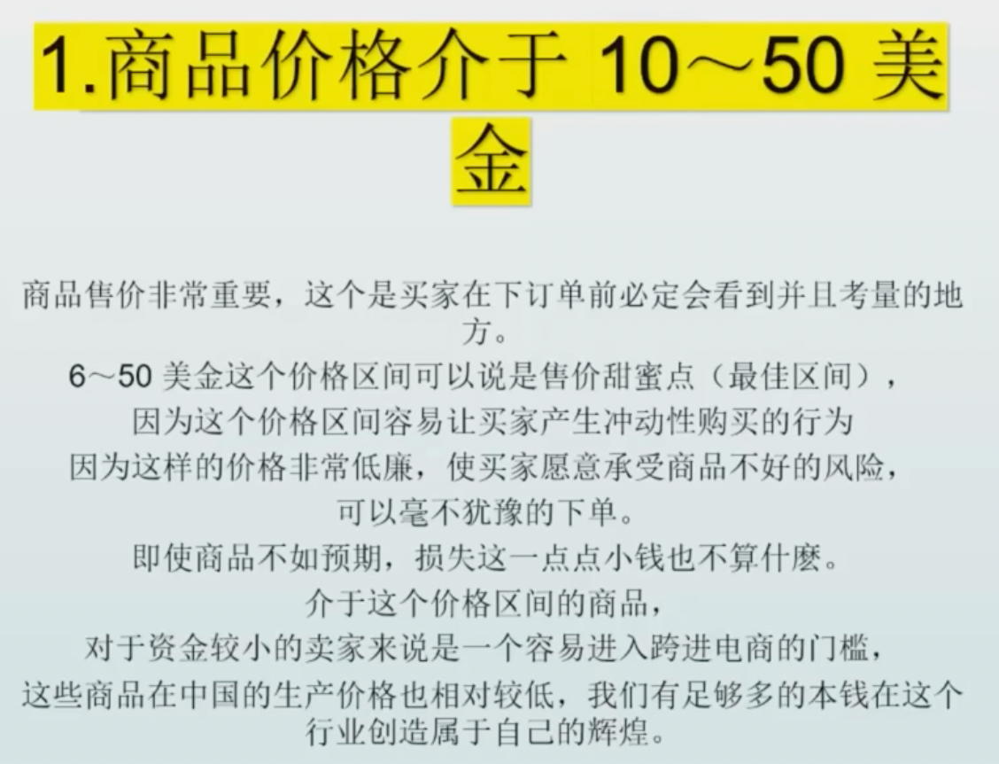
## 重量
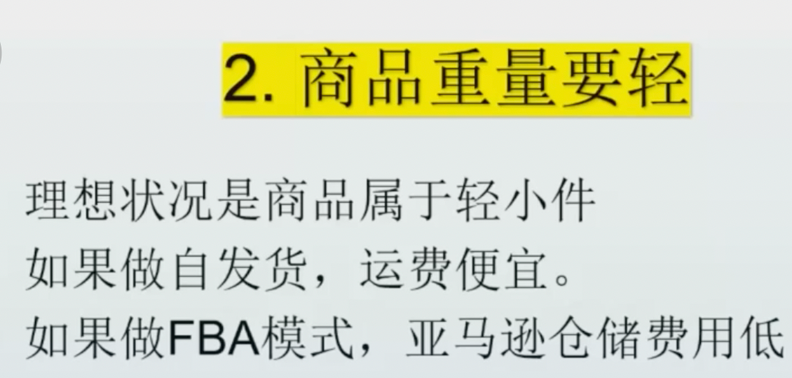
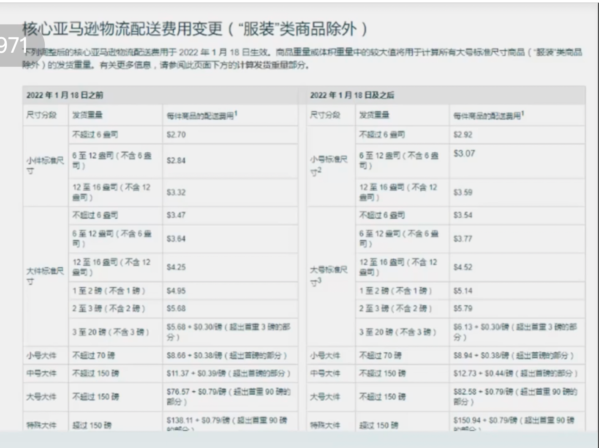
##  耐破损性
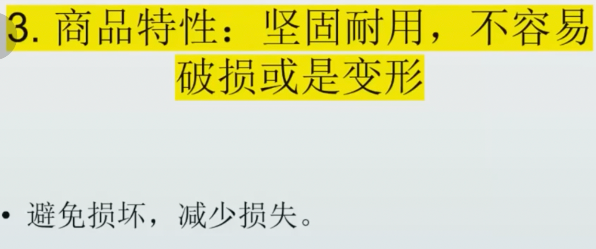
## 亚马逊商品排名
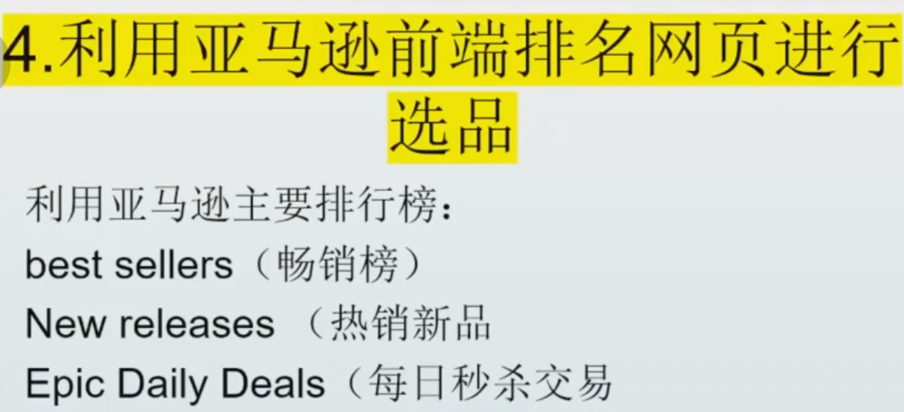
best sellers
new releases
epic daily deals
选择评分不高销量好的产品
## 产品review
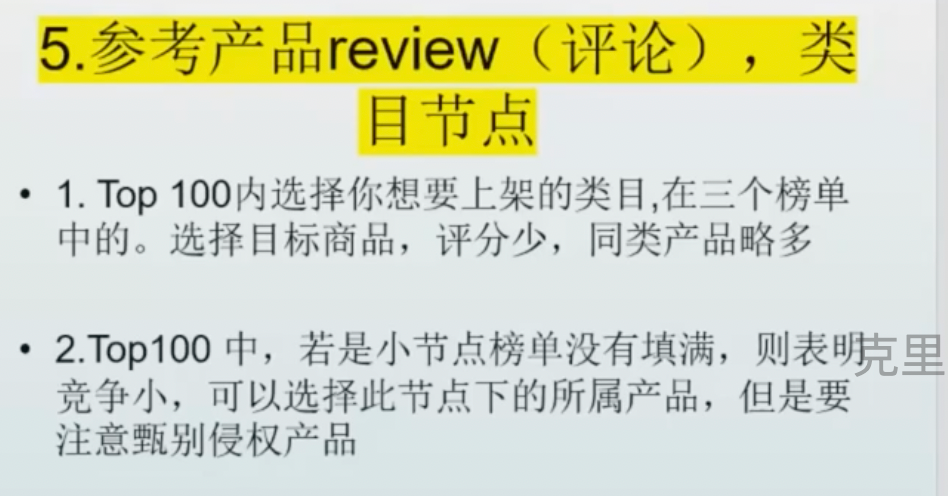
注意:注意侵权产品
## 成本价格低于售价25%
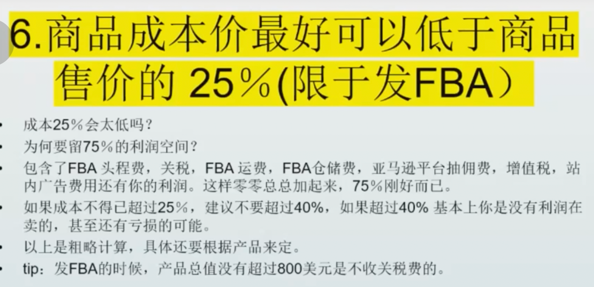
## 当前流行趋势
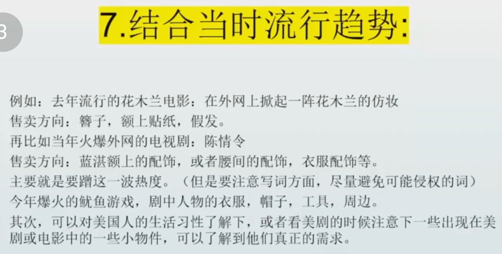
## 结合ebay,速卖通选品
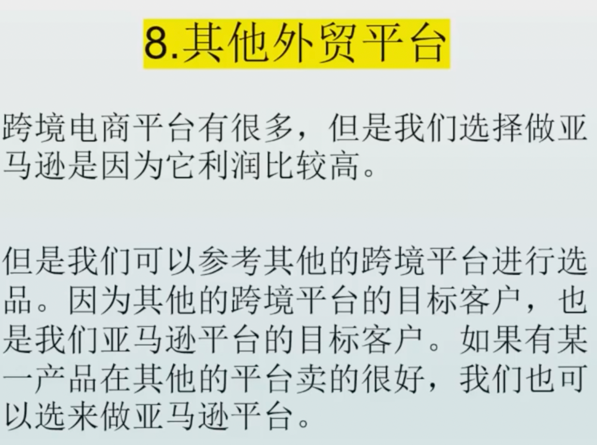
## 非季节性商品
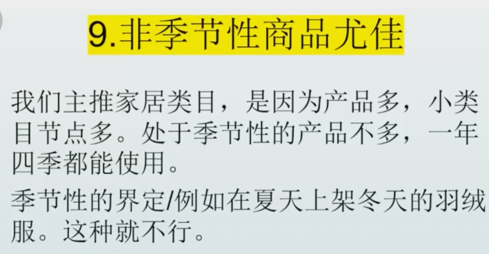
## 节日
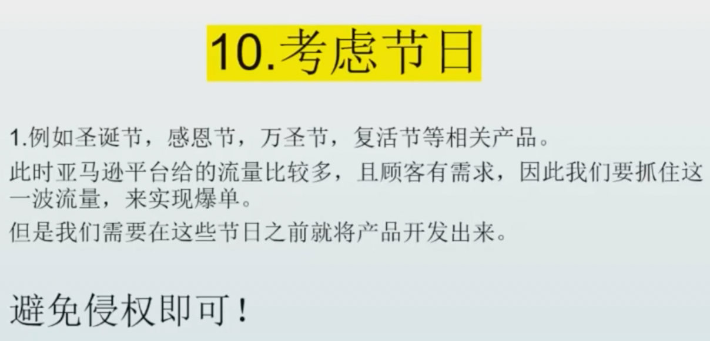

#注意事项
##产品图片
第一个是产品页面编辑方面，listing页面完整（图片、标题、五大卖点、详情），符合平台要求并且正确显示，没有汉字等不当信息

产品变体信息的主图，一也要是纯色底图，背景不要太花，主图上除了单个的产品形象以外不要有其他的东西
##敏感词汇
还有就是如果商品信息中以下信息，则很可能被判定为杀虫剂，您编辑的时候也要注意下的：防水，防污，防霉，防潮，防菌，除螨，无毒、无害、净化、过滤、
过敏、干燥、耐久性、耐用、湿/干、矿物油、抗菌、抗微生物、抗真菌、抗细菌、霉菌、消毒、驱虫、去除过敏原或预防细菌、预防、消灭、驱除或减缓任何害虫、
紫外线装置、发声器、昆虫陷阱、地面振动器、水处理装置、空气处理装置

##违禁
违禁词：热销、新品上市、畅销书、热销、最受欢迎的、100%质量、有史以来最好的、批发、黄jin交易日、高质量、最佳评分、退款、提供不同颜色、自定义大小、
全球免费送货、2到3天发货、好价格、买2送1、保证或退款、大甩卖、当日优惠、放心、免费送货、所有尺寸和样式、不可错过、限量版、按要求

常见的：纳米、欧盟认证、热销，推荐，创意，风格类的词，爆款，其他电商平台，国家，地域，婴儿，儿童，宝宝这种词不要编辑在您的产品信息里面

##受限商品
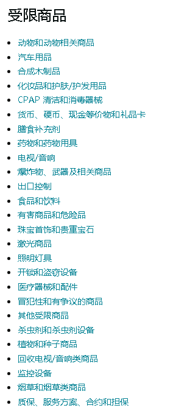
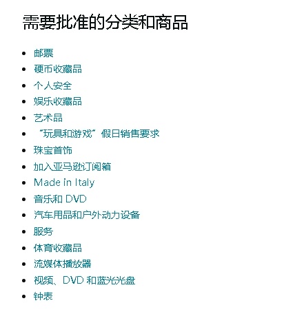

##侵权商品
还需要注意的是，亚马逊平台上的商家对产品的品牌（商标），设计，外观专利是非常看中的，所以我们上传的时候，不要去触碰到这些，
在我们没有授权到这些品牌，设计，外观专利的情况下，直接贸然上传，就会被亚马逊认为是在卖仿冒品

比如说一些大品牌的商标，比如iphone，huawei、mac。还有一些造型比较奇特，或者功能新奇的商品，可能存在外观专利，其次还有飞盘和花生漫画以及
balloons这个单词和EMOJI这个单词以及这个表情包相关的产品我们也不要去上传，这几个是很容易收到律师函的

比基尼，男士泳裤：款式大多模仿品牌维多利亚的秘密，因为系列款式之多，我们很难避开一些细节设计的雷区

公仔和著名人物形象：大白，米奇米妮，冰雪奇缘，等等一系列迪士尼的产品，还有漫威等公仔娃娃，
即使有些厂商对动画人物做了细小的改动，但还是特别容易造成侵权（将卡通人物印在衣服，抱枕上也一样）。另外还有翻转娃娃，这个是有翻转设计专利的，是不可以上传的

苹果周边：苹果表带，耳机，数据线
魔方：高阶魔方中六阶和七阶是属于V-CUBE公司的专利，像一些高阶魔方如圣手六七阶如在外国平台销售是会被V-CUBE投诉的。不了解魔方一系列详情的卖家还是慎卖。
另外魔方的英文翻译出来后，是一个已经注册了的商标
##尺寸
衣服裤子鞋子这些有明确尺码的产品是不建议您上架的，一是国内外的尺码不一样，二是这类产品很容易产生侵权问题，您说的这个有品牌的也不可以上架 哦
