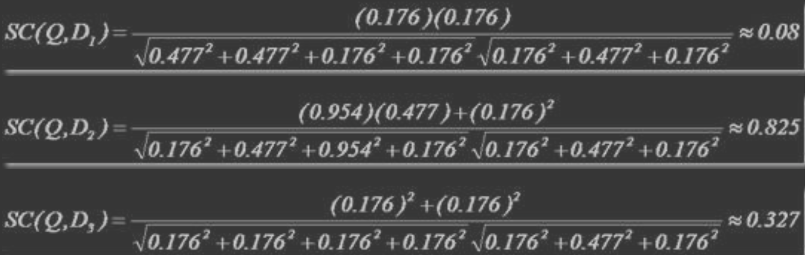

#临界知识


#非结构化数据检索优化(反向索引)
顺序扫描 -> 数据慢,why?
由于我们想要搜索的信息和非结构化数据中所存储的信息不一致造成的
非结构化数据中所存储的信息是每个文件包含哪些字符串
而我们想搜索的信息是哪些文件包含此字符串
由于从字符串到文件的映射是文件到字符串映射的反向过程，于是保存这种信息的索引称为 反向索引


```asp
左边保存的是一系列字符串，称为词典。 
每个字符串都指向包含此字符串的文档(Document)链表，此文档链表称为倒排表(Posting List)。
有了索引，便使保存的信息和要搜索的信息一致，可以大大加快搜索的速度。 
比如说，我们要寻找既包含字符串“lucene”又包􏰇字符串“solr ”的文档，我们只需要以下几步: 
1. 取出包􏰇字符串“lucene”的文档链表
2. 取出包􏰇字符串“solr”的文档链表
3. 通过合并链表，找出既包􏰇“lucene”又包含“solr”的文件
```
#全文索引核心问题
1. 索引里面究竟存些什么?(Index)
2. 如何创建索引?(Indexing)
3. 如何对索引进行搜索?(Search)
```asp
1.快,实时性(数据结构,压缩算法)
2.准,准确性(相关度)
3.召回率
```
#核心拓扑

```asp
1. 索引过程:
1) 有一系列被索引文件
2) 被索引文件经过语法分析和语言处理形成一系列词(Term)。
3) 经过索引创建形成词典和反向索引表。
4) 通过索引存储将索引写入硬盘。

2. 搜索过程:
a) 用户输入查询语句。
b) 对查询语句经过语法分析和语言分析得到一系列词(Term)。
c) 通过语法分析得到一个查询树。
d) 通过索引存储将索引读入到内存。
e) 利用查询树搜索索引，从而得到每个词(Term)的文档链表，对文档链表进行交，差，并得 到结果文档。
f) 将搜索到的结果文档对查询的相关性进行排序。
g) 返回查询结果给用户。
```
##原文档
```asp
文件一:Students should be allowed to go out with their friends, but not allowed to drink beer. 
文件二:My friend Jerry went to school to see his students but found them drunk which is not
```
##分词
```asp
1. 将文档分成一个一个单独的单词。
2. 去除标点符号。
3. 去除停词(Stop word)
```
###分词组件(Tokenizer)
###停词(stop word)
(Stop word)如:“the”,“a”，“this”等
###词元(Token)
“Students”，“allowed”，“go”，“their”，“friends”，“allowed”
###语言处理组件(Linguistic Processor)
对得到的词元(Token)做一些同语言相关的处理
```asp
1. 变为小写(Lowercase)。
2. 将单词缩减为词根形式，如“cars”到“car”等。这种操作称为:stemming,数量
3. 将单词转变为词根形式，如“drove”到“drive”等。这种操作称为:lemmatization,同义词,时态
```
###词(Term)
语言处理组件(linguistic processor)的结果称为词(Term)
索引系统通过扫描文章中的每一个词，对其创建索引，指明在文章中出现的次数和位置，当用户查询时，索引系统过就会根据事先简历的索引进行查找，并将查找的结果反馈给用户的检索方式
```asp
“student ”，“allow ”，“go”，“their ”，“friend”，“allow ”，“drink”，“beer ”，“my ”，
“friend”，“jerry ”， “go”，“school”，“see”，“his”，“student”，“find”，“them”，“drink”，“allow”
```
##索引
###字典(词和文档id的映射)


###字典排序


###合并相同词形成倒排链表

###文档频次(Document Frequency)
表示总共有多少文件包含此词(Term)
###词频(Frequency)
表示此文件中包含了几个此词(Term)

##搜索
###查询语句
lucene AND learned NOT hadoop
###词法分析
经过词法分析，得到单词有 lucene，learned，hadoop
###语法分析
如 lucene NOT AND learned，则会出错

###语言处理
learned 变成 learn
###搜索索引
```asp
1. 首先，在反向索引表中，分􏰅找出包􏰇 lucene，learn，hadoop 的文档链表。
2. 其次，对包含lucene，learn 的链表进行合并操作，得到既包含 lucene 又包含 learn 的文档链表。
3. 然后，将此链表与 hadoop 的文档链表进行差操作，去除包􏰇 hadoop 的文档，从而得到既包含 lucene 又包含 learn 而且不包􏰇 hadoop 的文档链表。 
4. 此文档链表就是我们要找的文档
```
###结果排序(相关性排序)
对文档与文档之间的相关性(relevance)进行打分 (scoring)，分数高的相关性好，就应该排在前面
找出词(Term)对文档的重要性的过程称为计算词的权重(Term weight)的过程
计算词的权重(term weight)有两个参数，第一个是词(Term)，第二个是文档(Document)。 词的权重(Term weight)表示此词(Term)在此文档中的重要程度，
越重要的词(Term)有越大的权 重(Term weight)，因而在计算文档之间的相关性中将发挥更大的作用。 判断词(Term)之间的关系从而得到文档相关性的过程
应用一种叫做向量空间模型的算法 (Vector Space Model)
###词权重计算

####Term Frequency (tf)
Term Frequency (tf):即此 Term 在此文档中出现了多少次。tf 越大说明越重要
####Document Frequency (df)
df 越大说明越不重要

###向量空间模型算法
我们把文档看作一系列词(Term)，每一个词(Term)都有一个权重(Term weight)，不同的词(Term) 根据自己在文档中的权重来影响文档相关性的打分计算
于是我们把所有此文档中词(term)的权重(term weight) 看作一个向量。
Document = {term1, term2, ...... ,term N}
Document Vector = {weight1, weight2, ...... ,weight N}
同样我们把查询语句看作一个简单的文档，也用向量来表示。
Query = {term1, term 2, ...... , term N}
Query Vector = {weight1, weight2, ...... , weight N}
我们把所有搜索出的文档向量及查询向量放到一个 N 维空间中，每个词(term)是一维

我们认为两个向量之间的夹角越小，相关性越大
所以我们计算夹角的余弦值作为相关性的打分，夹角越小，余弦值越大，打分越高，相关性 越大
不同时，取二者的并集，如果不 􏰇某个词(Term)时，则权重(Term Weight)为 0



