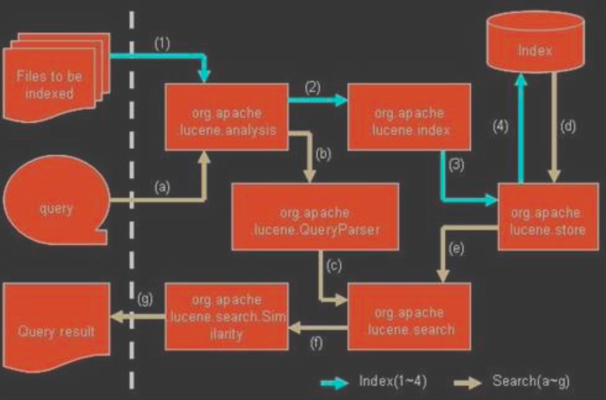
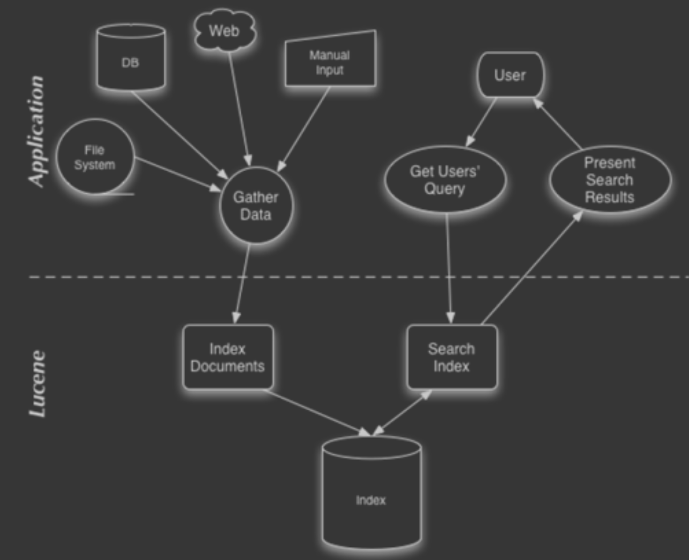
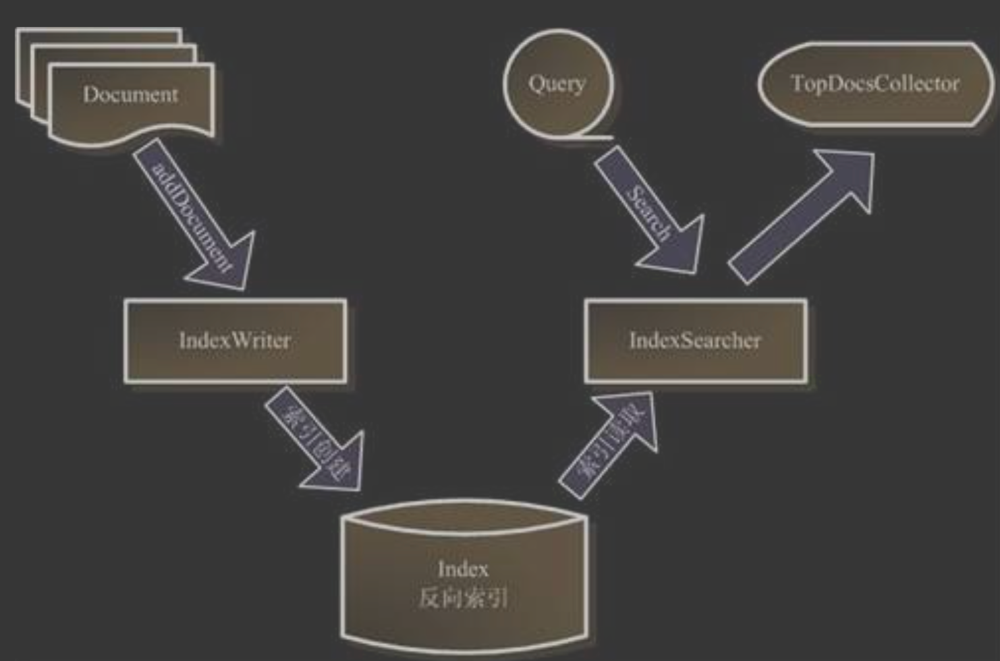
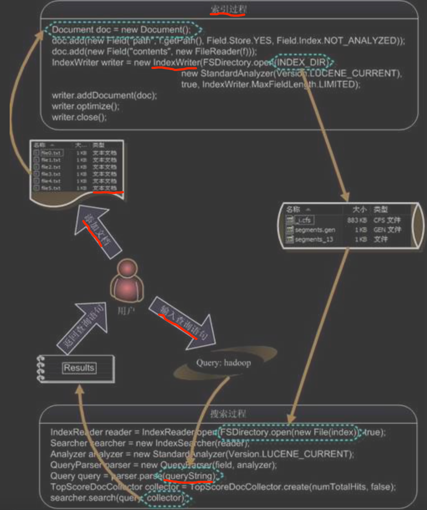

#lucene拓扑

Lucene 是有索引和搜索的两个过程，包􏰇索引创建，索引，搜索三个要点


```asp
􏰁 被索引的文档用Document对象表示。
􏰁 IndexWriter通过函数addDocument将文档添加到索引中，实现创建索引的过程。 􏰁 Lucene的索引是应用反向索引。
􏰁 当用户有请求时，Query代表用户的查询语句。
􏰁 IndexSearcher通过函数search搜索LuceneIndex。
􏰁 IndexSearcher计算termweight和score并且将结果返回给用户。
􏰁 返回给用户的文档集合用TopDocsCollector表示
```
##segment
##doc
##field
##term
##docvalues
#索引过程

```asp
􏰂 创建一个 IndexWriter 用来写索引文件，它有几个参数，INDEX_DIR 就是索引文件所
存放的位置，Analyzer 便是用来对文档进行词法分析和语言处理的。
􏰂 创建一个 Document 代表我们要索引的文档。
􏰂 将不同的 Field 加入到文档中。我们知道，一篇文档有多种信息，如题目，作者，
修改时间，内容等。不同类型的信息用不同的 Field 来表示，在本例子中，一共有 两类信息进行了索引，一个是文件路径，一个是文件内容。其中 FileReader 的 SRC_FILE 就表示要索引的源文件。
􏰂 IndexWriter 调用函数 addDocument 将索引写到索引文件夹中
```
#搜索过程
```asp
􏰂 IndexReader 将磁盘上的索引信息读入到内存，INDEX_DIR 就是索引文件存放的位置。
􏰂 创建 IndexSearcher 准备进行搜索。
􏰂 创建 Analyer 用来对查询语句进行词法分析和语言处理。
􏰂 创建 QueryParser 用来对查询语句进行语法分析。
􏰂 QueryParser 调用 parser 进行语法分析，形成查询语法树，放到 Query 中。
􏰂 IndexSearcher 调用 search 对查询语法树 Query 进行搜索，得到结果TopScoreDocCollector
```

#lucene核心模块

```asp
􏰁 Lucene的analysis模块主要负责词法分析及语言处理而形成Term。 
􏰁 Lucene的index模块主要负责索引的创建，里面有IndexWriter。
􏰁 Lucene的store模块主要负责索引的读写。
􏰁 Lucene的QueryParser主要负责语法分析。
􏰁 Lucene的search模块主要负责对索引的搜索。
􏰁 Lucene的similarity模块主要负责对相关性打分的实现。 
```
