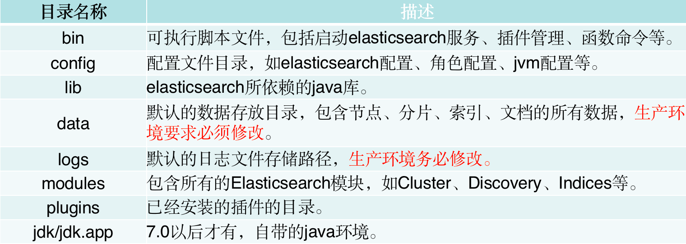

#为什么mysql不适合搜索引擎?
#文件物理目录


#倒排索引tip、tim
```asp
插入abd时，没有输出。
2. 插入abe时，计算出前缀ab，但此时不知道后续还不会有其他以ab为前缀的词，所以此时无输出。
3. 插入acf时，因为是有序的，知道不会再有ab前缀的词了，这时就可以写tip和tim了，tim中写入后缀词块d、e和它们的倒排表位置ip_d,ip_e，tip中写入a，b和以ab为前缀的后缀词块位置(真实情况下会写入更多信息如词频等)。
4. 插入acg时，计算出和acf共享前缀ac，这时输入已经结束，所有数据写入磁盘。tim中写入后缀词块f、g和相对应的倒排表位置，tip中写入c和以ac为前缀的后缀词块位置。
```
[](https://www.cnblogs.com/sessionbest/articles/8689030.html)
[](https://www.cnblogs.com/bonelee/p/6394451.html)
