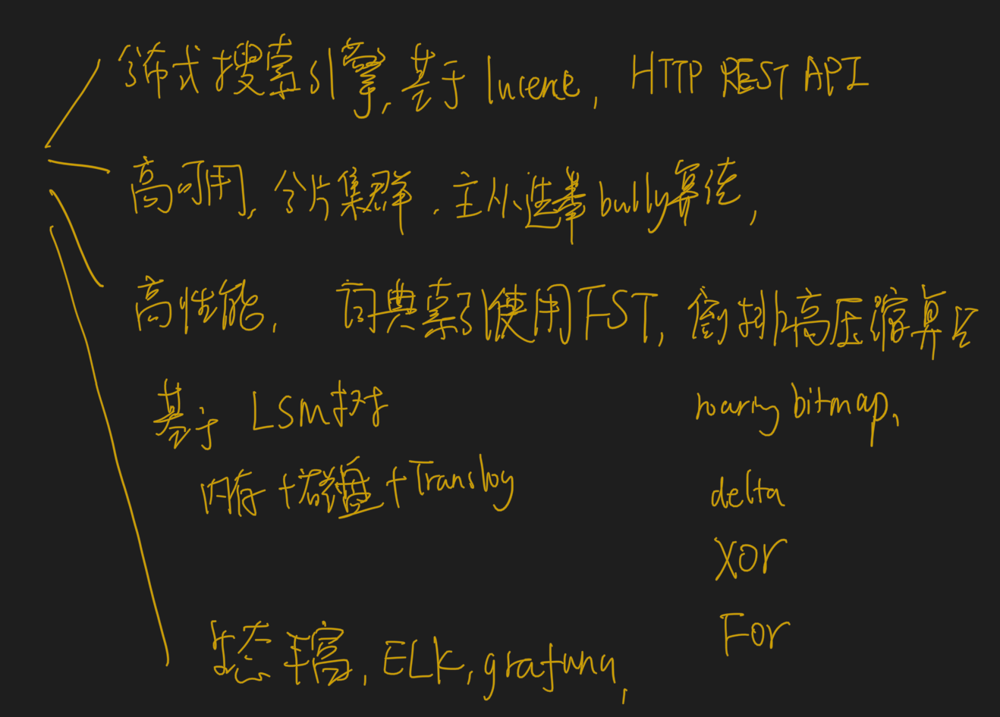
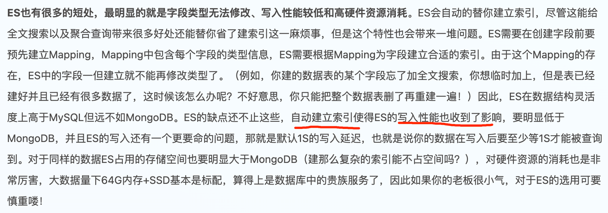

#临界知识

#选型

es vs Solr
#腾讯云 es vs 阿里云 es

#定位
Elasticsearch 是一个分布式、RESTful 风格的搜索和数据分析引擎
based on the Lucene library. It provides a distributed, multitenant-capable full-text search engine with an HTTP web
Elasticsearch is the distributed, RESTful search and analytics engine at the heart of the Elastic Stack. 
You can use Elasticsearch to store, search, and manage data

#写入性能 es vs hbase

