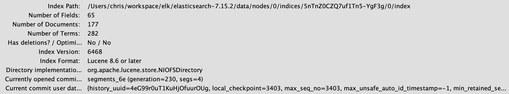
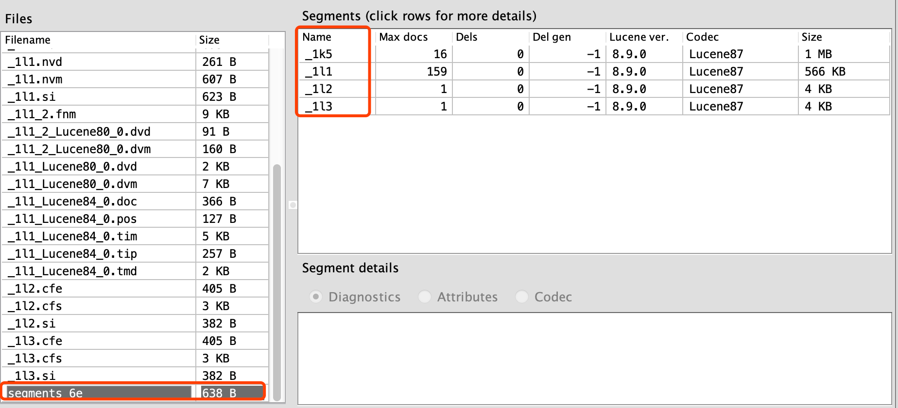

#head插件
#启动集群
./elasticsearch -d
/elasticsearch -E path.data=data1 -E path.logs=log1 -E node.name=node1 -E cluster.name=msb_teach
./elasticsearch -E path.data=data2 -E path.logs=log2 -E node.name=node2 -E cluster.name=msb_teach

./kibana

#集群启动常见问题

#luke查看物理索引文件
[下载地址](https://github.com/DmitryKey/luke)
/Users/chris/workspace/elk/lucene/luke脚本查看分析index索引文件

segments

