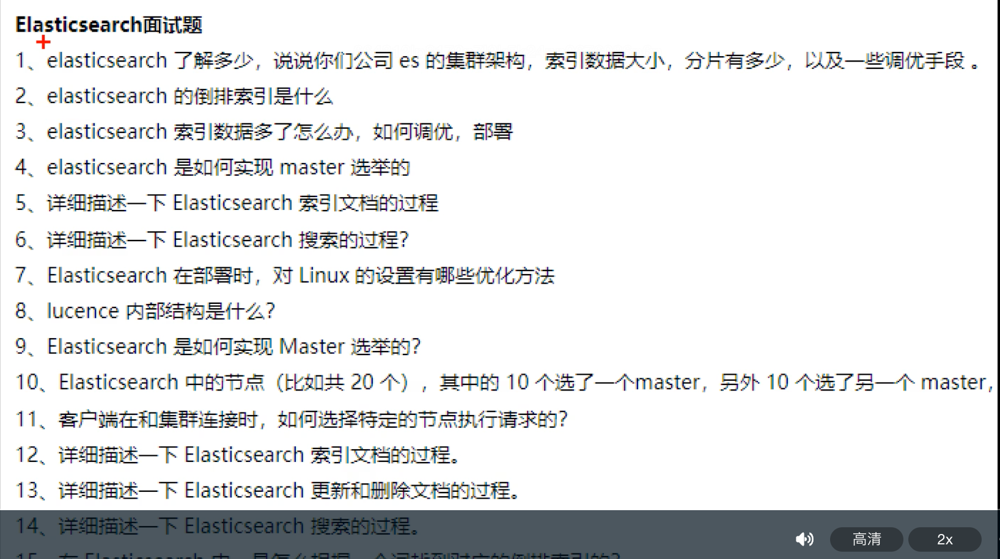
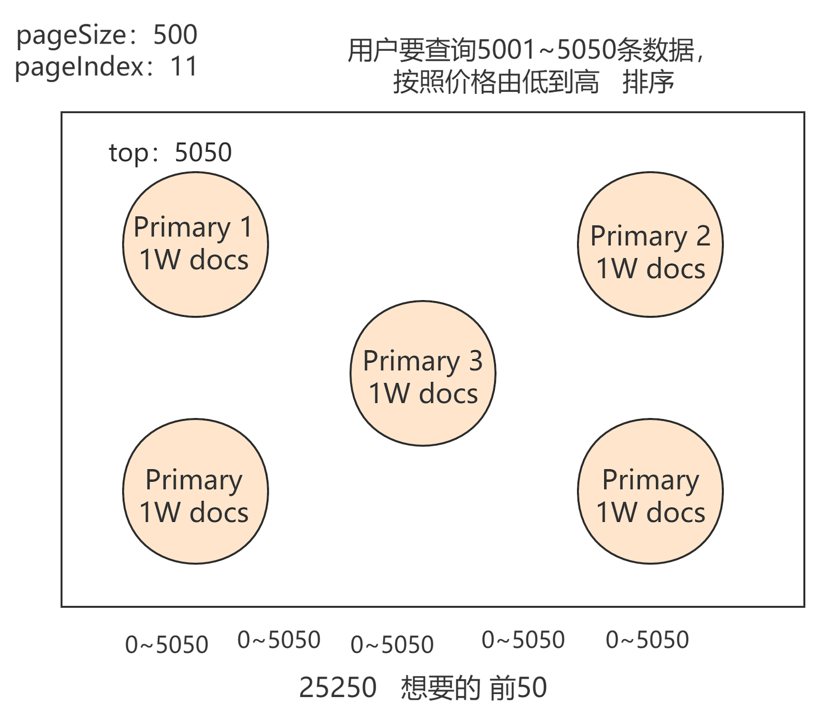
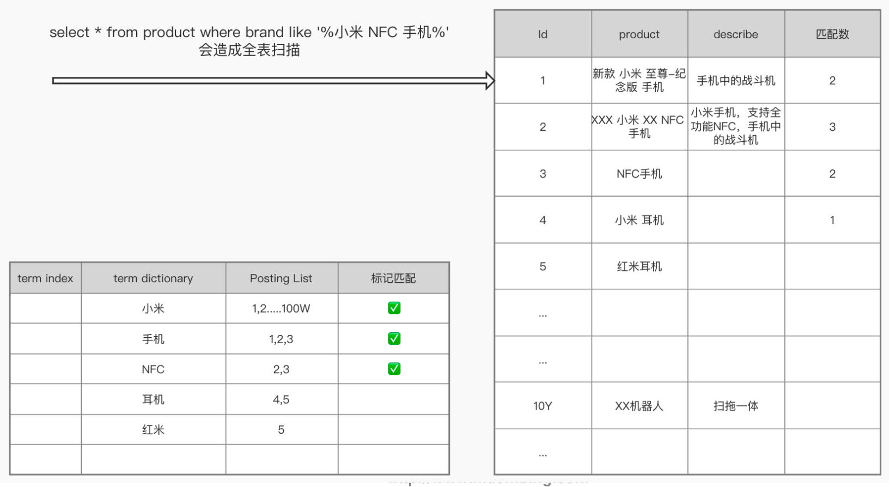

#es学习资料
[拉钩]
#说说对es的理解
```asp
总:
1.开源的分布式全文检索、存储引擎,基于lucene,提供restful 风格的http web请求

分:
elk技术栈,es,kibana,file beat
高性能:倒排fst,roaring bitmap,for
高可用:分布式分片集群,bully选举
高并发:
成本:开源,
可扩展:
安全:
```
#elasticsearch用途
```asp
全文搜索引擎,google,百度
github
日志系统
olap在线分析系统
```
#项目中的es问题
10000*1000B*24*30/1024/1024=6G
##深度分页(面试难点讲解)
[业界难题-“跨库分页”的四种方案](https://cloud.tencent.com/developer/article/1048654)

[search after](https://juejin.cn/post/7015792924457697316#heading-6)
[](https://developer.aliyun.com/article/771575#slide-8)
[查询阶段](https://www.elastic.co/guide/cn/elasticsearch/guide/2.x/_query_phase.html)
[取回阶段](https://www.elastic.co/guide/cn/elasticsearch/guide/2.x/_fetch_phase.html#_fetch_phase)
[原理](http://www.readingnotes.site/posts/%E4%BD%BF%E7%94%A8scroll%E5%AE%9E%E7%8E%B0Elasticsearch%E6%95%B0%E6%8D%AE%E9%81%8D%E5%8E%86%E5%92%8C%E6%B7%B1%E5%BA%A6%E5%88%86%E9%A1%B5.html)
##scroll原理
[](https://elasticsearch.cn/question/2935)
[](https://www.jianshu.com/p/91d03b16af77)
##search after原理
[doc values](https://www.jianshu.com/p/91d03b16af77)
[](https://elasticsearch.cn/question/2935)
#为什么mysql不适合搜索引擎?
```asp
1.定位不适合
搜索引擎面对的业务常见是海量数据检索,聚合,分析,排序,数据压缩,存储,弱事务,OLAP系统,需要分布式,高可扩展
mysql支持OLTP系统,强事务,使用行存储,b+树,写性能受限于主库,支持连接1000,扛不住海量写请求
2.数据结构不适合
mysql使用b+树,行存,适合单值索引和范围索引,聚合排序需要读取整行,对内存造成很大压力,不适合海量数据的聚合分析
b+树不适合无前缀的模糊匹配,不适合词模糊查询,不适合词的反向搜索,可能索引失效导致全表匹配
不适合海量数据指定字段排序,特定字段聚合,分页,需要读入整行,导致不必要的io操作,如果是列存储,只需读取需要的行,且列可以进行存储压缩优化,fst,delta
3.性能扛不住
mysql为了支持在线交易,需要强一致性,使用了binlog,redolog两阶段提交确保一致性,还要考虑事务隔离性如读已提交,可重复读级别,提供了事务视图undolog
表级锁,行级锁,性能受到限制,生产环境数据库一般只支持1000+的读写连接
4.分布式扩展性
mysql扩展性很差,主从结构,写主要在主库,对于海量日志收集,监控,mysql扛不住,es使用分片
```

