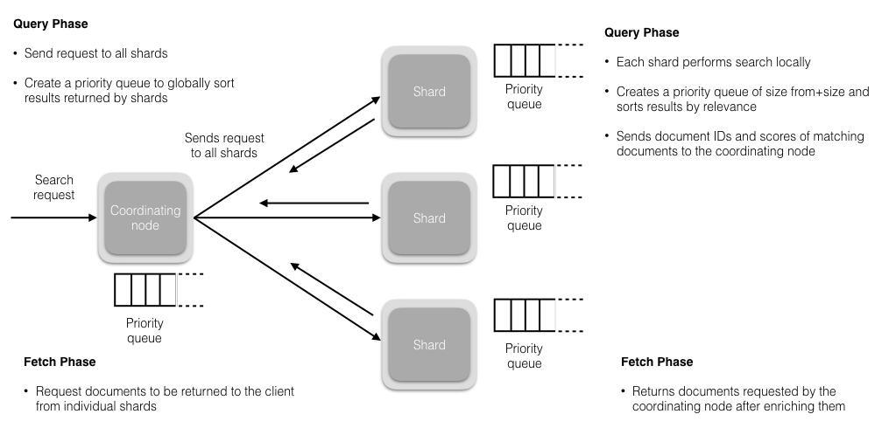

#es学习资料
[拉钩]
#说说对es的理解
```asp
总:
1.开源的分布式全文检索、存储引擎,基于lucene,提供restful 风格的http web请求

分:
elk技术栈,es,kibana,file beat
高性能:倒排fst,roaring bitmap,for,ack策略
高可用:分布式分片集群,bully选举,持久化translog
高并发:多分片
成本:开源,
可扩展:选举,脑裂
安全:
```
#elasticsearch用途
```asp
全文搜索引擎,google,百度
github
日志系统
olap在线分析系统
```
#elasticsearch优化
[z_es_02_es_03_性能优化.md]
##设计阶段调优
1.采取基于日期模板创建索引，通过 roll over API 滚动索引
2.使用别名进行索引管理
3.每天凌晨定时对索引做 force_merge 操作
4.采取冷热分离机制，热数据存储到 SSD，提高检索效率；冷数据定期进行 shrink操作，以缩减存储
5.Mapping 阶段充分结合各个字段的属性，是否需要检索、是否需要存储,最小通用原则
##写入调优
1.写入前副本数设置为 0
2.写入前关闭 refresh_interval 设置为-1，禁用刷新机制
3.写入过程中：采取 bulk 批量写入；
##查询调优
1.充分利用倒排索引机制，能 keyword 类型尽量 keyword
##运维优化
1关闭缓存 swap;
2堆内存设置为：Min（节点内存/2, 32GB）;
3设置最大文件句柄数；
4线程池+队列大小根据业务需要做调整；
5磁盘存储 raid 方式——存储有条件使用 RAID10，增加单节点性能以及避免单节点存储故障
#es运维排查问题?
flink yarn ui查看吞吐，反压，异常日志
grafana查看吞吐,jvm gc,merge
#说说倒排索引原理?
[z_es_01_lucene_01_索引生成_索引文件格式_拓扑.md]
[z_es_01_lucene_03_倒排算法_压缩算法_相关度排序算法.md]
#避免索引数据过多,如何管理索引？
##滚动索引
```asp
基于模板+时间+rollover api 滚动创建索引，举例：设计阶段定义：blog 索引的模板格式为： blog_index_时间戳的形式，每天递增数据。这样做的好处：不至于数据量激增导致单个索引数据量非 常大，接近于上线 2 的32 次幂-1，索引存储达到了 TB+甚至更大。
一旦单个索引很大，存储等各种风险也随之而来，所以要提前考虑+及早避免
```
##冷热分离
```asp
冷热数据分离存储，热数据（比如最近 3 天或者一周的数据），其余为冷数据。

对于冷数据不会再写入新数据，可以考虑定期 force_merge 加 shrink 压缩操作，节省存储空间和检索效率。
```
##部署层面
扩容节点
#elasticsearch 是如何实现 master 选举的?
1.心跳监听
2.宕机投票
3.候选节点投票选举,id小的优先级高
4.同步选举结果
5.数据同步
#写流程
[z_es_02_es_02_读写过程_乐观锁_段合并_刷盘机制.md]

协调节点默认使用文档 ID 参与计算（也支持通过 routing），以便为路由提供合适的分片
```asp
shard = hash(document_id) % (num_of_primary_shards)
```

#删流程
#更新流程
```asp
1.删除和更新也都是写操作，但是 Elasticsearch 中的文档是不可变的，因此不能被删除或者改动以展示其变更；
2.磁盘上的每个段都有一个相应的.del 文件。当删除请求发送后，文档并没有真的被删除，而是在.del 文件中被标记为删除。该文档依然能匹配查询，
但是会在结果中被过滤掉。当段合并时，在.del 文件中被标记为删除的文档将不会被写入新段。
3.在新的文档被创建时，Elasticsearch 会为该文档指定一个版本号，当执行更新时，旧版本的文档在.del 文件中被标记为删除，新版本的文档被索引到一个新段。旧版本的文档依然能匹配查询，但是会在结果中被过滤掉
```
#检索流程
query,fetch,局部优先队列,协调节点优先队列
```asp
1假设一个索引数据有 5 主+1 副本 共 10 分片，一次请求会命中（主或者副本分片中）的一个。
2每个分片在本地进行查询，结果返回到本地有序的优先队列中。
3第 2）步骤的结果发送到协调节点，协调节点产生一个全局的排序列表
```


[](https://pdai.tech/md/db/nosql-es/elasticsearch-y-th-4.html)
[深度分页]
#在并发情况下，Elasticsearch 如果保证读写一致？
```asp
1可以通过版本号使用乐观并发控制，以确保新版本不会被旧版本覆盖，由应用层来处理具体的冲突；
2另外对于写操作，一致性级别支持 quorum/one/all，默认为 quorum，即只有当大多数分片可用时才允许写操作。但即使大多数可用，也可能存在因为网络等原因导致写入副本失败，这样该副本被认为故障，分片将会在一个不同的节点上重建。
3对于读操作，可以设置 replication 为 sync(默认)，这使得操作在主分片和副本分片都完成后才会返回；如果设置 replication 为 async 时，也可以通过设置搜索请求参数_preference 为 primary 来查
```
#项目中的es问题
##项目中用到的查询与聚合
1.指标聚合,桶聚合,pipeline都用到了
term,Date histogram,Nested
top_metrics,max,cardinality,Stats
bucket_sort,bucket_selector(Sibling),bucket_script,Sum bucket
###统计当天告警变量只展示最新一条


should+filter时,需要配置should_match=1时should才生效


###获取变量今天的所有流程

filter,terms=groupId,terms=varName
range=time,gte=***,lte=**
field=process_ids.id
sort
###统计30天所有流程的总数


##项目索引配置策略&数据建模
alias+滚动

ILM
>30d || >5G 滚动
##项目中的优化策略
###集群性能调优
1.禁用Swapping
2.jvm不超过30G,避免指针压缩的问题，垃圾回收器使用的是？
3.分片1,副本0
4.绑定cpu,后台进程绑定一个cpu,不去消耗读写线程
5.2主1投票,8数据节点
6.使用DEFLATE不使用LZ4压缩算法
###数据
1.多多使用range限定范围
2.使用_source=false,field include和exclude过滤避免过多数据
3.mapping,使用keyword避免分词,模糊匹配keyword必须前缀,使用byte代替int,使用date代替string
4.bulk进行批量请求,避免translog频繁flush,避免生成过多小segment,后期merge太频繁
5.避免深度分页，避免单页数据过大，可以参考百度的做法(每次滚动10页缓存下来),search after
6.>30d||>5G滚动到冷数据层，热SSD,冷机械硬盘
7.日志监控close >7d的索引
8.对于冷数据不会再写入新数据，可以考虑定期 force_merge 加 shrink 压缩操作，节省存储空间和检索效率
9.index.merge.scheduler.max_thread_count，团队的是4
10.sort.order预排序
```asp
PUT my-index-000001
{
  "settings": {
    "index": {
      "sort.field": "date", 
      "sort.order": "desc"  
    }
  },
  "mappings": {
    "properties": {
      "date": {
        "type": "date"
      }
    }
  }
}
```
###刷segment&刷盘
1.增加refresh_interval的参数值，目的是减少segment文件的创建，减少segment的merge次数，merge是发生在jvm中的，有可能导致full GC，增加refresh会降低搜索的实时性
2.增加flush时间间隔，目的是减小数据写入磁盘的频率，减小磁盘IO
3.增加Buffer大小，本质也是减小refresh的时间间隔，因为导致segment文件创建的原因不仅有时间阈值，还有buffer空间大小，写满了也会创建。默认最小值 48MB< 默认值 堆空间的10% < 默认最大无限制
###评分
1.使用filter避免评分,query使用评分
2.关闭Norms字段
##说说你们公司 es 的集群架构和吞吐规模
11个节点,3个master,8个数据节点,1个分片1个副本

读写速度,grafana查看
[](https://www.elastic.co/cn/blog/benchmarking-and-sizing-your-elasticsearch-cluster-for-logs-and-metrics)
计算和存储合一，重点关注TPS,吞吐,merge效率,每个节点segment数量


##遇到的问题
1.分页<10000
2.单个文档的内嵌文档<10000,
3.并发,version
##深度分页(面试难点讲解)
[业界难题-“跨库分页”的四种方案](https://cloud.tencent.com/developer/article/1048654)

[search after](https://juejin.cn/post/7015792924457697316#heading-6)
[](https://developer.aliyun.com/article/771575#slide-8)
[查询阶段](https://www.elastic.co/guide/cn/elasticsearch/guide/2.x/_query_phase.html)
[取回阶段](https://www.elastic.co/guide/cn/elasticsearch/guide/2.x/_fetch_phase.html#_fetch_phase)
[原理](http://www.readingnotes.site/posts/%E4%BD%BF%E7%94%A8scroll%E5%AE%9E%E7%8E%B0Elasticsearch%E6%95%B0%E6%8D%AE%E9%81%8D%E5%8E%86%E5%92%8C%E6%B7%B1%E5%BA%A6%E5%88%86%E9%A1%B5.html)
###scroll原理
[](https://elasticsearch.cn/question/2935)
[](https://www.jianshu.com/p/91d03b16af77)
###search after原理
[doc values](https://www.jianshu.com/p/91d03b16af77)
[](https://elasticsearch.cn/question/2935)
```asp
GET /_search
{
  "size": 10000,
  "query": {
    "match" : {
      "user.id" : "elkbee"
    }
  },
  "pit": {
    "id":  "46ToAwMDaWR5BXV1aWQyKwZub2RlXzMAAAAAAAAAACoBYwADaWR4BXV1aWQxAgZub2RlXzEAAAAAAAAAAAEBYQADaWR5BXV1aWQyKgZub2RlXzIAAAAAAAAAAAwBYgACBXV1aWQyAAAFdXVpZDEAAQltYXRjaF9hbGw_gAAAAA==", 
    "keep_alive": "1m"
  },
  "sort": [
    {"@timestamp": {"order": "asc", "format": "strict_date_optional_time_nanos"}}
  ],
  "search_after": [                                
    "2021-05-20T05:30:04.832Z",
    4294967298
  ],
  "track_total_hits": false                        
}
```
#为什么mysql不适合搜索引擎?
```asp
1.定位不适合
搜索引擎面对的业务常见是海量数据检索,聚合,分析,排序,数据压缩,存储,弱事务,OLAP系统,需要分布式,高可扩展
mysql支持OLTP系统,强事务,使用行存储,b+树,写性能受限于主库,支持连接1000,扛不住海量写请求
2.数据结构不适合
mysql使用b+树,行存,适合单值索引和范围索引,聚合排序需要读取整行,对内存造成很大压力,不适合海量数据的聚合分析
b+树不适合无前缀的模糊匹配,不适合词模糊查询,不适合词的反向搜索,可能索引失效导致全表匹配
不适合海量数据指定字段排序,特定字段聚合,分页,需要读入整行,导致不必要的io操作,如果是列存储,只需读取需要的行,且列可以进行存储压缩优化,fst,delta
3.性能扛不住
mysql为了支持在线交易,需要强一致性,使用了binlog,redolog两阶段提交确保一致性,还要考虑事务隔离性如读已提交,可重复读级别,提供了事务视图undolog
表级锁,行级锁,性能受到限制,生产环境数据库一般只支持1000+的读写连接
4.分布式扩展性
mysql扩展性很差,主从结构,写主要在主库,对于海量日志收集,监控,mysql扛不住,es使用分片
```

[](https://cloud.tencent.com/developer/article/1808309)
[](https://juejin.cn/post/6958408979235995655/#heading-26)
[](https://juejin.cn/post/6958408979235995655/#heading-22)
