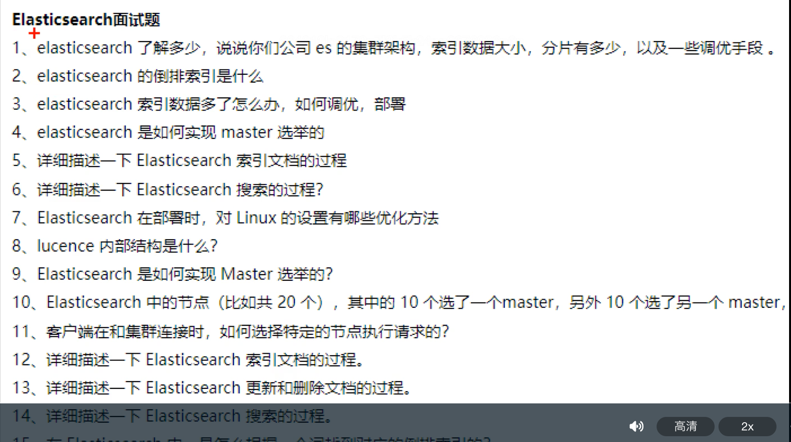
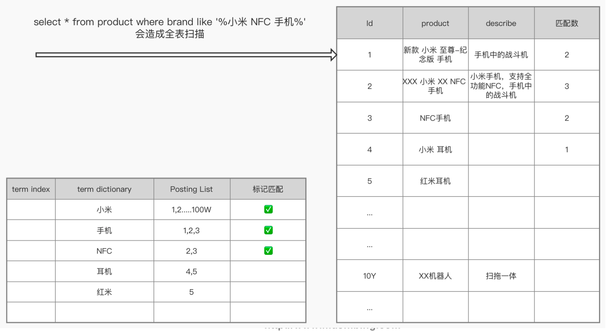

#es学习资料
[拉钩]
[马士兵资料]
[权威指南]
#项目中的es问题
10000*1000B*24*30/1024/1024=6G
#为什么mysql不适合搜索引擎?
```asp
mysql行存储,b+树
1.适合OLTP在线交易系统,结构统一的增删改,id查询,范围查询
2.不适合无前缀的模糊匹配,不适合词模糊查询,不适合词的反向搜索,可能索引失效导致全表匹配
3.不适合海量数据指定字段排序,特定字段聚合,分页,需要读入整行,导致不必要的io操作,如果是列存储,只需读取需要的行,且列可以进行存储压缩优化,fst,delta
```

