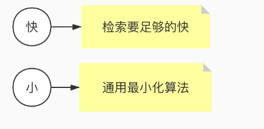

#临界知识
[lucene原理与代码分析完整版]
#拓扑


[](https://blog.csdn.net/qq_33067315/article/details/114668668)
[](https://juejin.cn/post/6844903760607592456#heading-3)
##索引(Index)
```asp
一个目录一个索引，在Lucene中一个索引是放在一个文件夹中的。
同一文件夹中的所有的文件构成一个Lucene索引
```
##段(Segment)

##文档(Document)

##域(Field)
一篇文档包含不同类型的信息，可以分开索引，比如标题，内存，作者等，都可以保存在不同的
域里。不同域的索引方式可以不同。
##词(Term)
词是索引的最小单位，是经过词法分析和语言处理后的字符串。


#物理索引结构
[](https://elasticsearch.cn/article/6178#tip10)
[](https://www.cnblogs.com/forfuture1978/archive/2009/12/14/1623599.html)
##索引相关
###segments_xxx


###write.lock	
##Segment相关
###.si(segment元信息)

segmentInfo文件，就是一个独立的子索引，其中Files是一个列表，里面存储了本segment所有相关的索引文件

###.cfs, .cfe(Compound File,复合文件,压缩多个文件到一个)		
##field域相关
###.fnm(域(Field)的元数据信息,每个Segment一个,不区分文档)
一个段(Segment)包含多个域(段->文档->域)，每个域都有一些元数据信息，保存在.fnm文件中，.fnm文件的格式如下：


###.fdx(域索引文件,每个Segment一个,里面包含多个doc,每个doc对应自己的域)	.fdt(域数据文件)	


##词向量(行存储)
词向量信息是从索引(index)到文档(document)到域(field)到词(term)的正向信息，有了词向量信息，我们就可以得到一篇文档包含那些词的信息。


###.tvx(文档索引offset)
文档文件(tvd)中此文档的偏移量,此文档的第一个域的偏移量
###.tvd(域索引offset)
此文档包含的域的个数NumFields,域在tvf中的偏移量
###.tvf(词offset,词频,词文本)
词的文本TermText，词频TermFreq(也即此词在此文档中出现的次数)，词的位置信息，词的偏移量信息
##term词相关(倒排索引)
<lucene4

lucene4+

###.tim(词典,Delta)
在词典中，所有的词是按照字典顺序排序的。
SkipInterval：倒排表无论是文档号及词频，还是位置信息，都是以跳跃表的结构存在的，SkipInterval是跳跃的步数
###.tip(词典索引,跳表lucene3,FST_lucene4+)
第一部分是词本身(TermInfo)，第二部分是在词典文件中的偏移量
###.doc(Delta,每个词的docId倒排表)


###.pos(词位置信息,差值规则,Stores position information about where a term occurs in the index)	


词位置信息也是倒排表，也是以跳跃表形式存在的
###.pay(payload附加信息)
	
##Doc Values
###.dvd
###.dvm	
##加权

###.nvd(加权因子数据)
###.nvm(加权因子索引文件)
##删除相关

###.liv	
#待处理
```asp
插入abd时，没有输出。
2. 插入abe时，计算出前缀ab，但此时不知道后续还不会有其他以ab为前缀的词，所以此时无输出。
3. 插入acf时，因为是有序的，知道不会再有ab前缀的词了，这时就可以写tip和tim了，tim中写入后缀词块d、e和它们的倒排表位置ip_d,ip_e，tip中写入a，b和以ab为前缀的后缀词块位置(真实情况下会写入更多信息如词频等)。
4. 插入acg时，计算出和acf共享前缀ac，这时输入已经结束，所有数据写入磁盘。tim中写入后缀词块f、g和相对应的倒排表位置，tip中写入c和以ac为前缀的后缀词块位置。
```
[](https://www.cnblogs.com/sessionbest/articles/8689030.html)
[](https://www.cnblogs.com/bonelee/p/6394451.html)


#文件存储优化算法与数据结构
##前缀后缀规则(Prefix+Suffix,字典排序的词典)
```asp
Lucene 在反向索引中，要保存词典(Term Dictionary)的信息，所有的词(Term)在词典中是按照
字典顺序进行排列的，然而词典中包􏰇了文档中的几乎所有的词，并且有的词还是非常的长 的，这样索引文件会非常的大，所谓前缀后缀规则，
即当某个词和前一个词有共同的前缀的 时候，后面的词仅仅保存前缀在词中的偏移(offset)，以及除前缀以外的字符串(称为后缀
```

```asp
比如要存储如下词:term，termagancy，termagant，terminal， 如果按照正常方式来存储，需要的空间如下:
[VInt = 4] [t][e][r][m]，[VInt = 10][t][e][r][m][a][g][a][n][c][y]，[VInt = 9][t][e][r][m][a][g][a][n][t]， [VInt = 8][t][e][r][m][i][n][a][l]
共需要 35 个 Byte.
如果应用前缀后缀规则，需要的空间如下:
[VInt = 4] [t][e][r][m]，[VInt = 4 (offset)][VInt = 6][a][g][a][n][c][y]，[VInt = 8 (offset)][VInt = 1][t]， [VInt = 4(offset)][VInt = 4][i][n][a][l]
共需要 22 个 Byte。 大大缩小了存储空间，尤其是在按字典顺序排序的情况下，前缀的重合率大大提高
```
##差值规则(Delta,文档ID,词位置)
```asp
在 Lucene 的反向索引中，需要保存很多整型数字的信息，比如文档 ID 号，比如词(Term)在 文档中的位置等等。
由上面介绍，我们知道，整型数字是以 VInt 的格式存储的。随着数值的增大，每个数字占 用的 Byte 的个数也逐渐的增多。
所谓差值规则(Delta)就是先后保存两个整数的时候，后面 的整数仅仅保存和前面整数的差即可

```

比如要存储如下整数:16386，16387，16388，16389 
如果按照正常方式来存储，需要的空间如下:

```asp
[(1) 000, 0010][(1) 000, 0000][(0) 000, 0001]，[(1) 000, 0011][(1) 000, 0000][(0) 000, 0001]，[(1) 000, 0100][(1) 000, 0000][(0) 000, 0001]，[(1) 000, 0101][(1) 000, 0000][(0) 000, 0001]
供需 12 个 Byte。
如果应用差值规则来存储，需要的空间如下:
[(1) 000, 0010][(1) 000, 0000][(0) 000, 0001]，[(0) 000, 0001]，[(0) 000, 0001]，[(0) 000, 0001] 共需 6 个 Byte。
大大缩小了存储空间，而且无论是文档 ID，还是词在文档中的位置，都是按从小到大的顺 序，逐渐增大的
```
##或然跟随规则(A,B?)
[](https://www.cnblogs.com/bonelee/p/6808409.html)

##跳表(Skiplist,词典postingList docId,词典offset)

按照描述，当SkipInterval为4，且有35篇文档的时候，Skip level = 0应该包括第3，第7，第11，第15，第19，第23，第27，第31篇文档，Skip level = 1应该包括第15，第31篇文档。
##FST(词项)
[](https://www.jianshu.com/p/7b270acf9ba7)

###前缀树trie

无法共享后缀
###FSA(有限状态接收机)
有向无环图,有终点信息

###FST
```asp
确定：意味着指定任何一个状态，只可能最多有一个转移可以遍历到。
无环： 不可能重复遍历同一个状态
transducer：接收特定的序列，终止于final状态，同时会输出一个值。
```
节点冷冻,节点信息不会发生改变
[](https://www.cnblogs.com/cangqinglang/p/15606270.html)
有向无环权重图,终点有权重,动态调整权重
[](https://www.shenyanchao.cn/blog/2018/12/04/lucene-fst/)
[](https://blog.csdn.net/yians/article/details/119353272)


