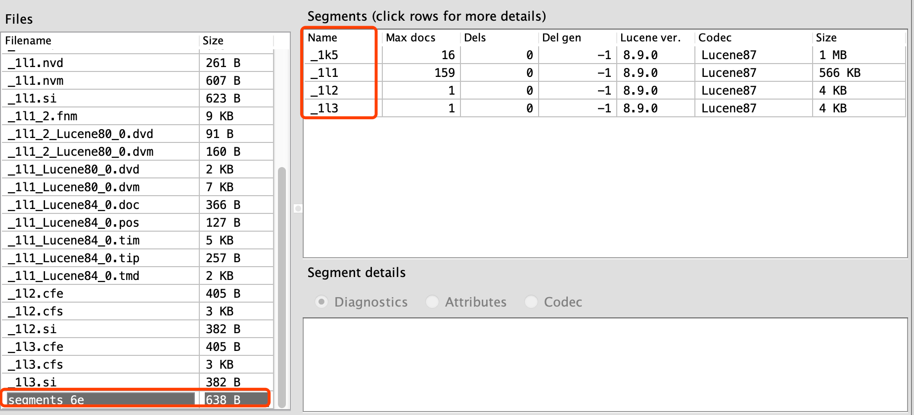
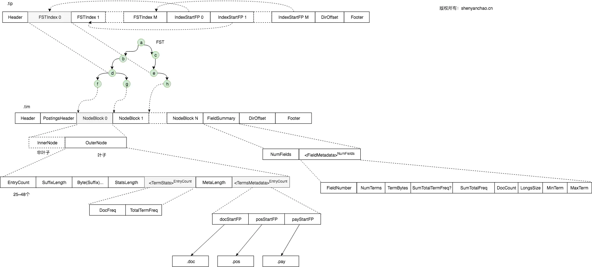
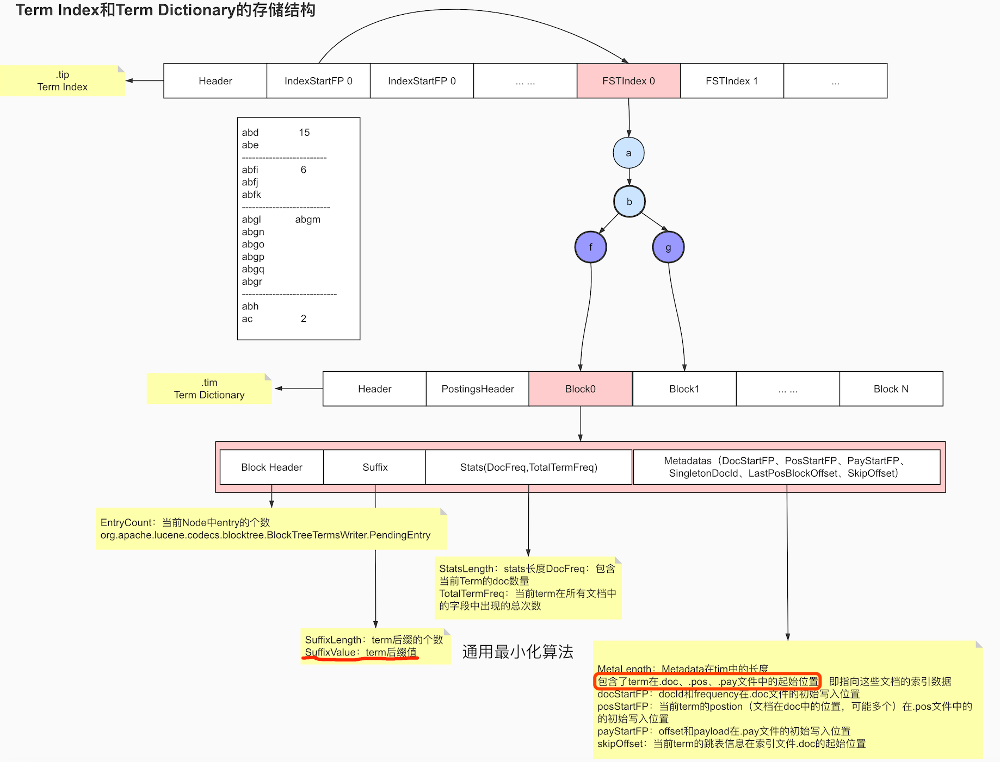
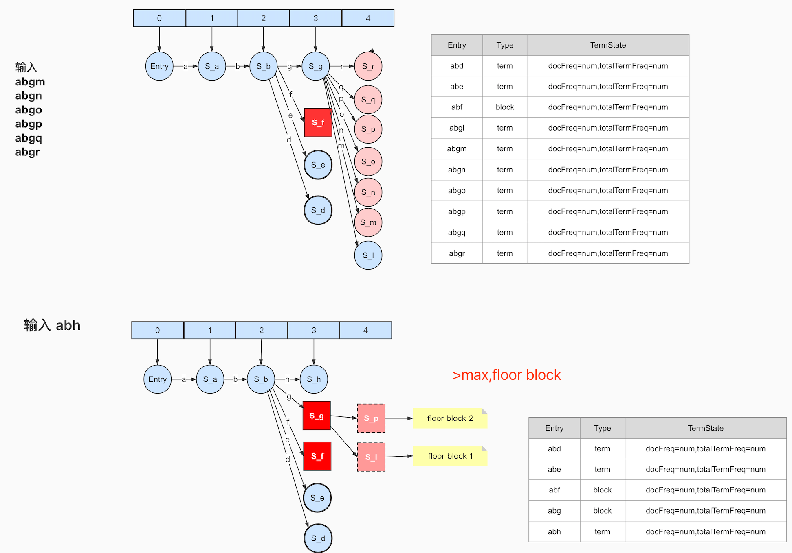

#临界知识
[lucene原理与代码分析完整版]
字典树
#拓扑


[](https://blog.csdn.net/qq_33067315/article/details/114668668)
[](https://juejin.cn/post/6844903760607592456#heading-3)
##索引(Index)
```asp
一个目录一个索引，在Lucene中一个索引是放在一个文件夹中的。
同一文件夹中的所有的文件构成一个Lucene索引
```
##段(Segment)
Lucene默认情况是每加入10份文档(Document)就从内存往index文件写入并生成一个段
然后每10个段(Segment)就合并成一个段(Segment)
```asp
MergeFactory 10 控制segment合并的频率和大小 
MaxMergeDocs Int32.MaxValue 限制每个segment中包含的文档数 
MinMergeDocs 10 当内存中的文档达到多少的时候再写入segment
```

##文档(Document)

##域(Field)
一篇文档包含不同类型的信息，可以分开索引，比如标题，内存，作者等，都可以保存在不同的
域里。不同域的索引方式可以不同。
##词(Term)
词是索引的最小单位，是经过词法分析和语言处理后的字符串。


#物理索引结构

[](https://elasticsearch.cn/article/6178#tip10)
[](https://www.cnblogs.com/forfuture1978/archive/2009/12/14/1623599.html)
##索引相关
###segments_xxx



###write.lock	
##Segment相关
###.si(segment元信息)

segmentInfo文件，就是一个独立的子索引，其中Files是一个列表，里面存储了本segment所有相关的索引文件

###.cfs, .cfe(Compound File,复合文件,压缩多个文件到一个)		
##field域相关
###.fnm(域(Field)的元数据信息,每个Segment一个,不区分文档)
一个段(Segment)包含多个域(段->文档->域)，每个域都有一些元数据信息，保存在.fnm文件中，.fnm文件的格式如下：


###.fdx(域索引文件,每个Segment一个,里面包含多个doc,每个doc对应自己的域)	.fdt(域数据文件)	


##词向量/正向信息(行存储)
[](https://www.cnblogs.com/sessionbest/articles/8689030.html)
词向量信息是从索引(index)到文档(document)到域(field)到词(term)的正向信息，有了词向量信息，我们就可以得到一篇文档包含那些词的信息。


###.tvx(文档索引offset)
文档文件(tvd)中此文档的偏移量,此文档的第一个域的偏移量
###.tvd(域索引offset)
此文档包含的域的个数NumFields,域在tvf中的偏移量
###.tvf(词offset,词频,词文本)
词的文本TermText，词频TermFreq(也即此词在此文档中出现的次数)，词的位置信息，词的偏移量信息
##term词相关(倒排索引)
[](https://blog.csdn.net/zteny/article/details/82857080)


<lucene4
lucene4+

###.tip(词典索引,跳表lucene3,FST_lucene4+,前缀树,后缀是tim block,)


```asp
.tip看起来是像一棵Trie,叶子节点是Container（即是Lucene中的Block),Lucene的block是数组，准确的说，就是把一系列的Block系列化写到文件上
```


```asp
tip部分，每列一个FST索引，所以会有多个FST，每个FST存放前缀和后缀块指针，这里前缀就为a、ab、ac。tim里面存放后缀块和词的其他信息如倒排表指针、TFDF等，doc文件里就为每个单词的倒排表。
所以它的检索过程分为三个步骤：
1. 内存加载tip文件，通过FST匹配前缀找到后缀词块位置。
2. 根据词块位置，读取磁盘中tim文件中后缀块并找到后缀和相应的倒排表位置信息。
3. 根据倒排表位置去doc文件中加载倒排表。
```
####FST(term的前缀,叶子节点记录block的offset,Finite-State-Transducer)
[z_es_01_lucene_03_倒排算法_压缩算法_相关度排序算法.md]



```asp
FST是字段级别的，在Segment上每个字段有且仅有一张FST图
FST最终只能指向一个Block的起始位置，并不能指向具体的一个Term

FST提供两个基本功能:
快速试错，即是在FST上找不到可以直接跳出不需要遍历整个Dictionary。类似于BloomFilter的作用。
快速定位Block的位置，通过FST是可以直接计算出Block的在文件中位置（offset,FP）。实现了HashMap的功能
```
###.tim(词典,Terms Dictionary,Delta)
[](https://www.cnblogs.com/forfuture1978/p/3945755.html)



在词典中，所有的词是按照字典顺序排序的。
SkipInterval：倒排表无论是文档号及词频，还是位置信息，都是以跳跃表的结构存在的，SkipInterval是跳跃的步数
```asp
插入abd时，没有输出。
2. 插入abe时，计算出前缀ab，但此时不知道后续还不会有其他以ab为前缀的词，所以此时无输出。
3. 插入acf时，因为是有序的，知道不会再有ab前缀的词了，这时就可以写tip和tim了，tim中写入后缀词块d、e和它们的倒排表位置ip_d,ip_e，tip中写入a，b和以ab为前缀的后缀词块位置(真实情况下会写入更多信息如词频等)。
4. 插入acg时，计算出和acf共享前缀ac，这时输入已经结束，所有数据写入磁盘。tim中写入后缀词块f、g和相对应的倒排表位置，tip中写入c和以ac为前缀的后缀词块位置。
```

####Block(树结构,子节点entry)


```asp
每个Block都有前缀的，Block的每个Term实际不记录共同前缀的。只有通过Block的共同的前缀，这是整个Block的所有Term共有的，
所以每个Term仅需要记录后缀可以通过计算得到，这可以减少在Block内查找Term时的字符串比较的长度。

Lucene规定，每个Block的大小在25-48范围内。
```

#####Entry(block树中的节点)
```asp
private static class PendingEntry {
    public final boolean isTerm;

    protected PendingEntry(boolean isTerm) {
      this.isTerm = isTerm;
    }
  }
```
[BlockTreeTermsWriter]


```asp
每个Entry含有后缀、统计信息（对应为前面据说的权重，它含有ttf和df）、Postings的位置信息（这就是反复提及postings相关的文件指针，postings是拆分多文件存储的）
```
#####OuterNode,叶子节点,(output)
#####InnerNode非叶子节点
#####PendingTerm待完成term

小于minTermBlockSize时为PendingTerm
```asp
private static final class PendingTerm extends PendingEntry {
    public final byte[] termBytes;
    // stats + metadata
    public final BlockTermState state;
  }
```
#####PendingBlock待完成block

```asp
private static final class PendingBlock extends PendingEntry {
    public final BytesRef prefix;
    public final long fp;
    public FST<BytesRef> index;
    public List<FST<BytesRef>> subIndices;
    public final boolean hasTerms;
    public final boolean isFloor;
    public final int floorLeadByte;
}
```
#####floor block


一个PendingBlock包含太多PendingTerm时会进行拆分,默认最大48,最小25，maxTermBlockSize
#####leading label
#####termstats
```asp
public class TermStats {
  /** How many documents have at least one occurrence of
   *  this term. */
  public final int docFreq;
  
  /** Total number of times this term occurs across all
   *  documents in the field. */
  public final long totalTermFreq;
}
```
###.doc(Postings List,Delta,每个词的docId倒排列表和词频)


###.pos(词位置信息,差值规则,Stores position information about where a term occurs in the index)	


词位置信息也是倒排表，也是以跳跃表形式存在的
###.pay(payload附加信息)
	
##Doc Values(列式存储,性能、存储成本,聚合,Metric,Bucket,Pipline)
[](https://www.cnblogs.com/sessionbest/articles/8689030.html)
[](https://zhuanlan.zhihu.com/p/384487150)
```asp
我们知道倒排索引能够解决从词到文档的快速映射，但当我们需要对检索结果进行分类、排序、数学计算等聚合操作时需要文档号到值的快速映射，
而原先不管是倒排索引还是行式存储的文档都无法满足要求
```
```asp
Doc Values 是在索引时与 倒排索引 同时生成。也就是说 Doc Values 和 倒排索引 一样，基于 Segement 生成并且是不可变的。
同时 Doc Values 和 倒排索引 一样序列化到磁盘，这样对性能和扩展性有很大帮助。

```
Lucene目前有五种类型的DocValues：NUMERIC、BINARY、SORTED、SORTED_SET、SORTED_NUMERIC，针对每种类型Lucene都有特定的压缩方法
###.dvd
###.dvm	
##加权

###.nvd(加权因子数据)
###.nvm(加权因子索引文件)
##删除相关

###.liv	
