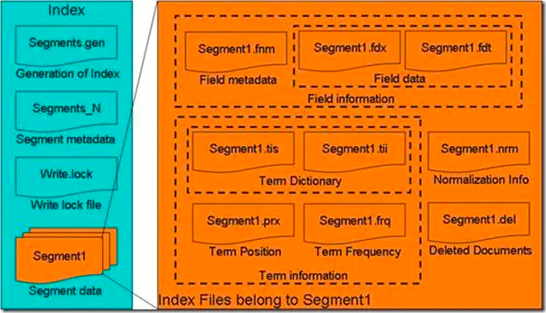
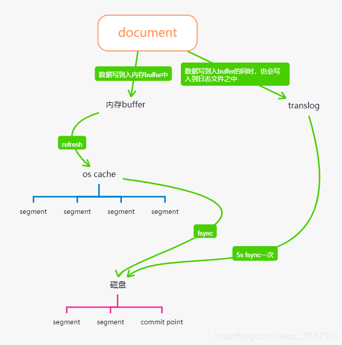
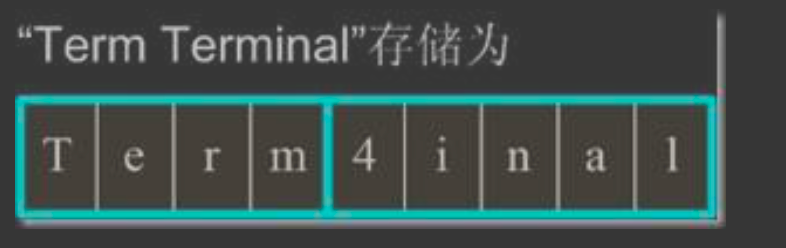
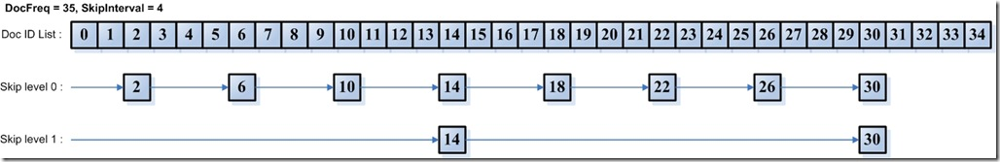
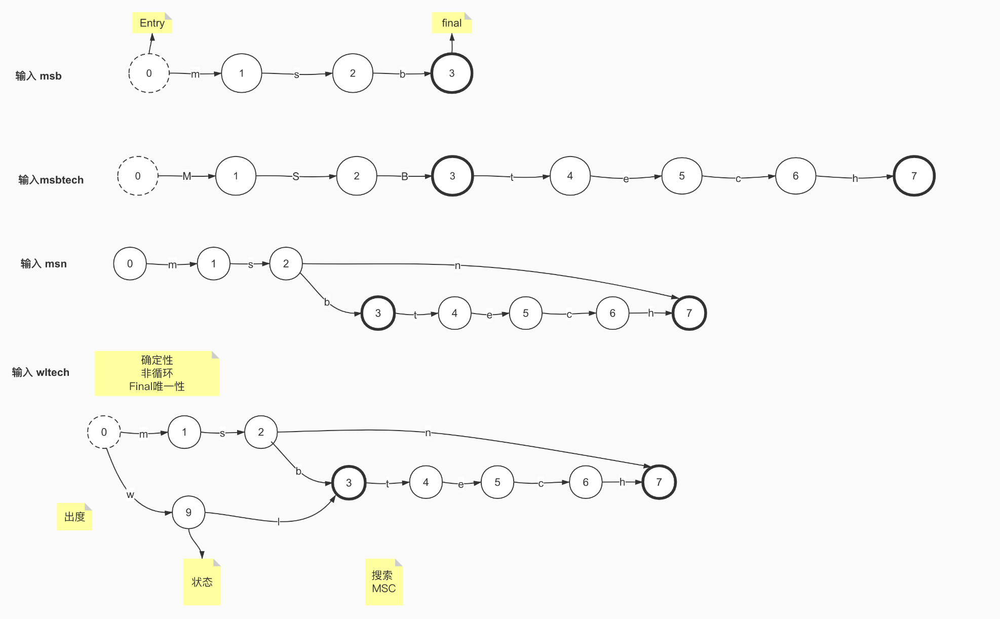
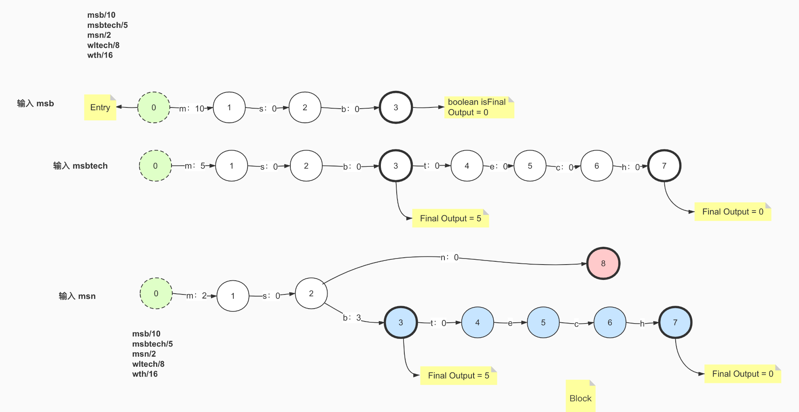
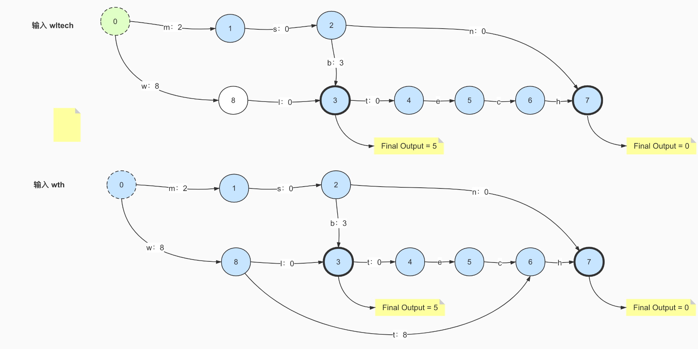

#临界知识
[lucene原理与代码分析完整版]
#拓扑




[](https://blog.csdn.net/qq_33067315/article/details/114668668)
##索引(Index)
```asp
一个目录一个索引，在Lucene中一个索引是放在一个文件夹中的。
同一文件夹中的所有的文件构成一个Lucene索引
```
##段(Segment)

##文档(Document)

##域(Field)
一篇文档包含不同类型的信息，可以分开索引，比如标题，内存，作者等，都可以保存在不同的
域里。不同域的索引方式可以不同。
##词(Term)
词是索引的最小单位，是经过词法分析和语言处理后的字符串。
##正向索引(docvalues,docId->term,列存储)
[](z_01_分布式_临界知识_行存储_列存储_OLAP_OLTP_数据模型_宽表_对比网站_数据关系_nosql_存储模型_时序数据库_文档数据库_列数据库_文件系统_键值系统_表格系统_数据库系统_ETL_HTAP.md)
[](https://blog.csdn.net/zteny/article/details/84627990)
[](https://cloud.tencent.com/developer/article/1463890)

```asp
按层次保存了从索引，一直到词的包含关系:
索引(Index) –> 段(segment) –> 文档(Document) –> 域(Field) –> 词(Term)
此索引包含了那些段，每个段包含了那些文档，每个文档包􏰇了那些域，每个域包含了那些词
既然是层次结构，则每个层次都保存了本层次的信息以及下一层次的元信息，也即属性
信息，比如一本介绍中国地理的书，应该首先介绍中国地理的概况，以及中国包􏰇多少 个省，每个省介绍本省的基本概况及包􏰇多少个市，
每个市介绍本市的基本概况及包􏰇 多少个县，每个县具体介绍每个县的具体情况
```

##倒排索引(term->docId)
[物理文件结构](https://www.cnblogs.com/forfuture1978/archive/2010/02/02/1661436.html)


#物理索引结构
[](https://elasticsearch.cn/article/6178#tip10)


##segments_xxx


##域(Field)

##待处理
```asp
插入abd时，没有输出。
2. 插入abe时，计算出前缀ab，但此时不知道后续还不会有其他以ab为前缀的词，所以此时无输出。
3. 插入acf时，因为是有序的，知道不会再有ab前缀的词了，这时就可以写tip和tim了，tim中写入后缀词块d、e和它们的倒排表位置ip_d,ip_e，tip中写入a，b和以ab为前缀的后缀词块位置(真实情况下会写入更多信息如词频等)。
4. 插入acg时，计算出和acf共享前缀ac，这时输入已经结束，所有数据写入磁盘。tim中写入后缀词块f、g和相对应的倒排表位置，tip中写入c和以ac为前缀的后缀词块位置。
```
[](https://www.cnblogs.com/sessionbest/articles/8689030.html)
[](https://www.cnblogs.com/bonelee/p/6394451.html)


#文件存储优化算法与数据结构
##前缀后缀规则(Prefix+Suffix)
```asp
Lucene 在反向索引中，要保存词典(Term Dictionary)的信息，所有的词(Term)在词典中是按照
字典顺序进行排列的，然而词典中包􏰇了文档中的几乎所有的词，并且有的词还是非常的长 的，这样索引文件会非常的大，所谓前缀后缀规则，
即当某个词和前一个词有共同的前缀的 时候，后面的词仅仅保存前缀在词中的偏移(offset)，以及除前缀以外的字符串(称为后缀
```

```asp
比如要存储如下词:term，termagancy，termagant，terminal， 如果按照正常方式来存储，需要的空间如下:
[VInt = 4] [t][e][r][m]，[VInt = 10][t][e][r][m][a][g][a][n][c][y]，[VInt = 9][t][e][r][m][a][g][a][n][t]， [VInt = 8][t][e][r][m][i][n][a][l]
共需要 35 个 Byte.
如果应用前缀后缀规则，需要的空间如下:
[VInt = 4] [t][e][r][m]，[VInt = 4 (offset)][VInt = 6][a][g][a][n][c][y]，[VInt = 8 (offset)][VInt = 1][t]， [VInt = 4(offset)][VInt = 4][i][n][a][l]
共需要 22 个 Byte。 大大缩小了存储空间，尤其是在按字典顺序排序的情况下，前缀的重合率大大提高
```
##差值规则(Delta)
```asp
在 Lucene 的反向索引中，需要保存很多整型数字的信息，比如文档 ID 号，比如词(Term)在 文档中的位置等等。
由上面介绍，我们知道，整型数字是以 VInt 的格式存储的。随着数值的增大，每个数字占 用的 Byte 的个数也逐渐的增多。
所谓差值规则(Delta)就是先后保存两个整数的时候，后面 的整数仅仅保存和前面整数的差即可

```

比如要存储如下整数:16386，16387，16388，16389 
如果按照正常方式来存储，需要的空间如下:

```asp
[(1) 000, 0010][(1) 000, 0000][(0) 000, 0001]，[(1) 000, 0011][(1) 000, 0000][(0) 000, 0001]，[(1) 000, 0100][(1) 000, 0000][(0) 000, 0001]，[(1) 000, 0101][(1) 000, 0000][(0) 000, 0001]
供需 12 个 Byte。
如果应用差值规则来存储，需要的空间如下:
[(1) 000, 0010][(1) 000, 0000][(0) 000, 0001]，[(0) 000, 0001]，[(0) 000, 0001]，[(0) 000, 0001] 共需 6 个 Byte。
大大缩小了存储空间，而且无论是文档 ID，还是词在文档中的位置，都是按从小到大的顺 序，逐渐增大的
```
##或然跟随规则(A,B?)
[](https://www.cnblogs.com/bonelee/p/6808409.html)

##跳表(Skiplist)

按照描述，当SkipInterval为4，且有35篇文档的时候，Skip level = 0应该包括第3，第7，第11，第15，第19，第23，第27，第31篇文档，Skip level = 1应该包括第15，第31篇文档。
##FST(词项)
[](https://www.jianshu.com/p/7b270acf9ba7)

###前缀树trie

无法共享后缀
###FSA(有限状态接收机)
有向无环图,有终点信息

###FST
```asp
确定：意味着指定任何一个状态，只可能最多有一个转移可以遍历到。
无环： 不可能重复遍历同一个状态
transducer：接收特定的序列，终止于final状态，同时会输出一个值。
```
节点冷冻,节点信息不会发生改变
[](https://www.cnblogs.com/cangqinglang/p/15606270.html)
有向无环权重图,终点有权重,动态调整权重
[](https://www.shenyanchao.cn/blog/2018/12/04/lucene-fst/)
[](https://blog.csdn.net/yians/article/details/119353272)



