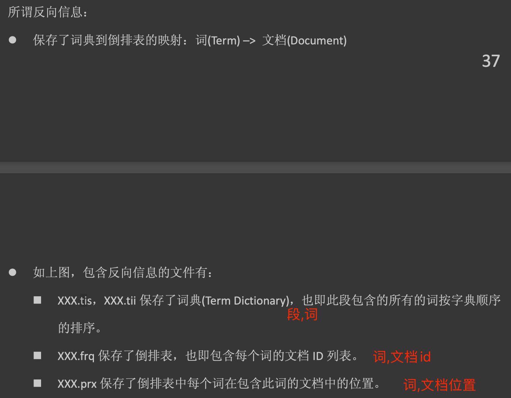

#倒排(term->docId,词搜索)
```asp
在lucene中将一个文档编入索引时,字段的原始值会丢失. 字段被分析(analyze),转换(transform)以至编入索引. 在没有其他额外添加的数据结构的情况下,
当我们检索文档时,我们只能得到被检索文档的id,而没有文档的原始字段. 为了去获得这些信息,我们需要额外的数据结构. lucene提供了两种可能性来实现这个,
stored fields 和 doc values
```
[物理文件结构](https://www.cnblogs.com/forfuture1978/archive/2010/02/02/1661436.html)

##关闭倒排

##Term index(词项索引,FST)
为了增加倒排索引的Term查找速度，ES还专门做了Term index，它的本质是一棵Trie（前缀）树(使用FST技术压缩)。
##词文档列表(倒排表,posting list,跳表)
##词项字典
#doc values(列式存储,docvalues,docId->term,排序,聚合,分组,正向索引)
[](https://www.elastic.co/guide/en/elasticsearch/reference/7.1/doc-values.html)
[](https://www.elastic.co/guide/en/elasticsearch/reference/7.1/fielddata.html8)
```asp
doc values用于加速一些诸如聚合(aggregation),排序(sorting),分组(grouping)的操作. doc values 也可以被用来在查询时返回字段值. 
例外是doc values不能用来存储text类型的字段.
```
[](z_01_分布式_临界知识_行存储_列存储_OLAP_OLTP_数据模型_宽表_对比网站_数据关系_nosql_存储模型_时序数据库_文档数据库_列数据库_文件系统_键值系统_表格系统_数据库系统_ETL_HTAP.md)
[](https://blog.csdn.net/zteny/article/details/84627990)
[](https://cloud.tencent.com/developer/article/1463890)

```asp
按层次保存了从索引，一直到词的包含关系:
索引(Index) –> 段(segment) –> 文档(Document) –> 域(Field) –> 词(Term)
此索引包含了那些段，每个段包含了那些文档，每个文档包􏰇了那些域，每个域包含了那些词
既然是层次结构，则每个层次都保存了本层次的信息以及下一层次的元信息，也即属性
信息，比如一本介绍中国地理的书，应该首先介绍中国地理的概况，以及中国包􏰇多少 个省，每个省介绍本省的基本概况及包􏰇多少个市，
每个市介绍本市的基本概况及包􏰇 多少个县，每个县具体介绍每个县的具体情况
```
```asp
按照以上的倒排索引结构，查找包含某个term的文档是非常迅捷的。如果要对这个字段进行排序的话，倒排索引就捉襟见肘了，需要使用其他的存储结构进行索引。
```

##关闭doc values

#Stored fields(行式存储)
[](https://www.elastic.co/guide/en/elasticsearch/reference/7.1/mapping-store.html)
[](https://www.elastic.co/guide/en/elasticsearch/reference/7.1/term-vector.html#term-vector)
##关闭行存
##关闭_source
```asp
stored fields用于存储没有经过任何分析(without any analysis)的字段值,以实现在查询时能得到这些原始值.
```
##_source(需要更新文档时,就必须要在配置中启用source)

source 用于存储在索引期间(index time)传给es的原始json. 可通过以下配置决定是否启用
默认会存储所有字段,可以通过以下方式指定原始json中要排除的字段,这可以减少存到source中的数据大小,从而减少磁盘空间占用.但是在查询时,
将无法得到被排除字段的原始值.
关闭source后， update, updatebyquery, reindex等接口将无法正常使用，所以有update等需求的index不能关闭sourc
```asp
"mappings": {
    "_source": {
      "enabled": false //是否启用source
    }
  }

"mappings": {
    "_source": {
      "excludes": [
        "meta.description",
        "meta.other.*"
      ]
    }
  }
```
```asp
在查询期,默认被命中文档的所有字段都会被返回,你也可以指定只返回source中的一部分字段,这可以使网络传输数据量减少.

如果禁用es的source(即不将文档json存储到source),将使得每次更新文档时都不得不重新索引(reindex)这个文档. 概念上讲,更新一个文档的字段值时,
我们需要获得旧文档的该字段值,然后讲新值写入.在没有source的情况下,旧文档的某个字段值可以通过doc values或stored fields来获得.
(solr中的原子更新就是通过这种方式来取旧值的) 然而,由于设计上的原因,es中这不被允许.如果你需要更新你的文档,就必须要在配置中启用source.
```
#检索字段性能比较
[](https://zhuanlan.zhihu.com/p/383999276)

```asp
"_source": { //从source中取
    "includes": [
        "address"
    ],
    "excludes": [
        "!address"
    ],
},
"stored_fields":["activated"],  //从store中取
"docvalue_fields":["address.keyword"] //从docvalue中取
```
如果一个字段被同时开启了source,store,docvalues,那么你可以选择从3个源中取值. 从功能的角度看,得到的结果是一样的,但是不同的选择将对查询的时间产生影响.
##Stored fields
Stored fields在磁盘上以行的方式放置: 每个文档对应一个行,这个行包含该文档所有的stored fields.

以上图作为例子. 要访问文档X的fields3,我们需要访问这个文档X的行,并且跳过field3前面的字段. 这个过程需要计算偏移地址, 虽然对性能影响并不特别大,但也不是一点都没有.
##Doc values
Doc values 以列的方式存储. 不同文档的相同字段被连续地存储在一起. 这种存储方式
可以直接访问一个特定的文档的特定字段. 计算想要字段值的偏移地址有一定成本.但是想象一下,假如我们只想要文档某一个字段,这种存储方式显然更有效率.
##_Source


