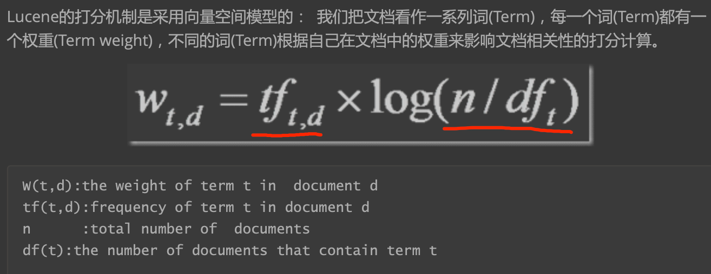
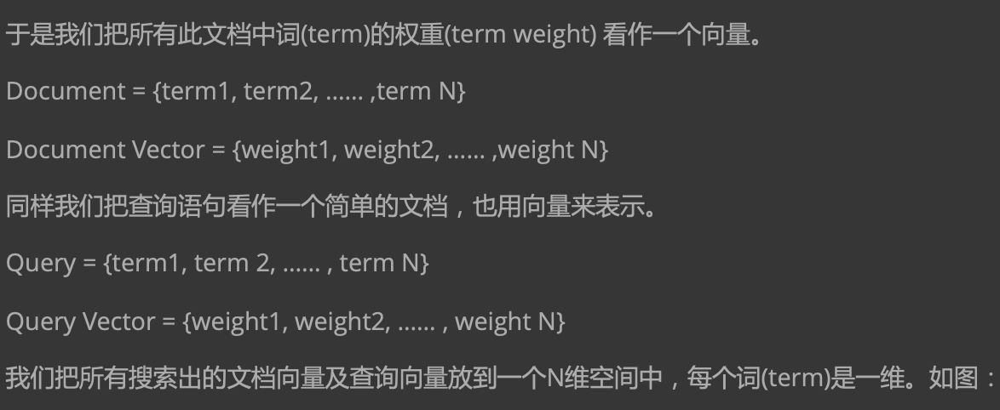
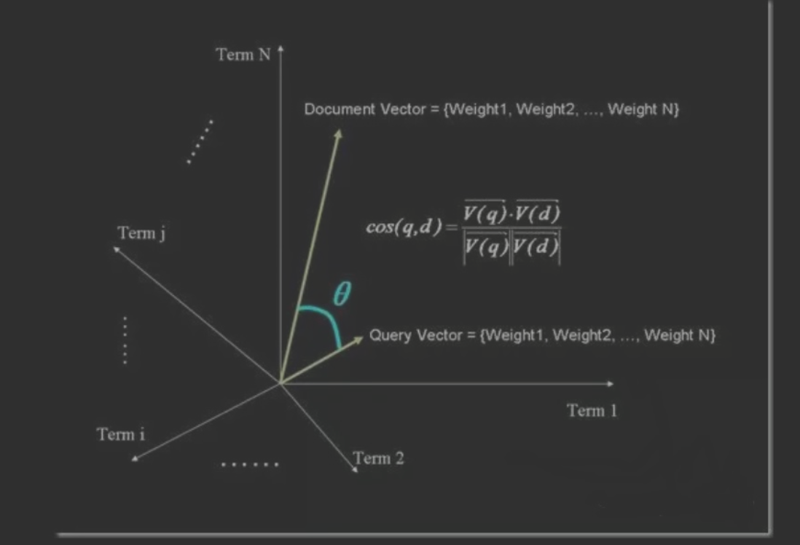

#相关度排序
Lucene对查询关键字和索引文档的相关度进行打分，得分高的就排在前边。 
Lucene是在用户进行检索时实时根据搜索的关键字计算出相关度得分。
[](https://www.cnblogs.com/forfuture1978/archive/2010/03/07/1680007.html)
##相关度排序公式

```asp
score(q,d) : 文档d对查询q的相关性得分
coord(q,d):协调因子 一次搜索可能包含多个搜索词，而一篇文档中也可能包含多个搜索词，此 项表示，当一篇文档中包含的搜索词越多，则此文档则打分越高。
queryNorm(q):计算每个查询条目的方差和，使得不同的query之间的分数可以比较。其公式如 下:
```

```asp
term boost:查询语句中每个词的权重，可以在查询中设定某个词更加重要。 
document boost:文档权重，在索引阶段写入文件，表明某些文档比其他文档更重要。 
field boost:域的权重，在索引阶段写入文件，表明某些域比其他的域更重要
```
##向量空间模型 VSM(Vector Space Model)



