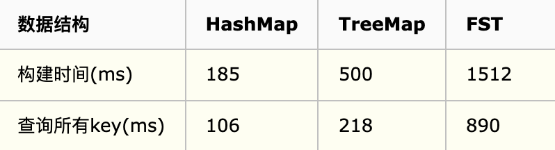
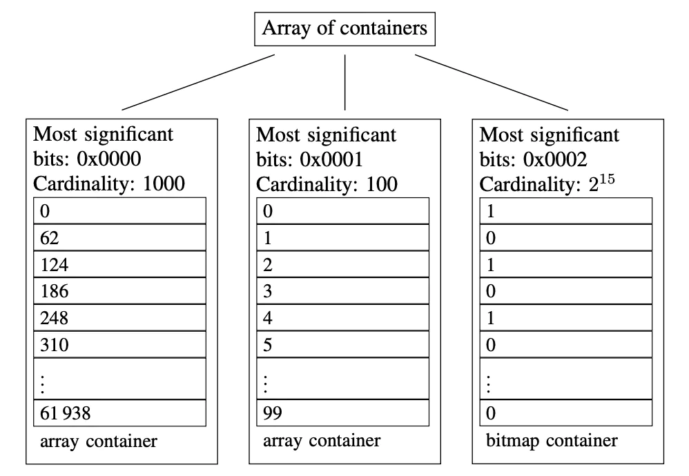
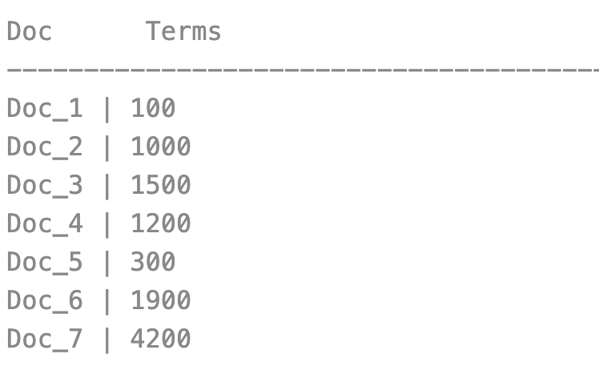
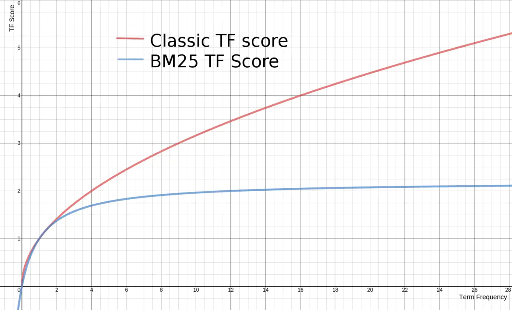

#临界知识
高效压缩算法(索引到的倒排列表太多),快速编码解码能力
delta-encoding增量编码frame of reference
hashmap(快),skiplist(快),trieTree(小),fst
http://cs.usfca.edu
输入词项有序,处理完节点冻结刷盘
海量数据的判重和基数统计,布隆过滤器
位图不适应稀疏存储

#文件存储优化算法与数据结构
##前缀后缀规则(Prefix+Suffix,字典排序的词典)
```asp
Lucene 在反向索引中，要保存词典(Term Dictionary)的信息，所有的词(Term)在词典中是按照
字典顺序进行排列的，然而词典中包􏰇了文档中的几乎所有的词，并且有的词还是非常的长 的，这样索引文件会非常的大，所谓前缀后缀规则，
即当某个词和前一个词有共同的前缀的 时候，后面的词仅仅保存前缀在词中的偏移(offset)，以及除前缀以外的字符串(称为后缀
```

```asp
比如要存储如下词:term，termagancy，termagant，terminal， 如果按照正常方式来存储，需要的空间如下:
[VInt = 4] [t][e][r][m]，[VInt = 10][t][e][r][m][a][g][a][n][c][y]，[VInt = 9][t][e][r][m][a][g][a][n][t]， [VInt = 8][t][e][r][m][i][n][a][l]
共需要 35 个 Byte.
如果应用前缀后缀规则，需要的空间如下:
[VInt = 4] [t][e][r][m]，[VInt = 4 (offset)][VInt = 6][a][g][a][n][c][y]，[VInt = 8 (offset)][VInt = 1][t]， [VInt = 4(offset)][VInt = 4][i][n][a][l]
共需要 22 个 Byte。 大大缩小了存储空间，尤其是在按字典顺序排序的情况下，前缀的重合率大大提高
```
##差值规则(Delta,文档ID,词位置)
```asp
在 Lucene 的反向索引中，需要保存很多整型数字的信息，比如文档 ID 号，比如词(Term)在 文档中的位置等等。
由上面介绍，我们知道，整型数字是以 VInt 的格式存储的。随着数值的增大，每个数字占 用的 Byte 的个数也逐渐的增多。
所谓差值规则(Delta)就是先后保存两个整数的时候，后面 的整数仅仅保存和前面整数的差即可

```

比如要存储如下整数:16386，16387，16388，16389 
如果按照正常方式来存储，需要的空间如下:

```asp
[(1) 000, 0010][(1) 000, 0000][(0) 000, 0001]，[(1) 000, 0011][(1) 000, 0000][(0) 000, 0001]，[(1) 000, 0100][(1) 000, 0000][(0) 000, 0001]，[(1) 000, 0101][(1) 000, 0000][(0) 000, 0001]
供需 12 个 Byte。
如果应用差值规则来存储，需要的空间如下:
[(1) 000, 0010][(1) 000, 0000][(0) 000, 0001]，[(0) 000, 0001]，[(0) 000, 0001]，[(0) 000, 0001] 共需 6 个 Byte。
大大缩小了存储空间，而且无论是文档 ID，还是词在文档中的位置，都是按从小到大的顺 序，逐渐增大的
```
##或然跟随规则(A,B?)
[](https://www.cnblogs.com/bonelee/p/6808409.html)

##跳表(Skiplist,词典postingList docId,词典offset)

按照描述，当SkipInterval为4，且有35篇文档的时候，Skip level = 0应该包括第3，第7，第11，第15，第19，第23，第27，第31篇文档，Skip level = 1应该包括第15，第31篇文档。
##FST(词项)
[](https://www.jianshu.com/p/7b270acf9ba7)

###前缀树trie

无法共享后缀
###FSA(有限状态接收机,共同前后缀)
有向无环图,有终点信息

###FST(正则字符串匹配状态机,词有序,前缀内存,叶子节点block磁盘)
[](https://www.cnblogs.com/cangqinglang/p/15606270.html)
####FST VS HashMap vs treeMap
```asp
优点：内存占用率低，压缩率一般在3倍~20倍之间、模糊查询支持好、查询快
缺点：结构复杂、输入要求有序、更新不易
```
100万数据性能测试：

```asp
可以看出，FST性能基本跟HaspMap差距不大，但FST有个不可比拟的优势就是占用内存小，只有HashMap10分之一左右，这对大数据规模检索是至关重要的，毕竟速度再快放不进内存也是没用的。
因此一个合格的词典结构要求有：
1. 查询速度。
2. 内存占用。
3. 内存+磁盘结合
```
```asp
Lucene现在采用的数据结构为FST，它的特点就是：
1、词查找复杂度为O(len(str))
2、共享前缀、节省空间
3、内存存放前缀索引、磁盘存放后缀词块
这跟我们前面说到的词典结构三要素是一致的：1. 查询速度。2. 内存占用。3. 内存+磁盘结合。我们往索引库里插入四个单词abd、abe、acf、acg,看看它的索引文件内容
```
####FST定义
```asp
出度:
出度:
final终点:
尾部冻结(压缩算法):
权重,为何加权?:暂时不管
```
####原理
```asp
确定：意味着指定任何一个状态，只可能最多有一个转移可以遍历到。
无环： 不可能重复遍历同一个状态
transducer：接收特定的序列，终止于final状态，同时会输出一个值。
```
节点冷冻,节点信息不会发生改变
有向无环权重图,终点有权重,动态调整权重
[](https://www.shenyanchao.cn/blog/2018/12/04/lucene-fst/)


###如何确认FST使用什么前缀?


#倒排索引算法(FST,跳表)

[z_es_01_lucene_01_索引生成_索引文件格式_拓扑.md]
##term index(词索引)
##term dictionary(词项字典)
##posting list(倒排列表)


#压缩算法(压缩doc ID)
[z_00_海量数据_压缩算法.md]
##通用最小化算法
##term index压缩
FST,要求Key必须按字典序从小到大加入到FST
##posting list压缩
###FOR(稠密压缩算法,frame of reference参考系,坐标)
适合稠密数组,差值列表deltas list,增量编码压缩，将大数变小数，按字节存储
[](https://www.elastic.co/cn/blog/frame-of-reference-and-roaring-bitmaps)


###RBM(Roaring bitmaps,稀疏压缩算法)
[](https://cloud.tencent.com/developer/article/1136054)
无符号short最大值65535

####ArrayContainer


[](https://www.elastic.co/cn/blog/frame-of-reference-and-roaring-bitmaps)
####bitmapContainer
固定8KB
[](https://www.cnblogs.com/suhaha/p/15363089.html)
####RunContainer
8B
```asp
BitmapContainer是恒定为8192B的。ArrayContainer的空间占用与基数（c）有关，为(2 + 2c)B；RunContainer的则与它存储的连续序列数（r）有关，
为(2 + 4r)B
```
##文档数量的压缩
[](https://www.jianshu.com/p/389551965d28)
##doc values列存压缩

```asp
Doc Values 在压缩过程中使用如下技巧。它会按依次检测以下压缩模式:

如果所有的数值各不相同（或缺失），设置一个标记并记录这些值
如果这些值小于 256，将使用一个简单的编码表
如果这些值大于 256，检测是否存在一个最大公约数
如果没有存在最大公约数，从最小的数值开始，统一计算偏移量进行编码
当然如果存储 String类型，其一样可以通过顺序表对 String类型进行数字编码，然后再把数字类型构建 DocValues。
```
因为列式存储的结构是严格且良好定义的，我们可以通过使用专门的模式来达到比通用压缩算法（如 LZ4 ）更高的压缩效果
###顺序表
```asp

你也许会想 "好吧，貌似对数字很好，不知道字符串怎么样？" 通过借助顺序表（ordinal table），String 类型也是类似进行编码的。
String 类型是去重之后存放到顺序表的，通过分配一个 ID，然后通过数字类型的 ID 构建 Doc Values。这样 String 类型和数值类型可以达到同样的压缩效果。
顺序表本身也有很多压缩技巧，比如固定长度、变长或是前缀字符编码等等
```
##行存压缩
##LZ4
[](https://www.elastic.co/cn/blog/save-space-and-money-with-improved-storage-efficiency-in-elasticsearch-7-10)
每当在流中找到先前出现过的字符串时，便会将该字符串替换为对先前出现的那个字符串的引用。实际上，这是 LZ4 唯一做的事情
##Deflate
字符串去重+哈夫曼编码
[](https://blog.csdn.net/FX677588/article/details/70767446)
#相关度排序算法
Lucene对查询关键字和索引文档的相关度进行打分，得分高的就排在前边。 
Lucene是在用户进行检索时实时根据搜索的关键字计算出相关度得分。
[](https://www.cnblogs.com/forfuture1978/archive/2010/03/07/1680007.html)
##相关度排序公式(TF-IDF,)
词频 TF(Term Frequency),逆文本频率指数 IDF(Inverse Dcument Frequency)

```asp
score(q,d) : 文档d对查询q的相关性得分
coord(q,d):协调因子 一次搜索可能包含多个搜索词，而一篇文档中也可能包含多个搜索词，此 项表示，当一篇文档中包含的搜索词越多，则此文档则打分越高。
queryNorm(q):计算每个查询条目的方差和，使得不同的query之间的分数可以比较。其公式如 下:
```

```asp
term boost:查询语句中每个词的权重，可以在查询中设定某个词更加重要。 
document boost:文档权重，在索引阶段写入文件，表明某些文档比其他文档更重要。 
field boost:域的权重，在索引阶段写入文件，表明某些域比其他的域更重要
```
##向量空间模型 VSM(Vector Space Model)


##BM25

[](https://www.jianshu.com/p/83d22040ad5a)
[拉钩es]
