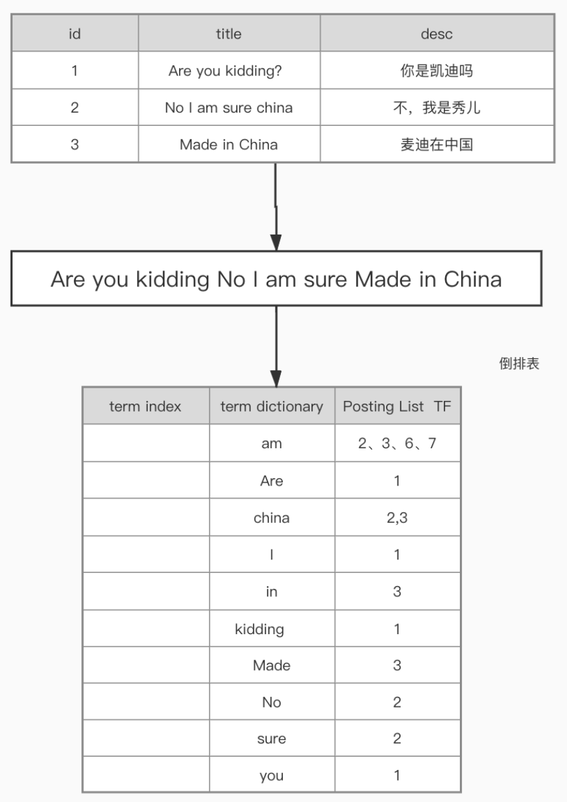
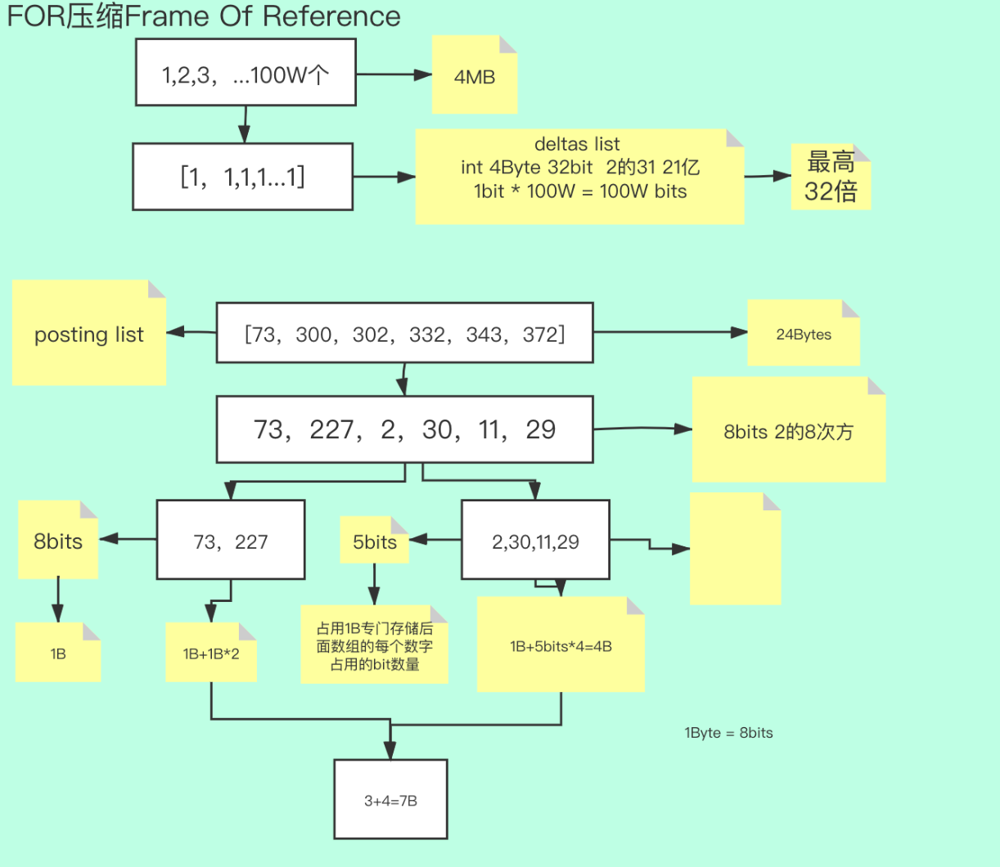
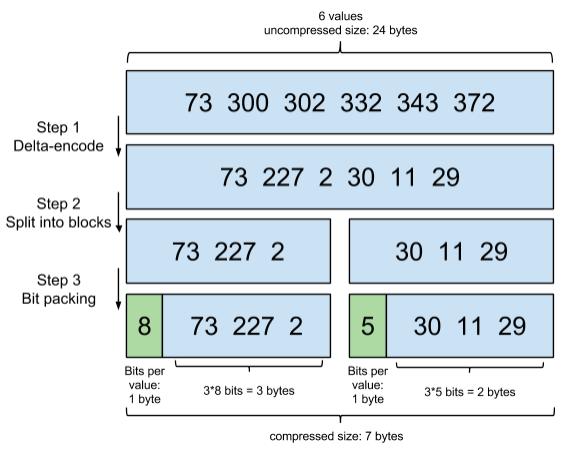
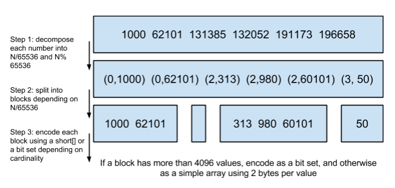

#临界知识
高效压缩算法(索引到的倒排列表太多),快速编码解码能力
delta-encoding增量编码frame of reference
hashmap(快),skiplist(快),trieTree(小),fst
http://cs.usfca.edu
输入词项有序,处理完节点冻结刷盘
#为什么mysql不适合搜索引擎?

#搜索引擎核心问题

#倒排索引

##term index(词索引)
##term dictionary(词项字典)
##posting list(倒排列表)

#查询速度加速(小/压缩,快/数据结构)
##压缩算法(压缩doc ID)

###FOR(稠密压缩算法,frame of reference参考系,坐标)
适合稠密数组
差值列表deltas list

###RBM
无符号short最大值65535

####ArrayContainer

####bitmapContainer
固定8KB
####RunContainer
8B

#结果准确
#检索结果丰富
召回率
