#拓扑关系
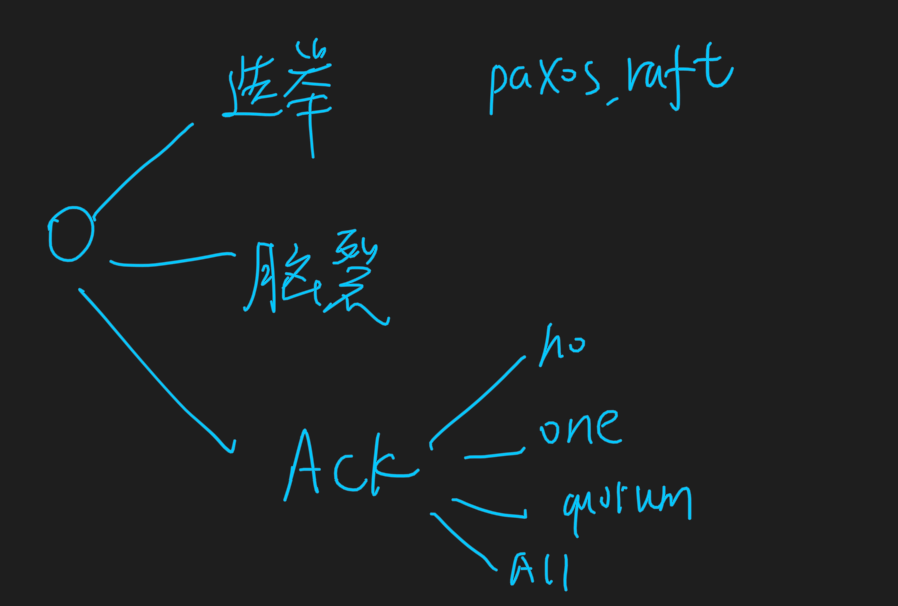
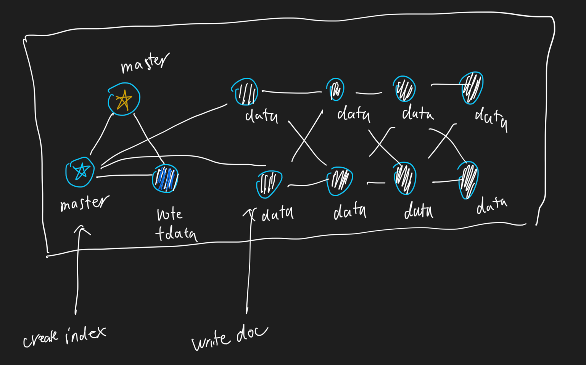
每个节点就是一个Elasticsearch的实例
一个节点≠一台服务器
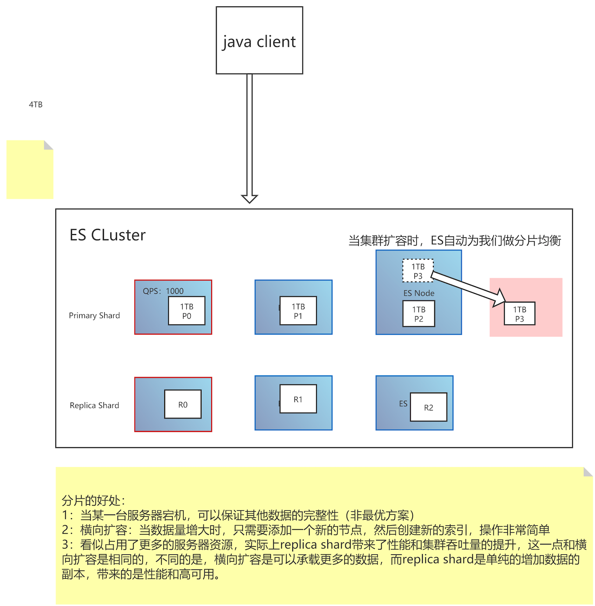
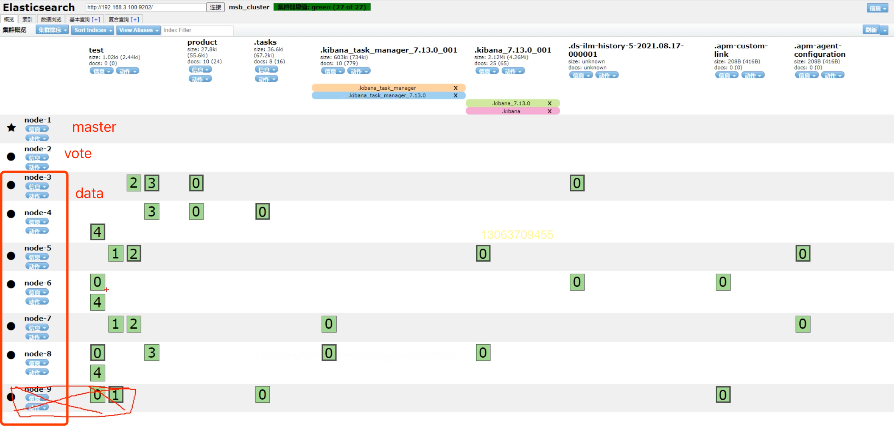
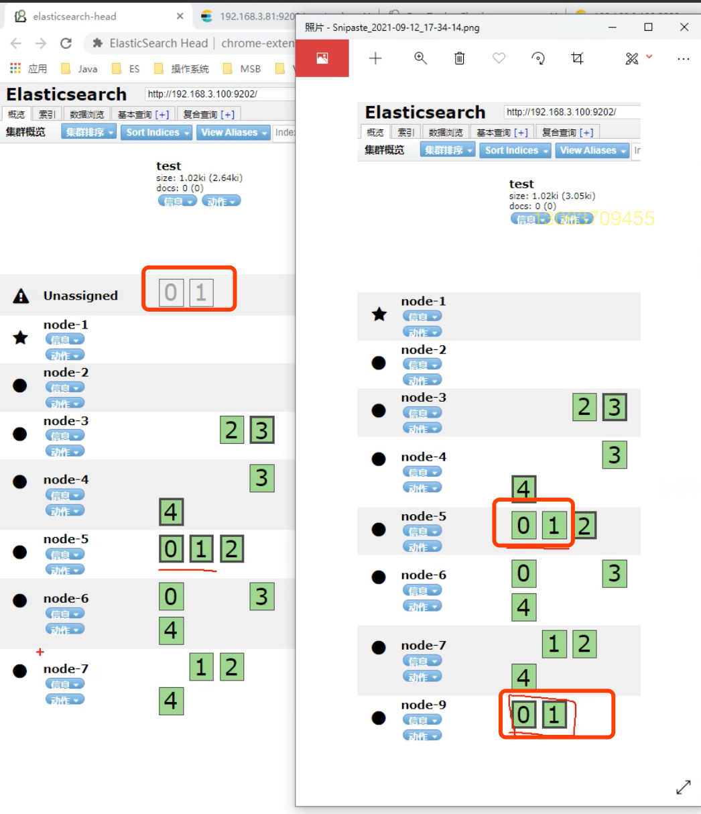
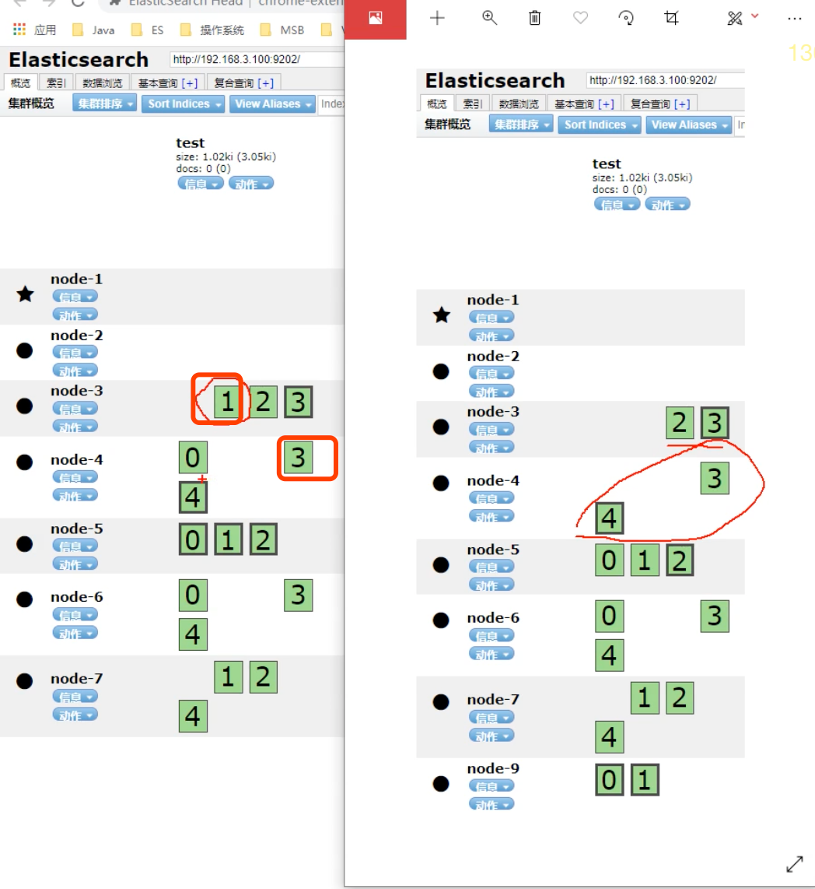

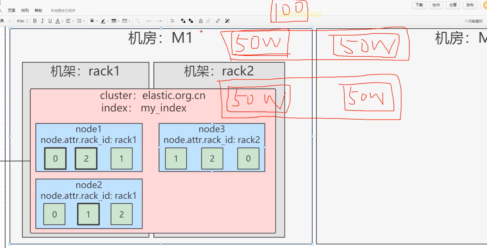
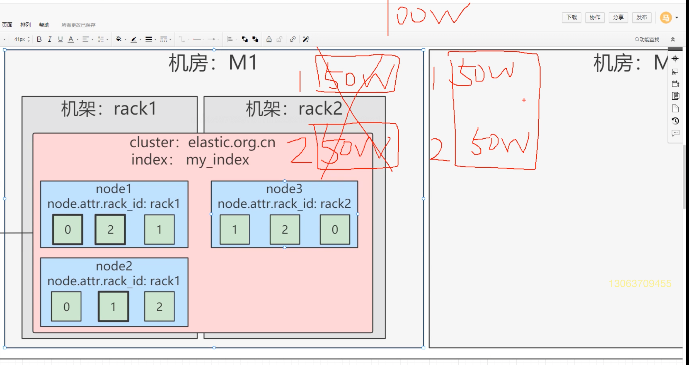
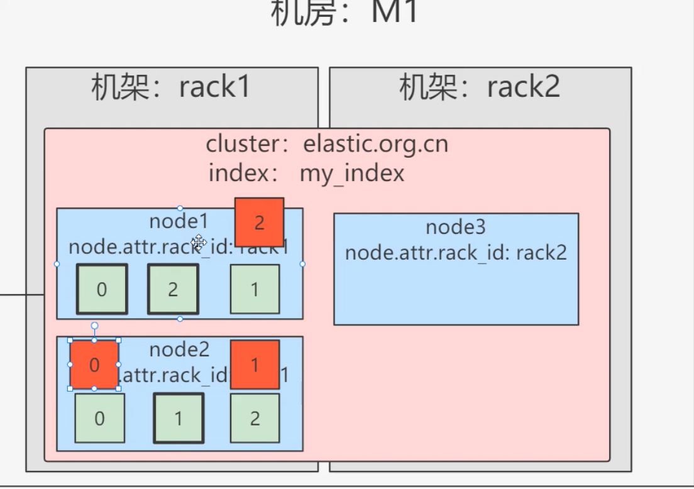

##分片
```asp
一个索引包含一个或多个分片，在7.0之前默认五个主分片，每个主分片一个副本；在7.0之后默认一个主分片。副本可以在索引创建之后修改数量，但是主分片的数量一旦确定不可修改，只能创建索引

每个分片都是一个Lucene实例，有完整的创建索引和处理请求的能力

ES会自动再nodes上做分片均衡

一个doc不可能同时存在于多个主分片中，但是当每个主分片的副本数量不为一时，可以同时存在于多个副本中。

每个主分片和其副本分片不能同时存在于同一个节点上，所以最低的可用配置是两个节点互为主备
```
##master：候选节点(索引元数据crud,主分片选举)
配置了master角色的节点都是有效的投票节点
高可用性 (HA) 集群需要至少三个候选节点，其中至少两个不是仅投票节点。这样即使其中一个节点发生故障，也可以保证剩下的节点能够选举出一个主节点
例如创建或删除索引、跟踪哪些节点是集群的一部分以及决定将哪些分片分配给哪些节点,使它们能够专注于管理集群
##data：数据节点
##voting_only：仅投票节点
配置了master和voting_only角色的节点将成为仅投票节点，仅投票节点虽然也是候选节点，但是在选举过程中仅可以投票而不参与竞选。不过仅投票节点可以同时也是数据节点，
这样的话，其不具备被选举为Master的资格，但是参与投票，可以在选举过程中发挥关键票的作用
但是有一种投票节点比较特殊，其只具备选举权而不具备被选举权，也就是“仅投票”节点，仅投票节点只能在Master选举过程中参与投票，而不能参加竞选。仅投票在某些场景下发挥着极其重要的作用：
- 当现有票数不足以选出Master的时候，充当决胜票。
- 在小型集群中仅投票节点可同时作为数据节点避免资源浪费
##data_content：数据内容节点
###data_hot：热节点
###data_warm：索引不再定期更新，但仍可查询
###data_cold：冷节点，只读索引
##Ingest：预处理节点，作用类似于Logstash中的Filter
##ml：机器学习节点
##remote_cluster_client：候选客户端节点
##transform：转换节点

#选举
```asp
ES基于Bully和Paxos两种算法实现，而并非就是两种算法或之一。 ES 7.x 基于以上算法，加入了基于Raft的优化。

- Bully：Bully是Leader选举的基本算法之一，基本原理就是按照节点ID进行排序，任何时候当前Leader的节点ID都是集群中最高节点ID。该算法非常易于实现但是当Leader处于不稳定状态的时候，如因负载过重而假死，此时可能会触发选主，选出第二大ID的节点为新的Leader。ES通过推迟选举直到Master失效（Master放弃Active Master资格触发选举）来解决问题，但是会产生双主或多主（也就是脑裂）问题。
- Paxos：Paxos非常强大，在选举方面的灵活性比Bully算法有很大的优势，但是其原理非常复杂。
- Raft：Raft是一种使用较为广泛的分布式一致性的协议，在Raft中，节点可能的状态有三种：
  - Leader：主节点
  - Candidate：候选节点
  - Follower：跟随节点

所有的节点开始都是跟随节点。如果跟随节点收不89到领导节点的信号，则他们可以成为候选节点候选节点接着请求其他节点投票节点将以他们的投票回复候选节点如果候选节点获取到大多数节点的投票，则他将会成为领导节点此过程称为Leader选举。此时，所有对系统的修改将通过Leader节点进行。任意改变将以entry的形式添加到节点的日志中。这个日志的entry此时是没有提交的，所以，它不会更新节点的值。为了提交entry，节点首先会备份至跟随节点，然后leader等待，知直到多数节点将entry写入（自己的日志），此时Leader节点将提交entry，并且节点的数据被修改，接着Leader通知其他跟随者entry已经被提交了。此时集群的系统状态称为一致的。这个过程称为日志复制

在Raft中有两个设置超时时间的地方去控制选举
**选举超时**：
此时间就是跟随节点等待Leader信号直到成为候选节点的时间。选举超时时间随机设置在150ms到300ms之间。当选举超时以后，跟随节点成为候选节点，然后为自己发起一轮新的选举，并且向其他节点发起投票请求。如果收到请求的节点本轮没有发出投票，则候选节点的投票。并且节点重置选举超时时间
一旦候选节点收到大多数投票，那么他将成为Leader。Leader开始对其他跟随节点发送追加entry的消息。这些消息按心跳超时指定的时间间隔发送。跟随节点接着响应每一个追加entry的消息。在选举任期持续直到跟随节点停止接收到心跳消息，并成为候选节点。
**重新选举**：
和Leader选举一样。要求大多数投票，保证了本期选举只能有一个Leader被选中。如果两个节点同时成为候选节点，则会发送分裂投票。
**分裂投票**：
两个节点在同一期间都开始选举，并且每个都在其他节点之前到达一个单一节点。此时，每个候选节点都有两票，并且本次投票无法再收到更多投票，则节点将等待新的选举并重试。
```
#脑裂
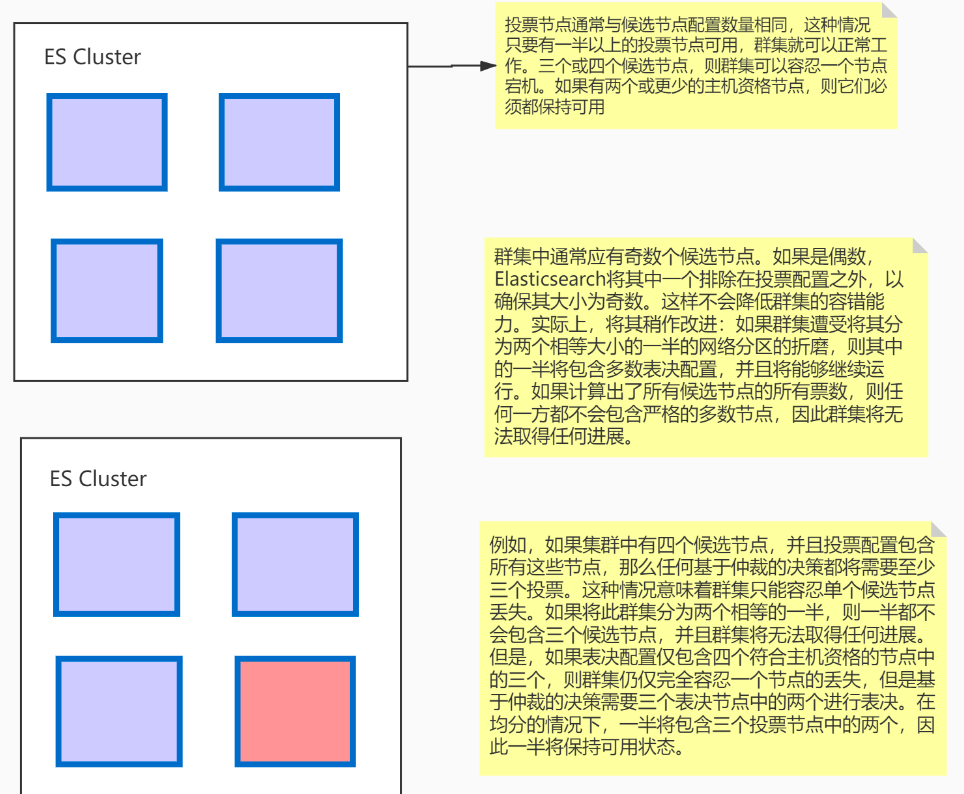
#集群模式
##单节点模式
##多节点集群
2个master,1个投票节点,8个数据节点
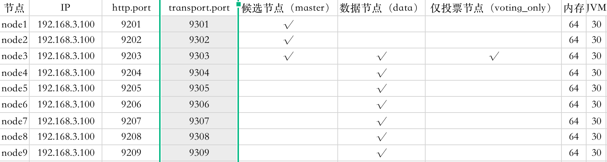
#ACK一致性
consistency，one(primary shard)，all(all shard)，quorum(default)
quorum机制
