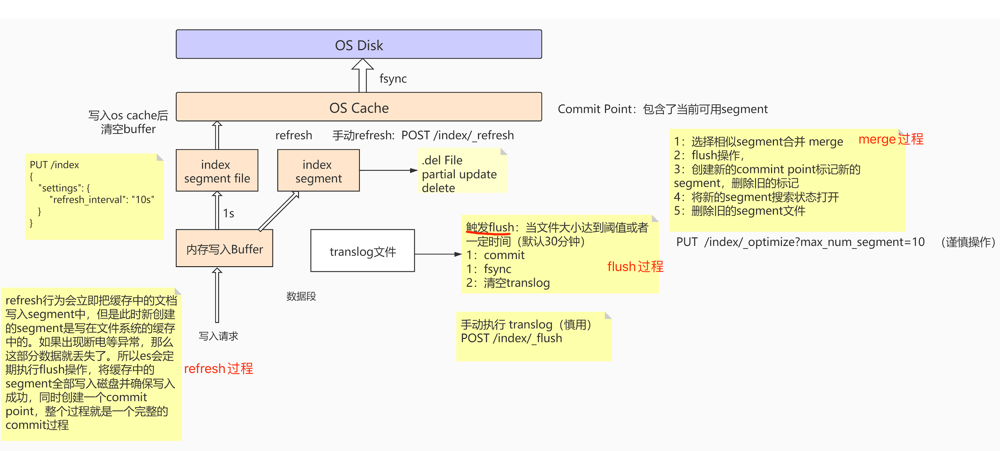
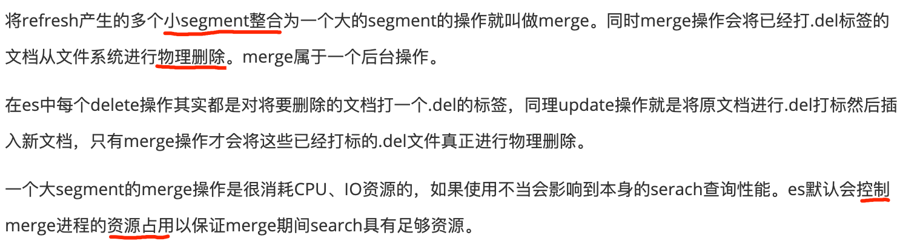
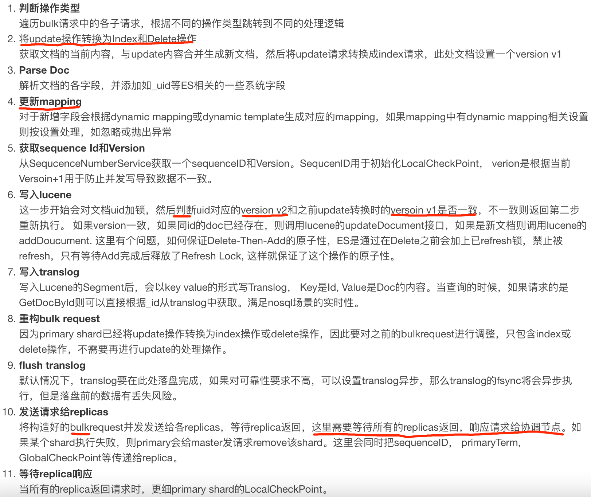

#临界知识
近实时搜索
translog持久化
refresh,flush,merge
写入流程:路由,mapping,refresh,flush,replicas
小段合并大段
最小通用化算法,int->byte
#写入的核心问题
```asp
可靠性：或者是持久性，数据写入系统成功后，数据不会被回滚或丢失。
一致性：数据写入成功后，再次查询时必须能保证读取到最新版本的数据，不能读取到旧数据。
原子性：一个写入或者更新操作，要么完全成功，要么完全失败，不允许出现中间状态。
隔离性：多个写入操作相互不影响。
实时性：写入后是否可以立即被查询到。
性能：写入性能，吞吐量到底怎么样
```

#拓扑


##文档缓存buffer(每秒refresh,buffer->segment,近实时1s才能被查询,发生在jvm)
每秒refresh内存文档缓存buffer,变成内存segment,并写入translog持久化,然后修改segment状态为open,就可以被索引到(近实时)
##segment缓存
每次创建一个新的 Document， 都会归属于一个新的 Segment， 而不会去修改原来的 Segment 。且每次的文档删除操作，
会仅仅标记 Segment 中该文档 为删除状态， 而不会真正的立马物理删除

##页缓存(flush,page cache->disk)
##translog(事务日志,可靠性;文档缓存buffer后,写入translog;translog周期性通过fsync进行刷盘，默认5s;commit point)
[translog刷盘策略](https://www.elastic.co/guide/cn/elasticsearch/guide/current/translog.html)

新文档被索引意味着文档会被首先写入内存 buffer 和 translog 文件。每个 shard 都对应一个 translog

一个文档被索引之后，就会被添加到内存缓冲区，并且追加到了translog

refresh操作不断发生，更多的文档被添加到内存缓冲区和追加到translog

```asp
1.translog周期性通过fsync进行刷盘，默认5s，可通过参数index.translog.sync_interval、index.translog.durability控制，保证应用重启后先确认最后记录的commit point，
commit point之后的变更操作通过落盘的translog进行重构恢复段
2.默认当translog太大（512MB）时，进行flush操作
```

##磁盘

##refresh & flush & merge

[](https://www.cxyzjd.com/article/weixin_37692493/108182161#refresh_2)
###refresh(searchalbe状态,内存segment+translog,1s一次,清空内存文档,)
[近实时搜索](https://www.elastic.co/guide/cn/elasticsearch/guide/current/near-real-time.html)


```asp
-- refresh全局索引
POST /_refresh 

-- refresh指定索引
POST /blogs/_refresh

不完整提交（因为没有刷盘）

refresh资源消耗相对较小，避免每次文档写入fsync导致资源上的瓶颈

默认每1s进行一次refresh，refresh后的段可以被打开，实现近实时搜索
```
###flush(commit状态,refresh+commit+fsync+删除old translog,5s一次,清空内存文档,重启恢复对齐commit point)
```asp
1.强制refresh，将内存缓冲区所有文档写入一个新的段，写入到文件系统缓存并将旧的内存缓冲区被清空（refresh）
2.将最新的commit point写入磁盘
3.将文件系统缓存中的段通过fsync进行刷盘
4.删除老的translog，启动新translog
```
```asp
index.translog.sync_interval
    translog通过fsync刷盘的的频率，默认5s，不允许设置100ms以内
    
index.translog.durability
    request(default)：默认每次请求（index, delete, update, or bulk request）后都进行fsync和commit
    async：每间隔sync_interval进行一次fsync和commit

index.translog.flush_threshold_size
    translog最大达到512MB的时候强制进行flush操作，flush后将commit point进行刷盘，保证数据安全
```
```asp
refresh会清空内存缓存，但是不会清空translog

flush操作将文件系统缓存中的segment进行fsync刷盘，并更新commit point

当程序意外重启后，es首先找到commit point，然后通过translog重构commit point之后的segment
```
###merge(合并小segment[包含完全提交以及searchalbe的segment],物理删除文档,)
[merge操作](https://www.elastic.co/guide/cn/elasticsearch/guide/current/merge-process.html)

```asp
1.refresh操作会相应的产生很多小的segment文件，并刷入到文件系统缓存（此时文件系统中既有已经完全commit的segment也有不完全提交仅searchable的segment）
2.es可以对这些零散的小segment文件进行合并（包含完全提交以及searchalbe的segment）
3.es会对merge操作后的segment进行一次flush操作，更新磁盘commit point
4.将merge之后的segment打开保证searchalbe，然后删除merge之前的零散的小segment
```


#写入流程
[](https://elasticsearch.cn/article/13533)
##coordinating节点(doc _id路由)
计算出文档要分配到的分片，在从集群元数据中找出对应主分片的位置，将请求路由到该分片进行文档写操作

##primary shard(主分片refresh+flush)

##replica shard

##分片副本同步Replica
#段合并merge(小段消耗文件句柄、内存和 CPU)
[merge操作](https://www.elastic.co/guide/cn/elasticsearch/guide/current/merge-process.html)

```asp
1.refresh操作会相应的产生很多小的segment文件，并刷入到文件系统缓存（此时文件系统中既有已经完全commit的segment也有不完全提交仅searchable的segment）
2.es可以对这些零散的小segment文件进行合并（包含完全提交以及searchalbe的segment）
3.es会对merge操作后的segment进行一次flush操作，更新磁盘commit point
4.将merge之后的segment打开保证searchalbe，然后删除merge之前的零散的小segment
```


#并发控制乐观锁

