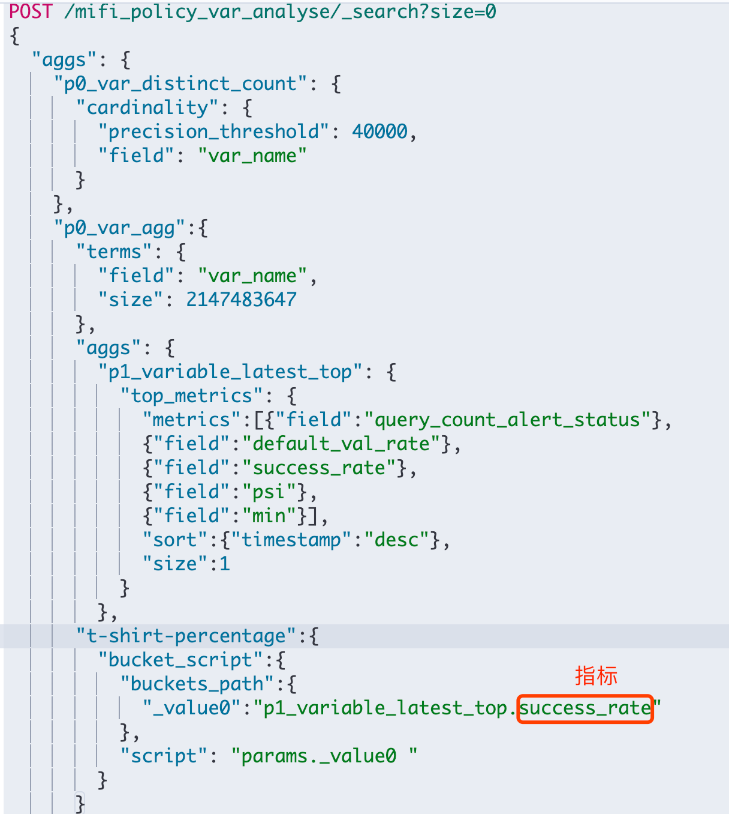

#桶聚合（Buckets）
满足特定条件的文档的集合，桶在概念上类似于 SQL 的分组（GROUP BY）
group documents into buckets, also called bins, based on field values, ranges, or other criteria

Bucket aggregations, as opposed to metrics aggregations, can hold sub-aggregations. 
These sub-aggregations will be aggregated for the buckets created by their "parent" bucket aggregation.


the bucket aggregations also compute and return the number of documents that "fell into" each bucket
##重要概念
1.可以有子聚合,子聚合可以是桶聚合、指标聚合、pipeline聚合
2.单桶和多桶聚合,单桶可通过路径索引聚合,排序
3.
##terms
keyword分桶
[](https://www.elastic.co/guide/cn/elasticsearch/guide/current/_aggregation_test_drive.html)
包含 doc_count 字段

##global(单值桶)
全局桶[](https://www.elastic.co/guide/cn/elasticsearch/guide/current/_scoping_aggregations.html)

##filter(单值桶)
过滤桶
[](https://www.elastic.co/guide/cn/elasticsearch/guide/current/_filter_bucket.html)
##filters
[](https://xiaoxiami.gitbook.io/elasticsearch/ji-chu/36aggregationsju-he-fen-679029/362tong-ju540828-bucketaggregations/duo-guo-lv-qi-ju-540828-filters-aggregation)

##近似聚合
[](https://www.elastic.co/guide/cn/elasticsearch/guide/current/_approximate_aggregations.html)
##cardinality
[去重精确度优化](https://www.elastic.co/guide/cn/elasticsearch/guide/current/cardinality.html#_%E9%80%9F%E5%BA%A6%E4%BC%98%E5%8C%96)
[hash优化](https://www.elastic.co/guide/cn/elasticsearch/guide/current/cardinality.html#_%E9%80%9F%E5%BA%A6%E4%BC%98%E5%8C%96)
##reverse_nested(单值桶)


#指标聚合（Metrics）
对桶内的文档进行统计计算
而指标则类似于 COUNT() 、 SUM() 、 MAX() 等统计方法。
桶能让我们划分文档到有意义的集合，但是最终我们需要的是对这些桶内的文档进行一些指标的计算。
分桶是一种达到目的的手段：它提供了一种给文档分组的方法来让我们可以计算感兴趣的指标

calculate metrics, such as a sum or average, from field values
获取指标,不支持子聚合,
##重要概念
1.单值,多值指标聚合
2.不可以有子聚合
##avg
对每个桶进行指标计算
[](https://www.elastic.co/guide/cn/elasticsearch/guide/current/_adding_a_metric_to_the_mix.html)
##百分位
[](https://www.elastic.co/guide/cn/elasticsearch/guide/current/percentiles.html#percentiles)
##top_metrics
top_hits is a metric aggregation so it can't take any child aggregation.
[](https://stackoverflow.com/questions/24944170/multiple-metric-sub-aggregations-situation-with-elasticsearch)
##top_hits
top_hits is a metric aggregation so it can't take any child aggregation.
#pipeline聚合
take input from other aggregations instead of documents or fields.
Pipeline aggregations work on the outputs produced from other aggregations rather than from document sets, adding information to the output tree. 

Pipeline aggregations cannot have sub-aggregations but depending on the type it can reference another pipeline in the 
buckets_path allowing pipeline aggregations to be chained. For example, you can chain together two derivatives to calculate the second derivative
##重要概念
###1.不可以有子聚合
###2.Parent,sibling

```asp
Parent:
A family of pipeline aggregations that is provided with the output of its parent aggregation and is able to compute new buckets or new aggregations to add to existing buckets

Parent - pipeline 结果会内嵌到现有的聚合分析结果之中
○ avg （求导）
○ Sum （累计求和）

```
```asp
Sibling:
Pipeline aggregations that are provided with the output of a sibling aggregation and are able to compute a new aggregation which will be at the same level as the sibling aggregation.

Sibling - 结果和现有分析结果同级，pipeline 聚合结果会与原先的结果并立。
○ script
○ 
```

###3.buckets_path
buckets_path,路径是相对当前pipe aggregation的路径
Paths are relative from the position of the pipeline aggregation; they are not absolute paths, and the path cannot go back "up" the aggregation tree
[](https://www.elastic.co/guide/en/elasticsearch/reference/current/search-aggregations-pipeline.html#buckets-path-syntax)

```asp
my_bucket>my_stats.avg//指标多维度
sales_per_month>sales,//子路径
sale_type['hat']>sales//多桶
my_percentile[99.9]//分位
```
###支持的聚合方式
桶聚合,指标聚合,pipeline聚合
###多桶聚合
[](https://www.elastic.co/guide/en/elasticsearch/reference/current/search-aggregations-pipeline.html#buckets-path-syntax)
###单值多值 指标聚合
###_count
buckets_path can use a special "_count" path. This instructs the pipeline aggregation to use the document count as its input
###_bucket_count
[](https://www.elastic.co/guide/en/elasticsearch/reference/current/search-aggregations-pipeline.html#buckets-path-syntax)
###间隙策略gap_policy
gap_policy
##avg pipeline(sibling pipeline)
每个桶只有一个指标，对每个桶的指标求和，得到一个结果
The specified metric must be numeric and the sibling aggregation must be a multi-bucket aggregation.
[](https://www.elastic.co/guide/en/elasticsearch/reference/current/search-aggregations-pipeline-avg-bucket-aggregation.html)


##bucket_script(parent pipeline)
参数引用params.hats，计算每个桶,每个桶都有一个值

[](https://www.elastic.co/guide/en/elasticsearch/reference/7.16/search-aggregations-pipeline-bucket-script-aggregation.html)
##bucket_selector
不支持平级,bucket_selector类似 having操作

#桶聚合&指标聚合&pipeline聚合拓扑关系


#重要实践

##只保留聚合结果
"size": 0
[](https://www.elastic.co/guide/en/elasticsearch/reference/current/search-aggregations.html)
##平级聚合&子聚合

###同时运行多个聚合
###嵌套聚合
[](https://www.elastic.co/guide/cn/elasticsearch/guide/current/_buckets_inside_buckets.html)
###同时使用嵌套桶&嵌套指标
[](https://www.elastic.co/guide/cn/elasticsearch/guide/current/_one_final_modification.html)
##聚合路径
my_bucket>another_bucket>metric，多值桶（如：terms ）动态生成许多桶，无法通过指定一个确定路径来识别
[](https://www.elastic.co/guide/cn/elasticsearch/guide/current/_sorting_based_on_deep_metrics.html)
需要提醒的是嵌套路径上的每个桶都必须是 单值 的。 filter 桶生成 一个单值桶：所有与过滤条件匹配的文档都在桶中。 
多值桶（如：terms ）动态生成许多桶，无法通过指定一个确定路径来识别
##桶个数
###桶个数
_bucket_count
###桶内文档数
_count:doc_count
[桶内个数排序](https://www.elastic.co/guide/cn/elasticsearch/guide/current/_intrinsic_sorts.html)
##聚合排序
###桶内排序
###桶间指标排序&基于tree深度指标聚合排序
[](https://www.elastic.co/guide/cn/elasticsearch/guide/current/_sorting_by_a_metric.html)
[](https://www.elastic.co/guide/cn/elasticsearch/guide/current/_sorting_based_on_deep_metrics.html)
my_bucket>another_bucket>metric

##查询、过滤、范围与聚合
###同时使用query、filter与聚合
[](https://www.elastic.co/guide/cn/elasticsearch/guide/current/_filtering_queries.html)
###聚合后过滤post_filter
[](https://www.elastic.co/guide/cn/elasticsearch/guide/current/_post_filter.html)
##条形图
###条形图
[histogram](https://www.elastic.co/guide/cn/elasticsearch/guide/current/_building_bar_charts.html)
###时间条形图聚合
[](https://www.elastic.co/guide/cn/elasticsearch/guide/current/_looking_at_time.html)

#聚合优化
##cardinality优化
精确度优化
hash优化
[](https://www.elastic.co/guide/cn/elasticsearch/guide/current/cardinality.html#_%E9%80%9F%E5%BA%A6%E4%BC%98%E5%8C%96)
