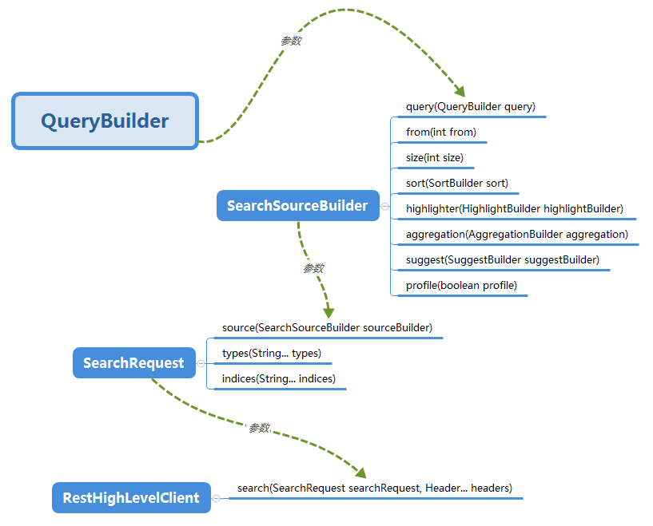

#检索语法

#post_filter
#过滤返回结果
filter_path

rest api支持结果过滤,但是rest high level不支持结果过滤
[不支持](https://github.com/elastic/elasticsearch/pull/67802)
[更新high level,支持](https://github.com/swallez/elasticsearch/commit/f85dd3e2b7fd39e4342df3d212e799899061a2cc)
